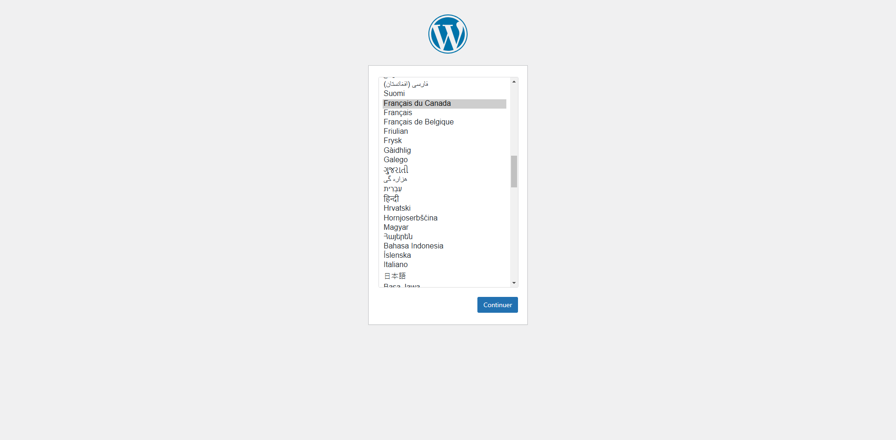
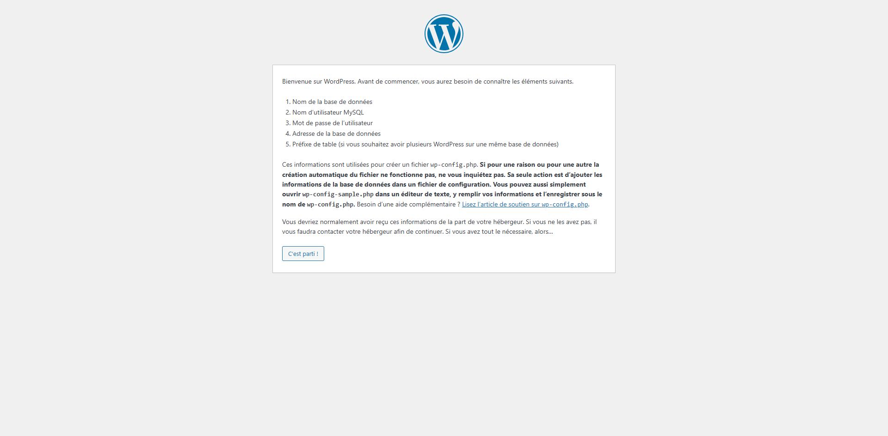
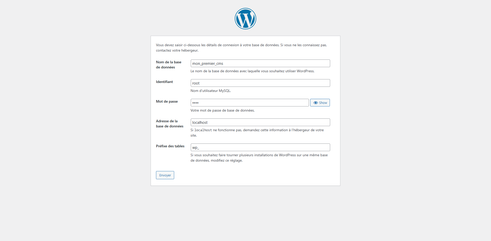
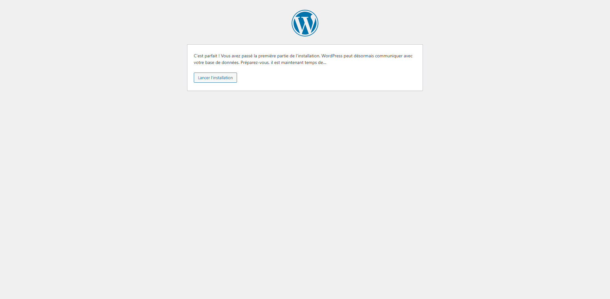
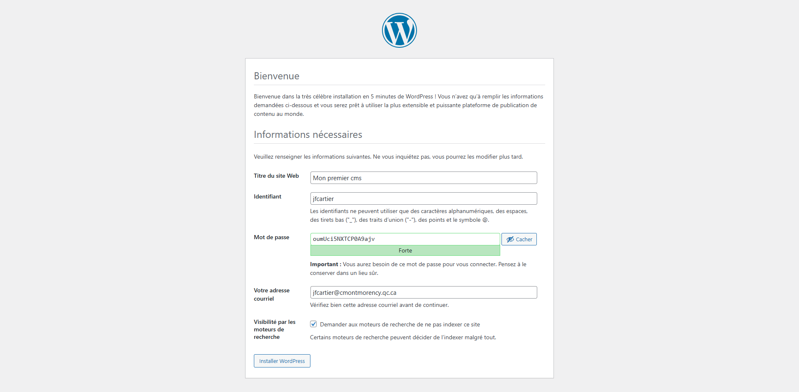
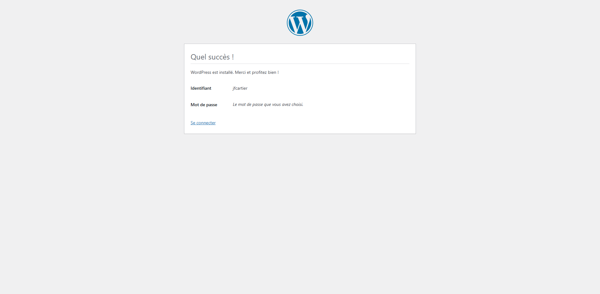
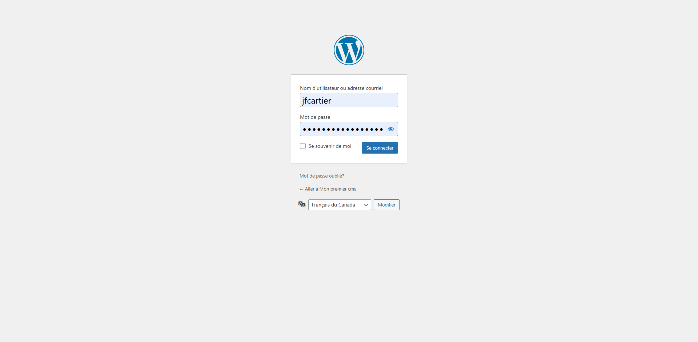

---
tags:
  - Exercice
---

# Installation de WordPress

L'objectif de cet exercice est d'installer le CMS WordPress localement avec un serveur AMP.

- [ ] Si ce n'est déjà fait, télécharger et installer MAMP sur l'ordinateur. (Les ordinateurs en TIM devraient disposer de MAMP par défaut)
- [ ] Si ce n'est déjà fait, créez une nouvelle base de données pour votre site Wordpress.

- [ ] [Télécharger WordPress](https://fr-ca.wordpress.org/download/) et extraire les fichiers dans le dossier des sites de MAMP (htdocs ou autrement précifié).
- [ ] Renommez le dossier wordpress par le nom de votre projet. Ex: mon_premier_wp
- [ ] Accédez à http://localhost:81/mon_premier_wp dans votre navigateur (ça peut prendre un certain temps)
- [ ] Suivez l’assistant d’installation :

<figure markdown>
  {data-zoom-image}
  <figcaption>Choisir « Français du Canada »</figcaption>
</figure>

<figure markdown>
  {data-zoom-image}
  <figcaption>Cliquez sur « C'est parti »</figcaption>
</figure>

<figure markdown>
  {data-zoom-image}
  <figcaption>Inscrire les informations associées à votre base de données.</figcaption>
</figure>

<figure markdown>
  {data-zoom-image}
  <figcaption>Cliquer sur « Lancer l'installation »</figcaption>
</figure>

<figure markdown>
  {data-zoom-image}
  <figcaption>Entrer le nom du site, votre identifiant de connexion, un mot de passe sécuritaire, votre courriel et sélectionnez « Demander aux moteurs de recherche de ne pas indexer ce site. ». Cliquez sur « Installer ».</figcaption>
</figure>

<figure markdown>
  {data-zoom-image}
  <figcaption>Cliquer sur « Se connecter »</figcaption>
</figure>

<figure markdown>
  {data-zoom-image}
  <figcaption>Connexion</figcaption>
</figure>

- [ ] Regardez maintenant dans le code source de WordPress, à la racine du site, le fichier `wp-config.php`. Observez que ce fichier contient les informations de connexion à la base de données!
- [ ] Consultez la base de données et observez ce qu'il y a de nouveau. Regardez par exemple la table wp_users. Vous devriez vos information de connexion avec le mot de passe encrypté.
