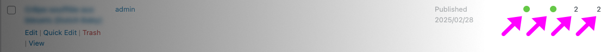

---
tags:
  - Exercice
---

*[SEO]: Search Engine Optimization

# Yoast

{ .w-100 }

> Yoast... Toast... Grillé... Bronzé... The ROCK !

L'objectif de cet exercice est de mettre en pratique la notion de **SEO** avec Wordpress.

## Résultat attendu

{ data-zoom-image }

Dans le tableau de bord, sous l'onglet `Posts`, vous devriez voir trois posts, avec chacun un score de lisibilité en vert 🟢 et un score SEO en vert 🟢.

!!! note "Yoast et le français"

    Le plugin Yoast gère plusieurs langues, mais il n'est pas parfait. Il peut arriver que certaines erreurs soient signalées à tort, même si votre score SEO reste satisfaisant. Ne vous inquiétez pas si 1 ou 2 alertes persistent malgré un bon contenu optimisé.

## Consignes

- [ ] Installer le plugin `Yoast SEO`
- [ ] Faire la configuration initiale (_First-time configuration_)
- [ ] Créer trois post sur un sujet connexe. C'est important que ça vous intéresse, car vous aurez à bien gérer le contenu.
- [ ] Configurez le formulaire Yoast pour chaque article.
- [ ] Corrigez le contenu de chaque article pour atteindre une note satisfesante pour les 2 critères de Yoast (SEO et lisibilité).