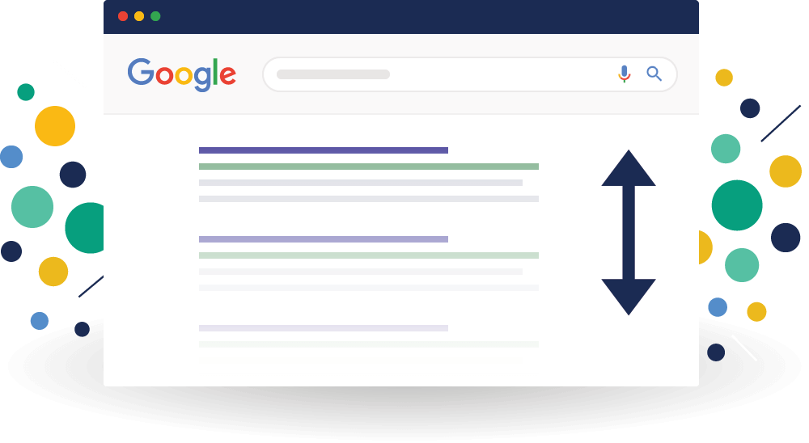
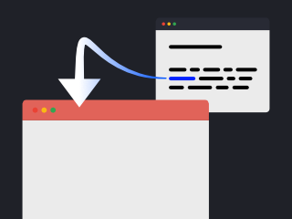
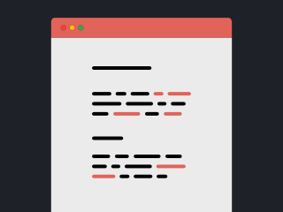
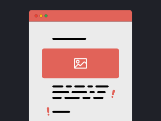
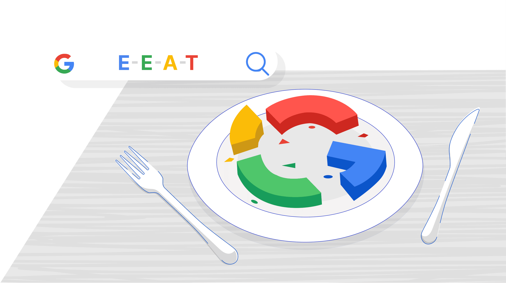
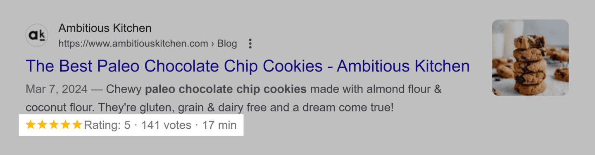
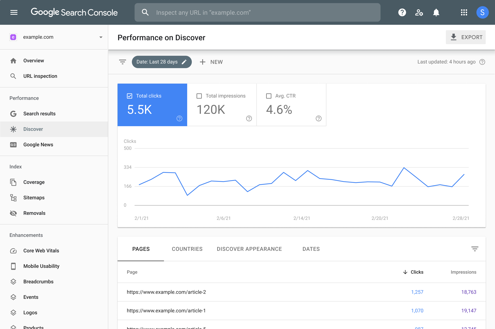

# SEO

*[SEO]: Search Engine Optimization
*[E-E-A-T]: Experience, Expertise, Authoritativeness, and Trustworthiness
*[WCAG]: Web Content Accessibility Guidelines
*[UX]: User eXperience
*[CTA]: Call To Action
*[CTR]: ClickThrough Rate



Le SEO (optimisation pour le moteur de recherche, ou Search Engine Optimization en anglais) est l'ensemble des techniques utilisées pour optimiser le positionnement d’une page web dans les moteurs de recherche, comme Google.

## Les bases du SEO

### Popularité

<div class="grid" markdown>


<div markdown>
La popularité se mesure par le nombre de liens (_backlinks_) qui pointent vers votre site.

> Imaginez que votre site soit recommandé par un blog populaire : c'est comme obtenir un "vote" de confiance qui aide Google à mieux vous classer.
</div>
</div>

### Pertinence

<div class="grid" markdown>


<div markdown>
La pertinence signifie que votre contenu répond exactement à **ce que recherche l'utilisateur**.

> Si quelqu'un tape "recettes de cookies faciles", un article avec des recettes pas à pas et des photos sera plus utile qu'un article sur l'histoire des cookies. C'est le principe de mot-clés.
</div>
</div>

### La qualité du contenu

<div class="grid" markdown>


<div markdown>
Un contenu de qualité est **original**, bien **structuré** et **intéressant** pour vos visiteurs.

> Par exemple, un tutoriel sur la réparation de vélos avec des images, des vidéos et des conseils pratiques retiendra mieux l'attention qu'un simple texte sans visuels.
</div>
</div>

## L'indice E-E-A-T



Google évalue la confiance d'un site avec l'indice **E-E-A-T** : **Expérience**, **Expertise**, **Autorité** et **Fiabilité**.

### Expérience

{ .w-50 }

L'auteur doit montrer qu'il connaît vraiment le sujet.

> Vous faites un tutoriel sur la programmation d’un site. Partagez des captures d’écran de votre code en action et parlez de vos expériences concrètes.

**🛠️ Concrètement, on peut :**

- Ajoutez des **témoignages**, des **études de cas**, des **expériences personnelles**.
- Intégrez des images ou vidéos prises par vous (ex. photos de vos projets, captures d’écran).
- Présentez-vous clairement dans une page "À propos".

### Expertise

{ .w-50 }

L'auteur doit être reconnu pour ses connaissances dans son domaine.

> Pour un article sur le développement web, indiquez les langages que vous maîtrisez et partagez des liens vers des tutoriels ou études que vous trouvez pertinents.

**🛠️ Concrètement, on peut :**

- Affichez votre nom et une courte biographie.
- Mentionnez vos formations ou expériences en lien avec le sujet.
- Citez des sources fiables pour renforcer vos propos.

### Autorité

{ .w-50 }

Votre site doit être vu comme une référence dans votre domaine.

> Si plusieurs sites spécialisés renvoient vers vos tutoriels, Google comprendra que votre contenu est important et digne de confiance.

**🛠️ Concrètement, on peut :**

- Obtenez des backlinks en faisant des échanges avec d'autres sites ou en participant à des forums.
- Publiez des articles invités[^guest] sur des blogs connus.
- Mentionnez les recommandations d'autres experts.

#### Comment publier un article invité ?

1. Trouver des blogs pertinents dans votre domaine qui acceptent des articles invités.
1. Proposer un sujet intéressant en contactant le propriétaire du blog.
1. Écrire un article de qualité qui respecte la ligne éditoriale du blog.
1. Inclure un lien vers votre site (souvent dans la bio de l’auteur ou dans le contenu, si autorisé).
1. Interagir avec les lecteurs en répondant aux commentaires.

### Fiabilité

{ .w-50 }

Votre site doit inspirer confiance.

> Un site avec un cadenas dans la barre d’adresse (HTTPS) et des informations claires sur l'auteur et les contacts donnera plus confiance aux visiteurs et à Google.

**🛠️ Concrètement, on peut :**

- Utilisez le protocole HTTPS pour sécuriser votre site.
- Affichez des mentions légales et une politique de confidentialité.
- Évitez les titres trop tape-à-l'œil, les _clickbaits_ et les informations non vérifiées.

## Optimiser la SEO

### L'ancienneté du site web

Un site qui existe depuis longtemps et qui est régulièrement mis à jour a souvent plus de crédibilité.

> Un site lancé il y a 10 ans avec beaucoup d'articles de qualité sera probablement mieux classé qu'un site créé hier.

### Backlinks (Liens entrants)

Les liens d'autres sites vers le vôtre montrent que votre contenu est utile.

> Si un site populaire dans votre domaine fait référence à votre tutoriel, c'est un bon signe pour le SEO.

### L'adaptation mobile

Votre site doit être lisible et facile à utiliser sur un smartphone ou une tablette.

> Testez votre site sur différents appareils. Un site avec un menu simple et des textes lisibles sur mobile aura un meilleur référencement.

### Le balisage sémantique

Utiliser les bonnes balises HTML pour structurer votre contenu aide Google à mieux comprendre vos pages.

**🛠️ Concrètement, on peut :**

- Utilisez `<h1>` pour le titre principal et `<h2>`, `<h3>` pour les sous-titres.
- Ajoutez des balises `<meta>` pour décrire le contenu.
- Structurer les données selon les structures proposées par Schema.org

#### Schema.org

Fondés par Google, Microsoft, Yahoo et Yandex, [Schema.org](https://schema.org/docs/schemas.html) aide à structurer les données de votre site web pour que les moteurs de recherche comprennent mieux votre contenu.

Pour améliorer la visibilité de vos pages, il est fortement recommandé d'ajouter ces balises structurées. Cela permet à Google d'afficher des infos enrichies (rich snippets) dans les résultats de recherche, comme le titre, la date de publication, ou encore l'auteur.



> Si vous gérez un blog, vous pouvez utiliser le format JSON-LD (recommandé par Google) pour marquer vos articles. Voici un exemple de code à intégrer dans la balise `<head>` de votre page :

```html
<script type="application/ld+json">
{
  "@context": "https://schema.org",
  "@type": "Article",
  "headline": "Comment optimiser votre site pour le SEO avec Wordpress",
  "description": "Un petit guide simple pour améliorer la visibilité de votre site sur Google.",
  "author": {
    "@type": "Person",
    "name": "JF Cartier"
  },
  "datePublished": "2025-02-28",
  "image": "https://www.cmontmorency.qc.ca/image-article.jpg",
  "publisher": {
    "@type": "Organization",
    "name": "Collège Montmorency",
    "logo": {
      "@type": "ImageObject",
      "url": "https://www.cmontmorency.qc.ca/logo.png"
    }
  }
}
</script>
```

### L'expérience utilisateur (UX)

L'expérience utilisateur (UX) se réfère à la manière dont les visiteurs interagissent avec votre site

**🛠️ Concrètement, on peut :**

- S'assurer que le site charge rapidement
- Organisez le contenu de manière claire et intuitive.
- Utilisez des images optimisées et un design responsive.
- Tester tout cela avec Google Lighthouse

### Sécurité

Un site doit être en **HTTPS** (protocole sécurisé), sinon Google peut le pénaliser.

De base, il est recommandé d'utiliser un certificat Let's Encrypt.

### Sitemap

Un sitemap est un fichier XML qui liste toutes les pages de votre site pour aider Google à les explorer.

> Si vous ajoutez une nouvelle page ou un nouvel article, mettez à jour votre sitemap pour que Google le trouve rapidement.

```xml
<?xml version="1.0" encoding="UTF-8"?>
<urlset xmlns="http://www.sitemaps.org/schemas/sitemap/0.9">
  <url>
    <loc>https://www.cmontmorency.qc.ca/</loc>
    <lastmod>2025-02-28</lastmod>
    <changefreq>monthly</changefreq>
    <priority>1.0</priority>
  </url>
  <url>
    <loc>https://www.cmontmorency.qc.ca/about</loc>
    <lastmod>2025-02-28</lastmod>
    <changefreq>monthly</changefreq>
    <priority>0.8</priority> <!-- importance relative aux autres pages -->
  </url>
  <!-- Ajoutez d'autres URLs ici -->
</urlset>
```

### Google Search Console

{ data-zoom-image }

Google Search Console est un outil gratuit qui vous aide à voir comment Google voit votre site, à corriger les erreurs et à améliorer le référencement.