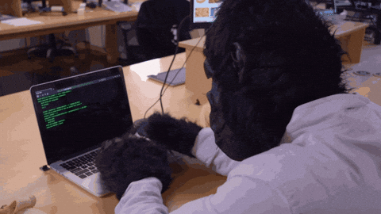

# TP

L’objectif de ce TP est de **concevoir, développer et présenter un magazine Web** sous WordPress, en intégrant l’ensemble des notions vues durant la session, dans un contexte  **collaboratif**.

!!! success "Astuce"

    Ce TP est une excellente occasion d’enrichir votre portfolio 🎨

## Un magazine dis-tu ?

{.w-100}

Effectivement mes chèr·es drougies, un magazine. Et pas n’importe lequel : un **magazine Web** !

Ce magazine doit inclure **au moins trois types de contenus** parmi les suivants :

- 📝 Articles ou texte d'opinion
- 🌟 Critiques du sujet
- 🛠️ Guides (_How-to_)
- 🏆 Palmares (ex: 10 meilleurs ...)
- 📅 Événements liés au sujet
- (autre suggestion?)

!!! quote "Bruh"

    — C'est pas un peu gros comme TP ‽ 
    — Bah, gros comme dans 45% là 
    — Oui, mais quand même 
    — En vrai, il vous faut un projet Web solide dans votre portfolio et c’est maintenant que ça se passe 😈

## Calendrier

- **Cours 11 – 11 avril** : Préparation + mini-cours (Plugins)
- **Cours 12 – 17 avril** : Développement + mini-cours (API)
- **Cours 13 – 25 avril** : Développement / Contenus
- **Cours 14 – 2 mai** : Contenus
- **Cours 15 – 9 mai** : Présentation en classe

## Modalités générales

- Le site doit être **multilingue (fr/en)** avec un **sélecteur de langue** fonctionnel
- Le site doit être **optimisé pour le SEO** (contenu bien rédigé, balises meta/OG configurées) et **accessible** (voir cours 6 – Yoast SEO)
- Tous les articles doivent avoir :
  - Une **catégorie assignée** (et traduite)
  - Une **image à la une**
  - Un **court extrait**
- Une **sauvegarde** régulière doit être effectuée avec **WPVivid** (on ne sait jamais!)
- Vous devez créer un **thème enfant** basé sur un thème FSE de votre choix
- Le site doit être **hébergé sur HostPapa** (via CPanel)
- Un **API** doit être **intégrée et utilisée** dans le site (voir cours 12)

## Les 4 phases du projet

  

  **[Préparation](./step1.md){.stretched-link .back}**

  

  **[Développement](./step2.md){.stretched-link .back}**

  

  **[Contenus](./step3.md){.stretched-link .back}**

  

  **[Présentation en classe](./step3.md){.stretched-link .back}**

## Remise

**Date limite** : **8 mai à 23h59** (remise sur Teams)
**Présentation** : en classe, le **9 mai**

Dans le devoir Teams, vous devrez fournir :

- Le **lien vers votre site Web**
- Les **accès administrateur WordPress** (login/mot de passe)
