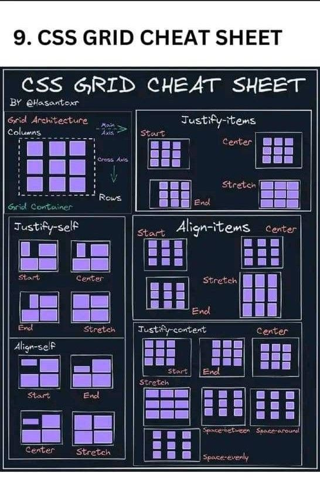
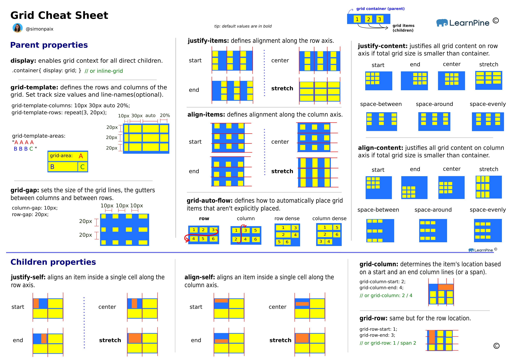

# CSS révision

## Grid

Grid Cheatsheet 01

[Grid Cheatsheet 01](https://grid.malven.co/)

Grid Cheatsheet 02

Grid Cheatsheet 03

- [CSS Grid intro](./css/grid/intro.md)
- [Styles du conteneur: `grid-template-columns` et `grid-template-rows`](./css/grid/grid-template-cols-rows.md)
- [Espacement avec `gap`](./css/grid/gap.md)
- [Unités `fr`, `minmax()`et `repeat()`](./css/grid/unites.md)
- [Styles des éléments enfants à placer: `grid-column` et `grid-row`](./css/grid/grid-col-row.md)
- [Définir les 4 coins de l'élément enfant à placer avec `grid-area`](./css/grid/grid-area.md)
- [Style du conteneur: `grid-template-areas`: nommer des zones dans une grille](./css/grid/grid-template-areas.md)

## Javascript révision

Clin d'oeil Charhier des charges

https://developer.mozilla.org/fr/docs/Learn_web_development/Core/Scripting/A_first_splash#le_cahier_des_charges_initial

