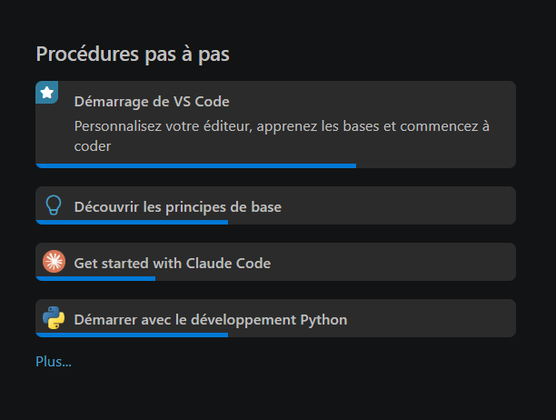
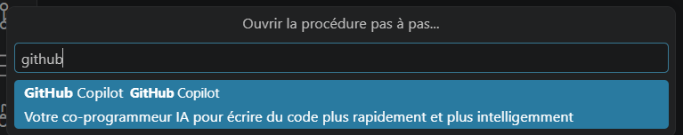

<!---
# Cours 2.1

!!! danger RAPPEL: Pas de cours officiel ce vendredi 4 septembre
      Tel que prévu au plan de cours, il n'y aura pas de cours officiel vendredi le 4 septembre.

      Vous pouvez venir au laboratoire pour avancer votre portfolio ou travailler de chez vous.

      Raison pour laquelle il n'y a pas de cours ce vendredi : je viendrai vous visiter les 14 et 17 septembre prochains dans les cours de *Préparation au milieu du travail* pour l'évaluation formative *Planification et design* (rencontre et rétroaction).

## Compléter la procédure pour activer GitHub Copilot Pro (via votre compte GitHub Éducation)

[:material-github: GitHub Education :material-robot: Copilot Pro :material-microsoft-visual-studio-code: VS Code](ia/Guide_GitHub_Education_Copilot.md){ .md-button .md-button--primary :target="_blank" }

## Extensions Visual Studio Code

- Visual Studio Code en *français* : [French Language Pack for Visual Studio Code](https://marketplace.visualstudio.com/items?itemName=MS-CEINTL.vscode-language-pack-fr)
- Connecteur Antidote
- Figma for VS Code
- Live Server


## Copilot pas-à-pas

1. Ouvrir une nouvelle fenêtre (++ctrl++ + ++shift++ + ++n++) pour ne pas interférer avec votre projet actuel.
2. Sous la section **Procédure pas-à-pas**, cliquer sur le petit *Plus...* bleu en bas.
   
3. Tapper `Github Copilot` dans la boîte de recherche et sélectionner:
   
4. Parcourir les 5 étapes de la procédure pas-à-pas pour mieux comprendre l'interface et les fonctionnalités de Copilot. Cocher lorsque vous avez bien compris l'étape.

-->
# Cours 2.1

## Aujourd'hui

- [ ] Compléter l'activation de GitHub Copilot Pro
- [ ] Rafraîchissement CSS : layout moderne (flexbox/grid), variables, responsive
- [ ] Nouveau workflow UI/UX : Figma + IA générative
- [ ] Atelier : diverger, 3 à 4 directions visuelles
- [ ] Atelier : converger et critiquer (persona + accessibilité)
- [ ] Citer l'IA dans le journal de bord
- [ ] Journal de bord

!!! danger "Rappel : pas de cours officiel ce vendredi 4 septembre"
    Tel que prévu au plan de cours, il n'y aura pas de cours officiel vendredi le 4 septembre.

    Vous pouvez venir au laboratoire pour avancer votre portfolio ou travailler de chez vous.

    Raison pour laquelle il n'y a pas de cours ce vendredi : je viendrai vous visiter les 14 et 17 septembre prochains dans les cours de *Préparation au milieu du travail* pour l'évaluation formative *Planification et design* (rencontre et rétroaction).

## Compléter l'activation des outils 🛠️

### GitHub Copilot Pro

Si ce n'est pas encore fait, complétez la procédure via votre compte GitHub Éducation.

[:material-github: GitHub Education :material-robot: Copilot Pro :material-microsoft-visual-studio-code: VS Code](ia/Guide_GitHub_Education_Copilot.md){ .md-button .md-button--primary :target="_blank" }

### Extensions Visual Studio Code

- Visual Studio Code en *français* : [French Language Pack for Visual Studio Code](https://marketplace.visualstudio.com/items?itemName=MS-CEINTL.vscode-language-pack-fr)
- Connecteur Antidote
- Figma for VS Code
- Live Server

### Copilot pas-à-pas

1. Ouvrir une nouvelle fenêtre (++ctrl++ + ++shift++ + ++n++) pour ne pas interférer avec votre projet actuel.
2. Sous la section **Procédure pas-à-pas**, cliquer sur le petit *Plus...* bleu en bas.
   
3. Taper `Github Copilot` dans la boîte de recherche et sélectionner :
   
4. Parcourir les 5 étapes de la procédure pas-à-pas pour mieux comprendre l'interface et les fonctionnalités de Copilot. Cocher lorsque vous avez bien compris l'étape.

## Citer l'utilisation de l'IA dans le journal de bord ✍️

Pour ce cours, cette citation se fait directement dans votre `JOURNAL.md`.

Vous ne devez pas inclure les autocomplétions de Copilot (VS Code) dans votre journal, mais vous devez inclure toute question posée à l'IA, que ce soit avec Copilot intégré à VS Code ou un autre outil IAG (Figma, ChatGPT, etc.).

### Éléments à inclure

- **Date :** La date précise du prompt ou de la question posée à l'IA.
- **Prompt :** Le texte exact utilisé, en italique.
- **Outil :** Le nom du logiciel utilisé.
- **Résultat :** Une description de ce que l'IA a généré, et ce que vous avez fait avec ce résultat (accepté tel quel, modifié, rejeté, etc.).

### Exemple de citation dans `JOURNAL.md`

```markdown
- **Date :** 2026-09-01
- **Prompt :** "Crée une liste de cartes de projets en HTML et CSS, avec la technique CSS Grid, qui s'adapte à la largeur de l'écran. Chaque carte doit contenir une image, un titre et une description."
- **Outil :** Co-Pilot (VS Code)
- **Résultat :** Le code généré par l'IA a été intégré dans le fichier `index.html` et `style.css`. J'ai ensuite moi même modifié la couleur de fond des cartes et ajusté la taille de la police pour améliorer la lisibilité.
```

!!! tip
    Voir aussi le modèle de citation détaillé sur la [page du projet portfolio](projets/portfolio/index.md#utilisation-de-lia).

## Rafraîchissement CSS : layout moderne 🎨

Vous connaissez déjà flexbox depuis Web 2. Aujourd'hui, on l'utilise en contexte : on construit ensemble une petite carte de contenu (le genre de bloc qu'on retrouve partout dans un portfolio), en combinant grid, flexbox, variables CSS et responsive. Suivez et codez en même temps.

### Structure de départ

```html
<div class="grille-cartes">
  <article class="carte">
    
    <div class="carte-contenu">
      <h3>Titre du projet</h3>
      <p>Courte description du projet.</p>
      <a href="#">Voir le projet</a>
    </div>
  </article>
  <!-- répéter .carte -->
</div>
```

### Étape 1 : Grid pour la mise en page générale

Grid gère l'agencement global des cartes entre elles, colonnes qui s'ajustent automatiquement selon l'espace disponible.

```css
.grille-cartes {
  display: grid;
  grid-template-columns: repeat(auto-fit, minmax(260px, 1fr));
  gap: 1.5rem;
}
```

!!! tip
    `auto-fit` + `minmax()` : le nombre de colonnes s'ajuste tout seul selon la largeur de l'écran, sans media query. Combinaison à retenir.

### Zoom sur `repeat()`, `minmax()` et `auto-fit` 🔎

C'est le trio qui rend une grille responsive sans écrire une seule media query. Décortiqué ligne par ligne :

```css
grid-template-columns: repeat(auto-fit, minmax(260px, 1fr));
```

- **`repeat(n, taille)`** : répète un patron de colonnes `n` fois. Ici, `n` n'est pas un nombre fixe, c'est le mot-clé `auto-fit`, qui veut dire « mets autant de colonnes que l'espace le permet ».
- **`minmax(min, max)`** : chaque colonne mesure au minimum `min`, et grandit jusqu'à `max` s'il reste de la place. Ici, chaque colonne fait au moins 260px, et se partage l'espace restant (`1fr`) avec les autres.
- **`auto-fit`** : calcule le nombre de colonnes possibles, puis étire les colonnes existantes pour combler tout l'espace, aucune colonne vide ne reste.

!!! warning "`auto-fit` vs `auto-fill`, la nuance qui mêle tout le monde"
    Les deux calculent le nombre de colonnes qui entrent dans l'espace disponible. La différence se voit quand il y a **moins d'items que de colonnes possibles** :

    | | S'il reste de la place vide |
    |---|---|
    | **`auto-fit`** | Les colonnes existantes s'étirent pour combler l'espace |
    | **`auto-fill`** | Des colonnes vides invisibles restent, les items ne s'étirent pas |

    Pour une grille de cartes qui doit toujours remplir la largeur, `auto-fit` est presque toujours le bon choix.

[:material-view-grid-outline: CSS Grid, intro](css/grid/intro.md){ .md-button :target="_blank" }
[:material-table-column: Conteneur et template](css/grid/grid-template-cols-rows.md){ .md-button :target="_blank" }

### Étape 2 : Flexbox pour l'intérieur d'une carte

Flexbox aligne le contenu à l'intérieur d'une carte, en colonne, avec le bouton toujours poussé vers le bas peu importe la longueur du texte.

```css
.carte {
  display: flex;
  flex-direction: column;
}

.carte-contenu {
  display: flex;
  flex-direction: column;
  flex: 1;
}

.carte-contenu a {
  margin-top: auto;
}
```

!!! note "Grid ou flexbox, comment choisir"
    Grid pour l'agencement en deux dimensions (lignes ET colonnes, ici : la grille de cartes). Flexbox pour l'alignement en une dimension (ici : l'empilement vertical dans une carte). Les deux se combinent naturellement, chacun à son échelle.

[:material-arrow-expand-horizontal: Aller plus loin : Flexbox](../582-211-web2/css/flexbox01.md){ .md-button :target="_blank" }

### Étape 3 : Variables CSS

On sort les valeurs répétées (couleurs, espacements) en variables, définies une fois, réutilisées partout.

```css
:root {
  --couleur-accent: #ff2b47;
  --couleur-texte: #1a1a1a;
  --espace: 1.5rem;
  --radius: 8px;
}

.carte {
  padding: var(--espace);
  border-radius: var(--radius);
}

.carte-contenu a {
  color: var(--couleur-accent);
}
```

!!! tip
    Utile pour maintenir la cohérence visuelle sur tout un site, et pratique quand vous changez d'avis sur une couleur : un seul endroit à modifier.

[:material-format-color-fill: Aller plus loin : variables, unités, fonctions](../582-211-web2/css/variables-unites-fonctions.md){ .md-button :target="_blank" }

### Étape 4 : Responsive, mobile-first

On écrit les styles de base pour mobile, puis on ajuste pour les écrans plus larges avec une media query.

```css
.grille-cartes {
  grid-template-columns: 1fr;
}

@media (min-width: 600px) {
  .grille-cartes {
    grid-template-columns: repeat(auto-fit, minmax(260px, 1fr));
  }
}
```

[:material-cellphone-link: Aller plus loin : media queries et breakpoints](../582-211-web2/css/mediaqueries-breakpoints.md){ .md-button :target="_blank" }

## Nouveau workflow UI/UX : Figma + IA générative 🤖🎨

Le design ne part plus d'une page blanche. L'IA de Figma sert à explorer rapidement plusieurs pistes avant de raffiner à la main.

!!! warning "Rappel : la frontière Figma"
    L'IA de Figma sert au **design** : diverger, explorer, prototyper. Le code livré reste **codé à la main**, Copilot en soutien au niveau du code seulement. Le code généré par Figma Make peut être inspecté comme référence, jamais livré tel quel.

### Apprendre à utiliser **Figma First Draft** pour générer des directions visuelles

[:material-figma: Figma First Draft](https://help.figma.com/hc/en-us/articles/1500000828232-Use-First-Draft-to-generate-designs-with-AI){ .md-button :target="_blank" }


### La boucle diverger / converger

1. **Diverger** : générer plusieurs directions visuelles très différentes les unes des autres avec *Figma First Draf*t, à partir d'un brief clair (votre persona, votre moodboard).
2. **Converger** : évaluer chaque direction contre des critères précis, pas selon un simple coup de cœur.

## Atelier : diverger, 3 à 4 directions 🌱

Individuellement, à partir de votre persona et de votre moodboard du dernier cours, générez **3 à 4 directions visuelles** distinctes avec Figma First Draft.

!!! tip
    Des directions vraiment différentes, pas des variantes de la même idée. Changez la typographie, la palette, la structure, l'ambiance générale d'une direction à l'autre. C'est le moment d'explorer large, pas de se figer trop vite.

## Atelier : converger et critiquer 🔍

En dyade ou petit groupe, présentez vos directions et recevez une critique selon deux filtres seulement :

- **Persona** : est-ce que cette direction parle à la bonne personne, celle définie au cours dernier?
- **Accessibilité** : contraste suffisant, hiérarchie visuelle claire, lisibilité.

À la fin de l'atelier, chacun repart avec **une direction retenue**, et une phrase qui justifie pourquoi.

## Devoirs 📓

- Réaliser les maquettes Figma pour les directions retenues. Si vous utilisez l'IA de Figma, citez vos prompts dans le [journal de bord](projets/portfolio/index.md#journal-de-bord-journalmd)..
- **Rappel : vendredi 4 sept, pas de cours.** Travail autonome : avancer les maquettes Figma et justifier vos choix technos dans `PLANIFICATION.md`.
