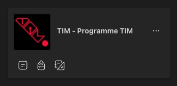

# Cours 3.1

<!--https://squidfunk.github.io/mkdocs-material/reference/admonitions/
✏️note, 📄abstract, ℹ️info, 🔥tip, ✔️success, ❔question, ⚠️warning, ❌failure, ⚡danger, 🐞bug, 🧪example, ❜❜quote
-->

## Aujourd'hui

- [ ] [Annonces à propos du tutorat](#tutorat)
- [ ] [Figma](#figma)
- [ ] [Révision en pair du Bootcamp JS](#Bootcamp JS)
- [ ] [Vue.js](#vuejs)
  - [ ] Introduction
  - [ ] Création d'une app
  - [ ] Interpolation de données
- [ ] [Exercice badge VIP](#exercice-badge-vip)


## Tutorat

Vous vous êtes déjà possiblement trouvés dans cette situation&nbsp;:

**HELP... I NEEP HELP, PLEASE !**

{.w-100}

Bonnne nouvelle, on a une solution pour toi! Le tutorat!
 
### Comment ça marche ?



Voici l'[horaire en ligne](https://www.cmontmorency.qc.ca/etudiants/services-aux-etudiants/aide-a-la-reussite/aide-techniques/centre-aide-integration-multimedia/) disponible sur le site du collège.

De plus, avant chaque séance de tutorat, il y aura une annonce faite par le tuteur pour annoncer sa disponibilité. Cette annonce sera faite dans le groupe Teams « TIM - Programme TIM ».

Il suffit d'envoyer un message privé au tuteur ou à la tutrice ou encore de se présenter au **local C-1602**.

Il n'y a pas de gêne à avoir parce que les tuteurs sont présents, en attente de vos demandes, prêts à vous donner un coup de pouce. Il sont payés pour ça!


## Figma

!!! quote "Figma a envoyé ceci par courriel"

    Nous procédons à d'importantes mises à jour de notre plan *Figma Education Pro*, notamment en ce qui concerne notre processus de vérification.

    ### Utilisateurs de l'enseignement supérieur

    **Nous sommes ravis de déployer notre nouveau produit, *Figma Make*, dans le plan *Education Pro* pour les utilisateurs de l'enseignement supérieur au cours de la semaine prochaine !**

    Afin d'obtenir l'accès à *Figma Make*, ainsi que de maintenir votre accès actuel aux équipes *Education Pro*, nous demandons à tous les utilisateurs de l'enseignement supérieur de revérifier qu'ils sont actuellement étudiants ou membres du personnel (même si vous avez récemment vérifié).

    Rendez-vous sur [figma.com/education/apply](https://www.figma.com/education/apply) pour vous identifier à nouveau. Si vous ne revérifiez pas votre statut avant le 29 septembre, vos équipes Education Pro seront converties en équipes Starter et vous perdrez l'accès aux fonctionnalités du plan Professionnel.

    → [Cliquez ici pour vérifier votre statut aujourd'hui](https://www.figma.com/education/apply)

    → [Cliquez ici pour en savoir plus](https://help.figma.com/hc/fr/articles/360041061214-V%C3%A9rifier-le-statut-%C3%A9ducation)


## Révision Bootcamp JS

Révision en pair, par équipe de 2, sélectionnées par l'enseignante.

[🥾🏃‍♂️🪖🏋️‍♂️Bootcamp JS](./exercices/bootcamp-js.md){ .md-button :target="_blank" } 

➜ [Solution](https://codepen.io/tim-momo/pen/YPydodm)💡


## Vue.js

<!--
 Considérer intégrer des templates genre: https://www.landingfolio.com/library/all/vue pour exercices Vue, peiut-être un TP qui se build à mesure qu'ils apprenent un nouveau concept...
-->


<div class="class-content-link">
  
  <a href="./vue/index.html">Introduction</a>
</div>


## Installation de VUE en CDN

[Suivre ce lien](https://vuejs.org/guide/quick-start.html#using-vue-from-cdn) pour récupérer la balise `<script>` à copier et à ajouter à votre page HTML. Collez-le dans le `<head>` *AVANT* le fichier *script.js* dans lequel vous allez créer votre instance Vue et coder par la suite.

Attention, il faut que ces script [soient chargés en différé](https://vuejs.org/guide/quick-start.html#using-vue-from-cdn), c'est à dire après que tout le HTML soit chargé mais en ordre l'un après l'autre.

```
<script src="..." defer></script>
```

<div class="class-content-link">
  
  <a href="./vue/creation-app.html">Création d'une app</a>
</div>

<div class="class-content-link">
  
  <a href="./vue/interpolation.html">Interpolation des données</a>
</div>


### Exercices

[🧑🏽‍💻 Exercice Vue.js: Badge VIP Festif](./exercices/vue-badge-vip.md){ .md-button :target="_blank" }

## Devoirs

Compléter l'exercice *Vue.js - Badge VIP Festif*


<!--
TUTEUR MOMO-BOT
<button class="btn-open-modal place-bottom-right" data-modal="momobot">🤖</button>

<div class="modal" id="modal-momobot">
  <div class="modal-content">
    <span class="close">&times;</span>
    <iframe src="https://tuteur-ai-web5.netlify.app" width="100%" style="width: 100%; height: 80vh;"></iframe>
  </div>
</div>
-->
