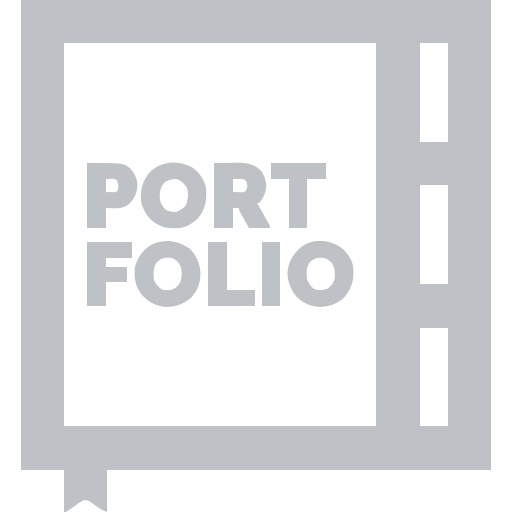
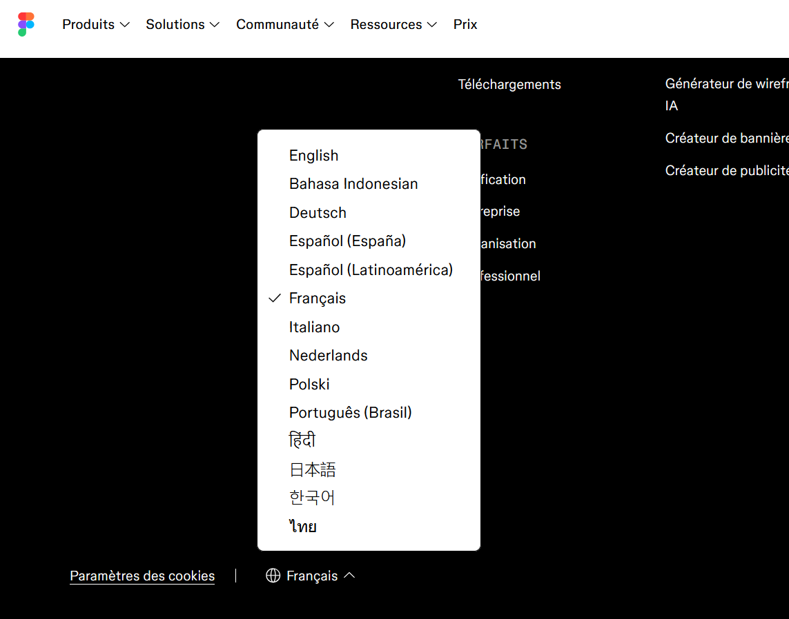

# Cours 3.2

## Projet portfolio

<div class="class-content-link">
  
  <a href="./projets/portfolio/index.html">Projet Portfolio : consignes sommaires</a>
</div>

---

<div class="class-content-link">
  
  <a href="./projets/portfolio/index-textuel.html">Projet Portfolio : consignes complètes (en détail)</a>
</div>

---

<div class="class-content-link">
  
  <a href="./projets/portfolio/index-textuel.html#remise-1-planification-et-design-gr-enric-14-sept-gr-lora-17-sept">Instructions de la <em>Remise 1 : Planification et design</em> (gr. Enric 14 sept. | gr. Lora 17 sept.)</a>
</div>

!!! tip "RAPPEL d'Eric et Lora : un de vos projet doit présenter le *processus de création*."
    Eric et Lora veulent que je vous rappelle qu'un de vos projet doit présenter le *processus de création complet*. Je vous communique ce rappel pour éviter les oublis.


## Aujourd'hui

- [ ] Retour sur Figma (FR, Make > Design, partager le lien avec l'enseignante)
- [ ] Tour d'horizon : les 4 choix technologiques à justifier dans `PLANIFICATION.md`
- [ ] Finaliser vos maquettes Figma (mobile + desktop)
- [ ] Finaliser `PLANIFICATION.md`
- [ ] Journal de bord

!!! warning "Rappel : remise 1 la semaine prochaine"
    Planification et design à remettre : **groupe Enric, 14 septembre** · **groupe Lora, 17 septembre**. Donc aujourd'hui c'est votre dernier bloc de cours pour finaliser `PLANIFICATION.md` et le design de l'interface de votre portfolio avant la remise.


[:material-file-powerpoint-box: Workflow design assisté par IA : diverger, copier, raffiner](assets/documents/cours03b.pptx){ .md-button .md-button--primary :target="_blank" }

## Retour sur Figma

### Changer la langue de Figma en français

#### Sur le site web

1. Aller sur le site Figma (pas l'app) et défiler jusqu'au pied de page et vous verrez la liste déroulnante pour changer la langue. 
2. Sélectionner **Français**.



#### Dans l'application Figma

<div style="max-width: 1280px"><div style="position: relative; padding-bottom: 56.25%; height: 0; overflow: hidden;"><iframe src="https://cmontmorency365-my.sharepoint.com/personal/mariem_ouellet_cmontmorency_qc_ca/_layouts/15/embed.aspx?UniqueId=9bab5590-634f-4255-ac19-bf8f3f8739e1&embed=%7B%22hvm%22%3Atrue%2C%22ust%22%3Atrue%7D&referrer=StreamWebApp&referrerScenario=EmbedDialog.Create" width="1280" height="720" frameborder="0" scrolling="no" allowfullscreen title="changer-langue-figm-app.mp4" style="border:none; position: absolute; top: 0; left: 0; right: 0; bottom: 0; height: 100%; max-width: 100%;"></iframe></div></div>

### Figma Make vers Figma Design

<div style="max-width: 1280px"><div style="position: relative; padding-bottom: 56.25%; height: 0; overflow: hidden;"><iframe src="https://cmontmorency365-my.sharepoint.com/personal/mariem_ouellet_cmontmorency_qc_ca/_layouts/15/embed.aspx?UniqueId=0201aebd-0be6-4321-af38-a65a443c0247&embed=%7B%22hvm%22%3Atrue%2C%22ust%22%3Atrue%7D&referrer=StreamWebApp&referrerScenario=EmbedDialog.Create" width="1280" height="720" frameborder="0" scrolling="no" allowfullscreen title="export-de-figma-make-vers-figma-design.mp4" style="border:none; position: absolute; top: 0; left: 0; right: 0; bottom: 0; height: 100%; max-width: 100%;"></iframe></div></div>

### Partager le lien de votre design Figma avec votre enseignante

1. Inviter votre enseignante à votre projet Figma (marie-michelle.ouellet@cmontmorency.qc.ca) avec le rôle **Can edit** (peut éditer).
2. Copier le lien de partage de votre design Figma et l'ajouter dans le fichier *README.md* de votre dépôt GitHub.

<div style="max-width: 1280px"><div style="position: relative; padding-bottom: 56.25%; height: 0; overflow: hidden;"><iframe src="https://cmontmorency365-my.sharepoint.com/personal/mariem_ouellet_cmontmorency_qc_ca/_layouts/15/embed.aspx?UniqueId=43ce894a-6553-4d12-988d-490b461bb499&embed=%7B%22hvm%22%3Atrue%2C%22ust%22%3Atrue%7D&referrer=StreamWebApp&referrerScenario=EmbedDialog.Create" width="1280" height="720" frameborder="0" scrolling="no" allowfullscreen title="partager-design-avec-prof.mp4" style="border:none; position: absolute; top: 0; left: 0; right: 0; bottom: 0; height: 100%; max-width: 100%;"></iframe></div></div>


## Les 4 choix technologiques de votre portfolio 🎯

Pour chacun des 4 éléments suivants, vous devez choisir une approche et **l'expliquer dans `PLANIFICATION.md`**. Il n'y a pas de mauvais choix, seulement des choix pas justifiés. L'objectif aujourd'hui : que vous ayez une idée claire de comment chaque option fonctionne concrètement, avant de trancher.

---

### 1. Gestion des données 🗂️

Vos projets (titre, description, image, catégorie, lien) doivent être séparés du reste du HTML et chargés de façon asynchrone en JavaScript. 

**Trois familles d'options :**

| Option | Comment ça marche | Bon pour |
|---|---|---|
| **Fichier JSON local** | Un fichier `projets.json` dans votre dépôt, chargé avec `fetch()`. Aucun serveur, aucun compte externe. | La majorité d'entre vous. Simple, fiable, fonctionne directement sur GitHub Pages. |
| **Base de données en ligne (gratuite)** | Vos données vivent ailleurs ([Airtable](https://airtable.com), [Google Sheets](https://sheets.google.com) publié en JSON, [Supabase](https://supabase.com), [Firebase](https://firebase.google.com)), récupérées par une requête `fetch()` vers une URL au lieu d'un fichier local. | Si vous voulez pouvoir modifier vos projets sans toucher au code ni redéployer. |
| **Petit CMS headless gratuit** ([Contentful](https://contentful.com), [Sanity](https://sanity.io)) | Une interface d'édition de contenu en ligne (texte riche, images), qui expose vos données via une API. | Si vous avez déjà utilisé ce genre d'outil ou voulez une vraie interface de gestion de contenu. Un peu plus de configuration au départ. |

---

### 2. Animations 🎬

| Outil | Ce que c'est | À considérer | Ressources pour apprendre |
|---|---|---|---|
| **CSS pur** (transitions, keyframes) | Ce que vous connaissez déjà de Web 2. | Suffisant pour la majorité des interactions simples (survol, apparition). Le plus léger, aucune dépendance. | [MDN CSS Transitions](https://developer.mozilla.org/fr/docs/Web/CSS/CSS_Transitions/Using_CSS_transitions), [MDN CSS Animations](https://developer.mozilla.org/fr/docs/Web/CSS/CSS_Animations/Using_CSS_animations) |
| **Anime.js** | Une librairie JS légère, que vous avez déjà utilisée dans vos cours précédents. | Bon compromis : plus de contrôle que le CSS, syntaxe que vous connaissez déjà. | [Documentation officielle Anime.js](https://animejs.com/documentation) |
| **GSAP** | La librairie professionnelle standard de l'industrie pour l'animation web. | Puissante, mais pas encore enseignée formellement, ce sera fait à l'intégrateur. Si vous la choisissez maintenant, ce sera en autodidacte (documentation officielle, Copilot en soutien), et ce sera à documenter dans votre journal. | [Documentation officielle GSAP](https://gsap.com/docs/v3/) |
| **Scroll-driven animation (CSS natif)** | `animation-timeline: scroll()`, une fonctionnalité CSS récente qui anime un élément en fonction du défilement, sans JS. | Élégant et natif, mais support navigateur encore inégal (à vérifier). Aussi vu plus en profondeur à l'intégrateur. | [Scroll-driven animation: Guide pratique](https://jolicode.com/blog/scroll-driven-animations-en-css-guide-pratique-pour-saffranchir-du-javascript) |

Peu importe l'outil, précisez dans `PLANIFICATION.md` : **quoi** vous voulez animer, **comment**, et **sur quel événement** (scroll, survol, clic).

Documentez votre idée dans `PLANIFICATION.md` avec ce format:

```markdown
- **Élément à animer :** [ex. les cartes de projets]
- **Type d'animation :** [ex. fondu et léger déplacement vers le haut]
- **Déclencheur :** [ex. apparition au défilement, survol, clic]
```


#### Des exemples pour s'inspirer d'animations web

- [Best Parallax Websites](https://www.awwwards.com/websites/parallax/), collection vivante de sites primés, plusieurs variantes de l'effet
- [Best Scroll Websites](https://www.awwwards.com/websites/scrolling/), sites où le défilement est au cœur de l'expérience
- [Collection Parallax : variantes](https://www.awwwards.com/awwwards/collections/parallax/), scroll horizontal, navigation canvas, typographie à glisser
- [20 GSAP ScrollTrigger Examples](https://animation-addons.com/blog/gsap-scrolltrigger-examples/), aperçus en direct avec courte explication de chaque effet
- [Documentation officielle ScrollTrigger](https://gsap.com/docs/v3/Plugins/ScrollTrigger/), référence technique pour plus tard dans la session

---

### 3. Structure de navigation 🧭

Deux grandes familles, selon votre concept :

**One-pager avec pop-up**

Toutes les données sont chargées une seule fois au chargement de la page. Un clic sur un projet ouvre une fenêtre modale (ex. l'élément natif `<dialog>`) qui affiche le détail en plus gros plan, sans changer de page.

**One-pager avec carousel**

Toutes les données sont chargées une seule fois, les projets défilent dans un carrousel (un projet visible à la fois, flèches ou points de navigation). Pas de fenêtre modale, le détail du projet est directement dans la carte qui défile.

**Multipages avec paramètre d'URL**

La page d'accueil liste les projets (cartes), chacune pointant vers une page comme `projet.html?id=cafe-du-coin`. La page projet lit ce paramètre dans l'URL et va chercher, dans le même JSON (ou la même source), les données du projet correspondant pour les afficher.

```js
// Dans projet.html
const params = new URLSearchParams(window.location.search);
const idProjet = params.get('id'); // "cafe-du-coin"
```

!!! note
    C'est ça, « passer le projet en paramètre dans l'URL » : pas besoin de routeur ni de cadriciel, juste la chaîne de requête (`?id=...`) et `URLSearchParams`. On détaille le code plus tard, aujourd'hui c'est pour que vous compreniez le principe avant de choisir.

---

### 4. Hébergement 🌐

| Service | Domaine par défaut | Remarque |
|---|---|---|
| **GitHub Pages** | `votre-nom.github.io/nom-du-depot` | Recommandé, déjà lié à votre dépôt. Aucune configuration serveur. |
| **Netlify** | `nom-du-projet.netlify.app` | Déploiement automatique depuis GitHub, gratuit, offre aussi des fonctions serverless si jamais vous en avez besoin. |
| **Vercel** | `nom-du-projet.vercel.app` | Même principe que Netlify. |
| **Cloudflare Pages** | `nom-du-projet.pages.dev` | Même principe, très rapide. |

**Nom de domaine personnalisé (optionnel)** : au lieu du sous-domaine gratuit, vous pouvez acheter un vrai domaine (quelques dollars par année, chez un registraire comme Namecheap ou OVH) et le pointer vers l'hébergeur choisi. Pas exigé pour ce projet, mais bon à savoir pour votre futur portfolio professionnel.

## Peu importe vos choix, le principe reste le même 🔁

Que vos données viennent d'un fichier JSON ou d'une base de données en ligne, le patron de code est identique. Deux syntaxes possibles, selon celle que vous avez déjà vue, choisissez celle avec laquelle vous êtes le plus à l'aise :

**Avec `async`/`await`**

```js
async function chargerProjets() {
  const reponse = await fetch('projets.json'); // ou une URL d'API
  const projets = await reponse.json();
  return projets;
}
```

**Avec `.then()`**

```js
function chargerProjets() {
  return fetch('projets.json') // ou une URL d'API
    .then(reponse => reponse.json())
    .then(projets => projets);
}
```

Les deux font exactement la même chose : `fetch()` retourne une promesse, `async`/`await` l'écrit de façon plus linéaire, `.then()` l'enchaîne étape par étape. Aucune n'est « meilleure », c'est une question de préférence et de ce que vous avez déjà pratiqué.

Seule l'adresse dans `fetch()` change. On reverra ce mécanisme en détail au bloc 5.1, c'est votre aide-mémoire JS qui couvre déjà `fetch`/async : 

- [Aide-mémoire JavaScript de JF Cartier](https://jfcmontmorency.github.io/aide-memoire/){ :target="_blank" }
- [Promesse JavaScript](https://tim-montmorency.com/timdoc/582-424MO/javascript/promesses-js/){ :target="_blank" }
- [Fetch API](https://tim-montmorency.com/timdoc/582-424MO/javascript/fetch-api/){ :target="_blank" }
- [Structure du JSON et accès aux propriétés](https://developer.mozilla.org/fr/docs/Learn_web_development/Core/Scripting/JSON#structure_du_json){ :target="_blank" }

## Maintenant, à vous 📝

Avec ces 4 choix plus clairs, terminez vos maquettes Figma et complétez `PLANIFICATION.md`. Je circule pour répondre aux questions.

## Devoirs 📓

### Portfolio : remise 1

- [Consignes complètes (en détail)](./projets/portfolio/index-textuel.md)
- [Consignes sommaires visuelle](./projets/portfolio/index.md)

**À remettre pour la semaine prochaine (gr. Enric 14 sept. | gr. Lora 17 sept.) :**

- Github initialisé, privé, avec invitation de l'enseignante comme collaboratrice.
  - Structure de dossiers cohérente et convention de nommage uniforme.
  - Fichiers README.md, PLANIFICATION.md et JOURNAL.md créés.
  - Commits réguliers, fréquents et bien nommés.
- Fichier *PLANIFICATION.md* complété, incluant la justification des choix technologiques, de design et d'animations prévues.
- Design mobile et desktop (Figma Design), adapté à votre style et à votre persona. Vous devrez l'exporter en PDF et le déposer dans le dépôt GitHub.
- *JOURNAL.md*:
  - Journal de bord documentant toutes les étapes du processus, incluant les versions initiales générées par Figma Make ou Stitch, et les modifications apportées.
  - Répondre aux 5 questions du premier bloc du projet.
  - Inscrire toute question posée à l'IA, avec date, prompt, outil utilisé et résultat obtenu.

<span class="important-label">Important</span>: Tout pousser sur votre dépôt GitHub avant la date limite et remettre le lien (URL) du dépôt dans le devoir sur TEAMS.
