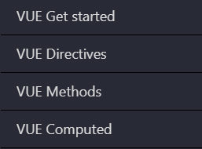

# Cours 5.1
<!-- lun. 22 sept. -->

!!! Tip "Rappel"
    - Portfolio, prochaine remise: Design: *mercredi 24 septembre*.
    - Examen à venir: *lundi le 6 octobre*. Sujets: Javascript l'API Fetch, Vue.js et Css Grid.

## Aujourd'hui

- [ ] Suivi compte Figma
- [ ] Retour Vue.js de lundi dernier:
  - [ ] Condition (v-if, v-else, v-show)
  - [ ] Rendu de listes (v-for sur tableau de données)
- [ ] Vue: formulaire
- [ ] Vue: propriété calculée

## Révision des exercices

- [Collection de films: Classe dynamique](https://tim-montmorency.com/timdoc/582-518MO/exercices/vue-collection-films-1/)
  ➜ [Solution💡](https://codepen.io/tim-momo/pen/vEBYxrr)

- [NBA Part.2 - Méthode unique avec paramètres](./exercices/NBA-methode-avec-parametres.md)
  ➜ [Solution💡](https://codepen.io/tim-momo/pen/ByoeMjL)

## Vue.js

### Condition (v-if, v-else, v-show)

  
  <a href="./vue/condition.html">Vue: Rendu conditionnel avec v-if, v-else et v-show</a>

### Rendu de listes (v-for sur tableau de données)

  
  <a href="./vue/boucle.html">Vue: Rendu de liste avec v-for</a>

#### 2 exercices 🧑🏽‍💻

[🧑🏽‍💻 Collection de films Part.2 - Boucle v-for](./exercices/collection-films-boucle-v-for.md){ .md-button } 

[🧑🏽‍💻 Côte ouest VS côte est](https://tim-montmorency.com/timdoc/582-518MO/exercices/vue-ouest-vs-est/){ .md-button } 

### Formulaires et propriété calculée

  
  <a href="./vue/elements-de-formulaire.html">Vue: Éléments de formulaire (v-model)</a>

  
  <a href="./vue/propriete-calculee.html">Vue: Propriété calculée (computed)</a>

#### Questionnaire Vue.js

[🤔 Questionnaire Vue](https://www.w3schools.com/vue/exercise.php?filename=exercise_intro1){ .md-button }

Répondre à toutes les questions des quatre premières sections: *Get started*, *Directives*, *Methods*, *Computed*

!!! danger "Traduire les consignes"

    Le questionnaire est disponible seulement en *anglais*. Au besoin, veuillez utiliser une extension de traduction par sélection de texte comme [DeepL](https://www.deepl.com/fr/chrome-extension) ou [Google Traduction](https://chromewebstore.google.com/detail/aapbdbdomjkkjkaonfhkkikfgjllcleb?utm_source=item-share-cb) traduire les *consignes* en français. 

    IMPORTANT: NE PAS TRADUIRE TOUTE LA PAGE car l'outil traduit aussi le contenu du script et ça brise le processus.

    

<iframe src="https://cmontmorency365-my.sharepoint.com/personal/mariem_ouellet_cmontmorency_qc_ca/_layouts/15/embed.aspx?UniqueId=d01c1ebc-2528-4578-9e58-eeed20558c6a&embed=%7B%22af%22%3Atrue%2C%22hvm%22%3Atrue%2C%22ust%22%3Atrue%7D&referrer=StreamWebApp&referrerScenario=EmbedDialog.Create" width="640" height="360" frameborder="0" scrolling="no" allowfullscreen title="traduire-consignes-google-translate-ou-deepl.mp4" style="border:none; position: absolute; top: 0; left: 0; right: 0; bottom: 0; height: 100%; max-width: 100%;"></iframe>

#### Exercice 🧑🏽‍💻

[🤼 Luchador](https://tim-montmorency.com/timdoc/582-518MO/exercices/vue-luchador/){ .md-button } 

## Devoirs

- [ ] Pour mercredi: terminer le [design de votre porfolio](./projets/portfolio-remise2.md)
- [ ] Pour lundi prochain: Terminer vos exercices *Vue.js*
  - [🧑🏽‍💻 Collection de films Part.2 - Boucle v-for](./exercices/collection-films-boucle-v-for.md)
  - [🧑🏽‍💻 Côte ouest VS côte est](https://tim-montmorency.com/timdoc/582-518MO/exercices/vue-ouest-vs-est/)
  - [🤔 Questionnaire Vue](https://www.w3schools.com/vue/exercise.php?filename=exercise_intro1) sur W3school
  - [🤼 Luchador](https://tim-montmorency.com/timdoc/582-518MO/exercices/vue-luchador/)