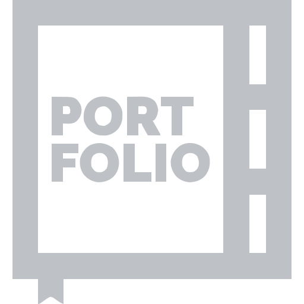
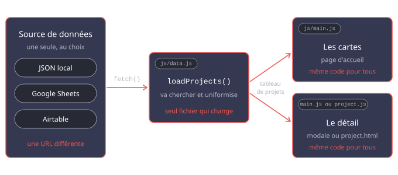

# Cours 6.1
<!-- merc. 30 sept. -->

  
  <a href="./projets/portfolio/index-textuel.html#remise-2-version-beta-vendredi-2-octobre">Instructions de la <em>Remise 2 : bêta</em> 2 oct. avant votre cours.</a>

[:material-clipboard-check: Liste de vérification de la remise bêta](projets/portfolio/remise-beta.md){ .md-button .md-button--primary }

## Aujourd'hui

- [ ] Où en êtes-vous?
- [ ] Du JSON à la carte, retour sur l'exercice partie 2
- [ ] Atelier supervisé : cartes générées + détail d'un projet (avec Alexis, tuteur)
- [ ] Animations pilotées par le défilement, en CSS
- [ ] Les branches Git, en 10 minutes
- [ ] Déployer sur GitHub Pages
- [ ] Remise *bêta* : la liste de vérification
- [ ] Devoir: Journal de bord, bloc 2 et remise version *bêta*

## Rappel et mise à jour

### Projet portfolio

!!! warning "Remise de la version bêta : vendredi 2 octobre"
    C'est notre dernier cours avant la bêta. Aujourd'hui : on termine ensemble le chargement des projets, on met le site en ligne, et on s'assure que tout le monde sait exactement quoi remettre.

    [:material-clipboard-check: Liste de vérification de la remise bêta](projets/portfolio/remise-beta.md){ .md-button .md-button--primary }

### Où en êtes-vous?

Levez la main pour chaque étape atteinte :

1. Ma source de données est prête (JSON, Airtable ou autre) pour au moins un projet.
2. `loadProjects()` fonctionne : `console.log(projects[0].title)` affiche un titre.
3. Mes cartes de projets sont générées en JavaScript.
4. Le détail d'un projet fonctionne (modale ou `project.html`).

Si vous êtes bloqué à l'étape 1 ou 2, c'est **la priorité d'aujourd'hui**, avant tout le reste.

## Du JSON à la carte: retour sur la partie 2 de l'exercice

On révise ensemble la partie 2 de l'exercice, au projecteur : c'est **exactement** le mécanisme de votre portfolio, en miniature. Suivez ma démo et les explications en détail. Si vous avez déjà terminé l'exercice, passez directement à votre portfolio.

[:material-code-json: Exercice « Du JSON à la carte », partie 2](exercices/ex-json-cartes/index.md#partie-2-du-json-a-la-carte){ .md-button .md-button--primary }

1. `fetch()` + `await` : les projets apparaissent dans la console.
2. `forEach` : le titre de chaque projet.
3. Un gabarit littéral : la carte du premier projet dans la page.
4. Toutes les cartes. Puis on ajoute un projet au JSON : une carte de plus, sans toucher au HTML.

### Et dans votre portfolio?

Le même code, réparti dans 3 fichiers :

| Dans l'exercice | Dans votre portfolio | Son travail | Revoir |
|---|---|---|---|
| `loadProjects()` | `js/data.js` | Aller chercher les données et les **retourner**. | [fetch et async](js/recap-js.md#async), [erreurs](js/recap-js.md#erreurs) |
| `createProjectCard(project)` | `js/components/project-card.js` | **Un** projet → le HTML de **sa** carte. | [gabarits littéraux](js/recap-js.md#gabarits) |
| `init()` | `js/main.js` | Attendre `loadProjects()`, puis insérer les cartes dans la page. Sans oublier d'appeler `init();`. | [init()](js/recap-js.md#init), [forEach](js/recap-js.md#foreach), [map et join](js/recap-js.md#map-filter-find) |

Seules deux choses changent par rapport à l'exercice : l'adresse du `fetch()` (votre source) et la structure de la carte (votre design).

[:material-database: Charger les données du portfolio](projets/portfolio/donnees/index.md){ .md-button }
[:material-cards-outline: Afficher les projets](projets/portfolio/donnees/afficher-projets.md){ .md-button }

## Atelier supervisé

Structure d'un cycle Pomodoro : 

- un objectif précis noté dans `JOURNAL.md` au début de chaque sprint,
- sprints de 25 minutes super focus sur l'objectif,
- 2 minutes de bilan puis, 
- mini pause 5 min (ne quittez pas le secteur, resstez pas loin de la classe).

Et on recommence le cycle...

 

**Objectif de l'atelier, dans cet ordre** :

1. Les cartes de projets sont générées à partir de vos données.
2. Le détail d'un projet fonctionne.
3. Le reste de l'intégration HTML/CSS et la version mobile.

!!! success "Le tuteur Alexis est avec nous en support"
    Notre tuteur de 3e année passera 25 minutes avec chaque groupe pendant l'atelier. Préparez votre question : le fichier ouvert, l'erreur de la console sous la main.

Je circule aussi. Un commit par étape terminée.

## Animer au défilement, en CSS

Le CSS moderne peut faire avancer une animation avec le défilement plutôt qu'avec le temps, sans une ligne de JavaScript. Parfait pour faire apparaître vos cartes de projets.

[:material-animation-play: Animations pilotées par le défilement](css/animations-scroll.md){ .md-button .md-button--primary }
[:material-play-circle: Voir la démo](css/demo-animations-scroll.html){ .md-button :target="_blank" }

!!! tip "Pour la bêta : optionnel"
    Une animation au défilement n'est pas exigée pour la bêta. Priorité au contenu qui fonctionne. Si vous avez le temps, une seule animation bien choisie (vos cartes qui apparaissent, par exemple) fait déjà une belle différence.

## Déployer sur GitHub Pages

La bêta se remet avec une branche `beta`, mise en ligne sur GitHub Pages. On fait les étapes ensemble, maintenant, pour régler les problèmes pendant que je suis là. Créez la branche `beta` **seulement quand votre bêta est terminée**, au plus tard vendredi avant le début du cours : elle doit contenir votre version finale.

[:material-source-branch: Les branches Git, en 10 minutes](projets/portfolio/branches-git.md){ .md-button }
[:material-github: Déployer son portfolio sur GitHub Pages](projets/portfolio/deploiement-github-pages.md){ .md-button .md-button--primary }

Avant de partir : l'adresse de votre site fonctionne, et elle est inscrite dans votre `README.md`.

## Remise bêta : la liste de vérification

[:material-clipboard-check: Liste de vérification de la remise bêta](projets/portfolio/remise-beta.md){ .md-button .md-button--primary }

## Journal de bord, bloc 2

C'est la fin du bloc 2 : dans `documentation/JOURNAL.md`, répondez aux 5 questions (elles sont dans la liste de vérification). Inscrivez aussi chaque prompt IA délibéré depuis la remise 1.

Commit final avant de partir.

## Devoir

### Portfolio: remise bêta (vend. 2 octobre)

Compléter tous les éléments de la [liste de vérification de la remise bêta](projets/portfolio/remise-beta.md), en particulier :

- [ ] les cartes de projets générées à partir de vos données, et le détail d'un projet;
- [ ] la remise : *push* sur `main`, branche `beta`, dépôt **public** et GitHub Pages publié à partir de `beta`, **avant le début du cours vendredi** ([procédure](projets/portfolio/deploiement-github-pages.md));
- [ ] les 5 questions du bloc 2 dans `JOURNAL.md`.

[:material-clipboard-check: Liste de vérification de la remise bêta](projets/portfolio/remise-beta.md){ .md-button .md-button--primary }

!!! info "Besoin d'aide d'ici vendredi?"
    Voir les périodes de tutorat en haut de cette page.
