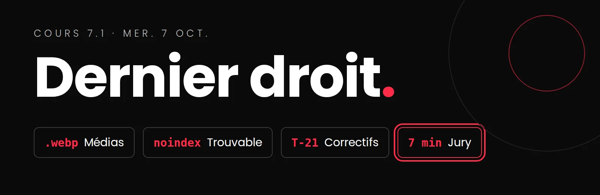

# Cours 7.1
<!-- mer. 7 oct. -->

{.w-100}

<div class="grid" markdown>

<div class="card" markdown>
:material-image-size-select-large: __Optimiser les médias__

---

Mesurer, puis 4 gestes pour alléger votre site.

[:octicons-arrow-right-24: La page](qa/optimisation-medias.md){ .stretched-link }
</div>

<div class="card" markdown>
:material-clipboard-check-multiple: __Vos correctifs QA__

---

Corriger, valider en ligne, documenter...

[:octicons-arrow-right-24: Étape 5 des consignes](projets/portfolio/qa-portfolio.md){ .stretched-link }
</div>

<div class="card" markdown>
:material-presentation-play: __Le jury__

---

Environ 7 minutes, puis les questions. Copilot fermé.

[:octicons-arrow-right-24: Les consignes](projets/portfolio/presentation-jury.md){ .stretched-link }
</div>

<div class="card" markdown>
:material-clipboard-text-clock-outline: __Autoévaluation et journal__

---

Une preuve pour chaque indicateur, et le dernier bloc du journal.

[:octicons-arrow-right-24: Dans cette page](#autoevaluation){ .stretched-link }
</div>

</div>

## Aujourd'hui

- [ ] Où en êtes-vous?
- [ ] Optimiser les médias
- [ ] Rendre votre portfolio trouvable par les moteurs de recherche (retirer `noindex` de `main`)
- [ ] Le jury (présentations) : à quoi s'attendre
- [ ] Atelier
  - [ ] Vos correctifs QA
  - [ ] Mon code, je le comprends et je l'assume : répétition un à un avant le jury
- [ ] Répétition de la présentation en duo avec un camarade de classe
- [ ] Autoévaluation : on la commence ensemble (10 min)
- [ ] Devoir : autoévaluation, journal, remise finale

## Rappel et mise à jour

### Projet portfolio

!!! danger "Remise finale et jury : gr. Lora **demain**, jeu. 8 oct. · gr. Enric jeu. 15 oct."
    Pour le gr. Lora, c'est le **dernier cours** avant le jury. Priorité aux bloquants et aux majeurs de votre fichier QA.

### Tutorat

=== "Tutorat supplém. pour Web 5"

    | 📅 Date | 👤 Tuteur | ⏱️ Durée | 📍 Où | 🎯 Avant |
    |---|---|---|---|---|
    | Mar. 13 oct., 19h10 à 20h | Alexis | 50min | En ligne Teams, équipe *Web5* : [canal « Tutorat Web5 »](https://teams.microsoft.com/l/channel/19%3A9d3216c048864138a5c339b1fab4744f%40thread.tacv2/Tutorat%20d%C3%A9di%C3%A9%20Web5?groupId=f3a480ff-8bfb-44d3-9785-1b4c7f366701&tenantId=ffa995c7-10de-4ec8-95db-28ed0576455d) | Remise finale gr. Enric (15 oct.) |

=== "Tutorat hebdomadaire récurrent"

    | 📅 Date | 👤 Tuteur | ⏱️ Durée | 📍 Où |
    |---|---|---|---|
    | Chaque mardi, 12h30 à 14h10 (8 sept. au 8 déc.) | Alexis Guilbault | 1h40 | 🏫 En personne au Centre d'aide C-1602 |
    | Chaque mercredi, 20h à 21h15 (9 sept. au 9 déc.) | Olivier Laliberté | 1h15 | 💻 En ligne sur Teams : [canal Tutorat de l'équipe TIM-Programme TIM](https://teams.microsoft.com/l/channel/19%3A68fb96c731e7460ba846ff328a9fe109%40thread.tacv2/Tutorat?groupId=924057af-2255-4c2a-8ce7-f0a1809ad4a4&tenantId=ffa995c7-10de-4ec8-95db-28ed0576455d) |

Ce soir, mercredi : la période régulière d'Olivier (20h) est encore là pour le gr. Lora qui présente demain.

## Où en êtes-vous?

Levez la main pour chaque étape atteinte :

1. Mes 3 tests sont faits (vous + 2 camarades), dans mon fichier QA.
2. GitHub Pages publie maintenant la branche **`main`**.
3. Mes écarts **bloquants** sont corrigés et validés en ligne.
4. Mes écarts **majeurs** sont corrigés et validés en ligne.
5. Mon autoévaluation est remplie, avec preuve pour chaque indicateur (onglet du fichier QA).

Bloqué à l'étape 1 ou 2? C'est la priorité, avant tout le reste. [Étape 4 des consignes QA : passer sur `main`](projets/portfolio/qa-portfolio.md#etape-4-passer-github-pages-sur-main)

## Optimiser les médias

C'est un indicateur de votre grille (critère 1), et souvent le gain le plus facile : les images pèsent presque toujours plus lourd que tout le reste du site. On mesure dans l'onglet Réseau, puis 4 gestes : le bon format, les bonnes dimensions, `loading="lazy"`, et `width`/`height`.

[:material-image-size-select-large: Optimiser les médias](qa/optimisation-medias.md){ .md-button .md-button--primary }

Notez le poids **avant** et **après** dans l'onglet Correctifs de votre fichier QA : c'est votre preuve.

## Rendre votre portfolio trouvable

Pendant les tests, votre bêta était cachée aux moteurs de recherche. Votre portfolio final, lui, doit pouvoir être **trouvé par un employeur**.

Sur `main`, dans VS Code, **retirez** cette ligne de chaque fichier HTML (si elle y est) :

```html
<meta name="robots" content="noindex, nofollow">
```

*Commit*, *push*. Vérification : sur votre site en ligne, Ctrl + U, la ligne n'y est plus.

!!! info "Et la branche `beta`?"
    Ne touchez à rien : elle n'est plus publiée. Elle reste dans votre dépôt comme trace de la version testée.

## Le jury : à quoi s'attendre

Environ 7 minutes de présentation, puis les questions. Le cœur : votre **page de projet qui montre le processus créatif**. Et préparez-vous à ouvrir votre code et à le modifier en direct, Copilot fermé.

[:material-presentation-play: Présentation devant le jury : les consignes](projets/portfolio/presentation-jury.md){ .md-button .md-button--primary }

## Atelier : vos correctifs

Votre fichier QA est votre liste de travail : **bloquants**, puis **majeurs**, puis mineurs si le temps le permet. Pour chaque correctif :

- [ ] un *commit* dont le message commence par l'ID du test (`T-21 : ...`);
- [ ] le scénario refait **en ligne**, sur `main`;
- [ ] la ligne remplie dans l'onglet **Correctifs** (validé, date, comment).

D'abord: [Consignes QA : étape 4 : passer GitHub Pages sur main](projets/portfolio/qa-portfolio.md#etape-4-passer-github-pages-sur-main) et ensuite :

[:material-clipboard-check-multiple: Consignes QA : étape 5, corriger et valider](projets/portfolio/qa-portfolio.md#etape-5-corriger-et-valider){ .md-button }

## Mon code, je le comprends et je l'assume

Pendant l'atelier, je passe vous voir **un à un**, environ 3 minutes chacun. C'est une **répétition** des questions du jury, sans note : le but est de découvrir **aujourd'hui** ce que vous maîtrisez moins, pendant qu'il reste du temps pour le corriger.

**Comment ça se passe**

- Vous êtes aux commandes du clavier. Copilot est fermé.
- Je vous pose 2 ou 3 questions, du même type que celles du jury.
- On termine par **une** chose à retravailler avant le jury, s'il y a lieu. Prenez-la en note.

**Le type de questions**

| Je vous demande de... | Ce que ça vérifie |
|---|---|
| **Montrer** | Vous savez où se trouve chaque partie de votre code. |
| **Expliquer** | Vous pouvez dire, en vos mots, ce que fait un bout de code et pourquoi il est là. |
| **Modifier en direct** | Vous pouvez changer votre code vous-même, sans aide. |
| **Prévoir** | Vous savez ce qui arrive quand quelque chose ne va pas comme prévu. |

Le gr. Lora passe en premier : votre jury est demain.

[:material-account-voice: Les questions du jury](projets/portfolio/presentation-jury.md#questions-jury){ .md-button }

## Répétition en duo

Vous avez fini vos correctifs? Formez un duo et présentez-vous mutuellement votre portfolio, **chronométré** :

1. Présentation complète, environ 7 minutes, sans interruption.
2. Votre partenaire joue le jury : une question de justification, puis une demande de modification en direct.
3. On inverse.

## Autoévaluation et journal de bord { #autoevaluation }

Deux éléments de la remise finale qui tombent facilement entre deux craques. On **commence l'autoévaluation ensemble, 10 minutes à la fin du cours**; vous la terminez à la maison, avec le journal.

### L'autoévaluation, dans votre fichier QA

Onglet *Autoévaluation* de votre `qa-prenom-nom.xlsx` qui [se trouve ici](https://cmontmorency365-my.sharepoint.com/:f:/r/personal/mariem_ouellet_cmontmorency_qc_ca/Documents/01_cours/Cours%20Web%205%20-%20Projet%20Web/04_projets/01-projet-portfolio/qa-2026?d=w4a3f50b34edd4cb1a4014fafe79b1ea2&csf=1&web=1&e=HML1yB). Pour chacun des 14 indicateurs de la [grille critériée](projets/portfolio/index-textuel.md#criteres-devaluation) :

1. choisissez **votre niveau** (Insuffisant, Acceptable, Très bien, Excellent);
2. écrivez **la preuve** qui le justifie : un fichier (ex. `PLANIFICATION.md`), un ID de test (ex. `T-21`), un commit.

| Pas utile | Utile |
|---|---|
| « Excellent, mon site est accessible. » | « Très bien : WAVE sans erreur, contraste corrigé (T-21), mais le focus de la modale reste à améliorer. » |

!!! tip "La meilleure préparation au jury"
    Les questions du jury portent sur ces mêmes indicateurs. Si vous savez prouver votre niveau par écrit, vous saurez le justifier à voix haute. Un niveau sans preuve, ce n'est qu'une opinion.

### Le journal de bord, dernier bloc

Dans `documentation/JOURNAL.md`, un titre pour ce bloc, par exemple `## Bloc 3 : correctifs et finalisation`, puis les **5 questions** :

1. Qu'est-ce que j'ai accompli depuis le dernier bloc? (Vous pouvez faire référence à vos *commits*.)
2. Quelle a été ma principale difficulté et comment je l'ai surmontée?
3. Qu'est-ce que j'ai appris que je ne savais pas avant?
4. Si j'avais une semaine de plus, qu'est-ce que je changerais? *(remplace « Quelle est ma prochaine étape concrète? » pour ce dernier bloc)*
5. Est-ce que j'ai utilisé l'IA? Si oui, pour quoi et qu'est-ce que ça m'a appris?

N'oubliez pas : **chaque question posée à l'IA depuis la bêta**, avec la date, le prompt, l'outil et le résultat. [Comment citer l'IA](projets/portfolio/index-textuel.md#utilisation-de-lia)

## Devoir

### Portfolio : remise finale (gr. Lora jeu. 8 oct. · gr. Enric jeu. 15 oct.)

- [ ] GitHub Pages publie `main`, sans la ligne `noindex`, et l'adresse est dans votre `README.md`.
- [ ] Vos correctifs (au moins les bloquants et les majeurs) sont validés dans l'onglet **Correctifs**.
- [ ] <span class="label-important">Important</span> : L'onglet **Autoévaluation** de votre fichier QA est rempli, avec une preuve pour chaque indicateur.
- [ ] Le lien vers votre fichier `qa-prenom-nom.xlsx` est dans votre `README.md`.
- [ ] `JOURNAL.md` : les 5 questions du dernier bloc, et chaque question posée à l'IA depuis la bêta.
- [ ] Votre présentation est prête et chronométrée : [consignes du jury](projets/portfolio/presentation-jury.md).

!!! warning "Autoévaluation à ne pas oublier"
    L'autoévaluation est *obligatoire* pour que votre remise finale soit acceptée. C'est la preuve que vous avez compris les critères de qualité et que vous savez où vous en êtes. Vous devez le remplir via l'onglet *Autoévaluation* de votre `qa-prenom-nom.xlsx` qui [se trouve ici](https://cmontmorency365-my.sharepoint.com/:f:/r/personal/mariem_ouellet_cmontmorency_qc_ca/Documents/01_cours/Cours%20Web%205%20-%20Projet%20Web/04_projets/01-projet-portfolio/qa-2026?d=w4a3f50b34edd4cb1a4014fafe79b1ea2&csf=1&web=1&e=HML1yB). 
