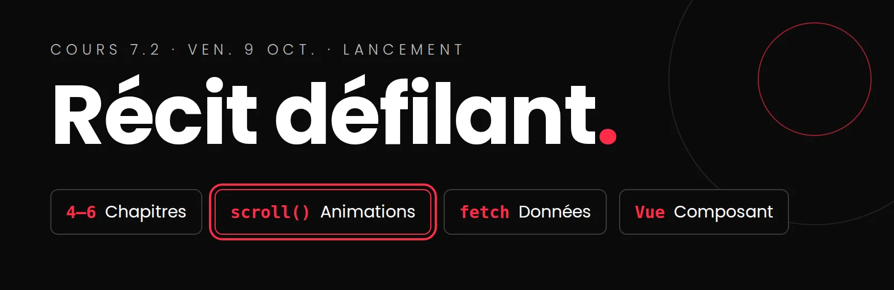

# Cours 7.2
<!-- ven. 9 oct. -->

{.w-100}

:material-book-open-page-variant-outline: __Les consignes__

---

Le projet au complet : produit, bornes, évaluation, calendrier.

[:octicons-arrow-right-24: Consignes complètes](projets/integrateur/index-textuel.md){ .stretched-link }

:material-file-document-edit-outline: __Le cahier de charges__

---

Le gabarit à remplir d'ici le ven. 23 oct.

[:octicons-arrow-right-24: Gabarit et consignes](projets/integrateur/cahier-de-charges.md){ .stretched-link }

## Aujourd'hui

- [ ] Lancement du projet intégrateur : le récit défilant
- [ ] Former les équipes de 2
- [ ] Choisir un thème
- [ ] Commencer le cahier de charges, en équipe
- [ ] Devoir : vos deux semaines, jusqu'au ven. 23 oct.

## Rappel et mise à jour

### Projet portfolio

!!! danger "Gr. Enric : remise finale et jury jeu. 15 oct."
    Votre priorité de la semaine prochaine reste le portfolio. Le cahier de charges de l'intégrateur est dû le **ven. 23 oct.** : planifiez votre temps en conséquence.

### Tutorat

=== "Tutorat supplém. pour Web 5"

    | 📅 Date | 👤 Tuteur | ⏱️ Durée | 📍 Où | 🎯 Avant |
    |---|---|---|---|---|
    | Mar. 13 oct., 19h10 à 20h | Alexis | 50min | En ligne Teams, équipe *Web5* : [canal « Tutorat Web5 »](https://teams.microsoft.com/l/channel/19%3A9d3216c048864138a5c339b1fab4744f%40thread.tacv2/Tutorat%20d%C3%A9di%C3%A9%20Web5?groupId=f3a480ff-8bfb-44d3-9785-1b4c7f366701&tenantId=ffa995c7-10de-4ec8-95db-28ed0576455d) | Remise finale gr. Enric (15 oct.) |

=== "Tutorat hebdomadaire récurrent"

    | 📅 Date | 👤 Tuteur | ⏱️ Durée | 📍 Où |
    |---|---|---|---|
    | Chaque mardi, 12h30 à 14h10 (8 sept. au 8 déc.) | Alexis Guilbault | 1h40 | 🏫 En personne au Centre d'aide C-1602 |
    | Chaque mercredi, 20h à 21h15 (9 sept. au 9 déc.) | Olivier Laliberté | 1h15 | 💻 En ligne sur Teams : [canal Tutorat de l'équipe TIM-Programme TIM](https://teams.microsoft.com/l/channel/19%3A68fb96c731e7460ba846ff328a9fe109%40thread.tacv2/Tutorat?groupId=924057af-2255-4c2a-8ce7-f0a1809ad4a4&tenantId=ffa995c7-10de-4ec8-95db-28ed0576455d) |

## Le lancement

Ce qu'on construit, comment on est évalué, et le calendrier jusqu'au 11 décembre.

[:material-presentation-play: Présentation de lancement (PowerPoint)](assets/documents/Web5_integrateur-lancement.pptx){ .md-button .md-button--primary }

## Former les équipes

- **Équipes de 2.** Choisissez quelqu'un avec qui vous pouvez travailler **à distance** pendant deux semaines : échangez vos coordonnées (Teams, téléphone) avant de partir.
- Une compétence complémentaire aide : l'un plus à l'aise en design, l'autre en code, par exemple. Mais **chacun code ses propres chapitres**.
- Inscrivez votre équipe : <!-- MM : coller ici le lien du fichier d'inscription des équipes --> [liste des équipes](#){ :target="_blank" }

## Choisir un thème

En équipe, 20 minutes :

1. Chacun propose **3 idées** de récit : une cause, un mini-documentaire, une vitrine, un explicatif.
2. Pour chaque idée, vérifiez : **ça se raconte en 4 à 6 chapitres?** Il y a des **images** à trouver ou à produire? Une **donnée** à aller chercher pour la dataviz?
3. Gardez **une** idée, et résumez-la en une phrase.

Validez votre thème avec moi avant de partir.

## Commencer le cahier de charges

Avant la fin du cours, chaque équipe a :

- [ ] créé son **dépôt GitHub**, avec la coéquipière ou le coéquipier et `marie-michelle-ouellet` comme collaborateurs;
- [ ] copié le **gabarit** dans `documentation/CAHIER-DE-CHARGES.md`;
- [ ] rempli la **section 1** (le concept) et commencé le **découpage en chapitres**.

[:material-file-document-edit-outline: Le cahier de charges : gabarit et consignes](projets/integrateur/cahier-de-charges.md){ .md-button }

## Devoir : vos deux semaines

On se revoit le **ven. 23 oct.** D'ici là, vous travaillez en équipe, à votre rythme. Un ordre qui fonctionne :

1. **Le concept et les chapitres** : ce que chaque chapitre raconte.
2. **Le storyboard dans Figma** : un cadre par chapitre, annoté (ce qui bouge, ce qui le déclenche, la technique).
3. **Les animations** de chaque chapitre, dans les bornes.
4. **La matrice de responsabilités** : qui possède quoi. Ensemble.
5. **Votre média animable** : chacun choisit son format (calques, spritesheet ou SVG).
6. **L'API de la dataviz** : trouvée et **testée** dans la console.
7. **Votre journal** : chacun le sien, `documentation/JOURNAL-prenom.md`, avec les 5 questions.

!!! info "Pas encore de code d'animation"
    GSAP, le CSS au défilement et Vue arrivent en classe à partir du 28 oct. D'ici là, c'est la **conception** : bien planifier maintenant, c'est coder plus vite ensuite.

!!! warning "Remise 1 : début du cours du ven. 23 oct."
    Cahier de charges complet dans le dépôt, storyboard dans Figma, un journal par personne. [Liste de vérification de la remise 1](projets/integrateur/index-textuel.md#remise-1)
