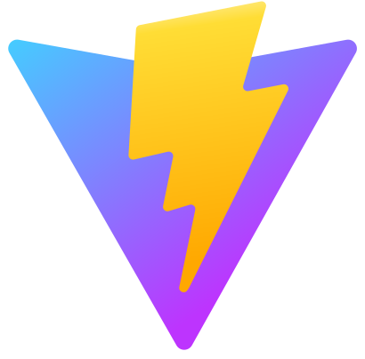

# Cours 8.1
<!-- 20 octobre-->

<!--

Node.js et NPM : gestionnaire de paquets JavaScript

VITE : outil de développement front-end qui inclut serveur de développement et compilateur

IMPORTANT DE VOIR VITE CE COURS_CI car j'exige le setup du projet Vite pour le 22 octobre.

-->

!!! info "Projet application web créative"
    Prochaine remise mercredi le 22 octobre pour 15% :

    - Rédaction du cahier de charges
    - Création des maquettes Figma
    - Planification du projet KANBAN dans Trello
    - Répertoire git et README.md
    - ~~Setup du projet de base (Vite + Vue + dépendances)~~
<!--
## Annonces

- L'examen n'a pas été encore tout évalué à ce jour, ça devrait sortir dans les prochains jours.

!!! question "Pour les échecs - possibilité de remonter un peu"
    Si vous avez échoué l'examen (moins de 60%), il y aura possibilité de faire un exercice de rattrapage. C'est facultatif mais je vous le permets. Suite à quoi, dépendemment de votre compréhension, vous pourrez regagner jusqu'à 20% de la note de l'examen (donc équvaut à 5% de la session). Vous ne pourrez regagner que pour un maximum de 60% à l'examen. Donc si vous aviez 55%, cet exercice ne peut pas vous remonter à 75%.
-->
  
## Projet portfolio (25%)

  
  <a href="./projets/portfolio.html">Projet Portfolio - Infos générales</a>

  
  <a href="./projets/portfolio-instructions-fecth-vue.html">Instructions spécifiques aux données <strong>json</strong> du fichier <strong>projects.json</strong> et celles pour la partie <strong>Vue</strong>.</a>

## Projet application web créative (50%)

  
  <a href="./projets/appweb-creative/syllabus_guide_etudiant.html">Projet intégrateur: Web app créative - Infos générales</a>

  
  <a href="./projets/appweb-creative/cahier_charges_memoires.html">Cahier de charge - Option A - <strong>Mémoires interactives</strong></a>

  
  <a href="./projets/appweb-creative/cahier_charges_chemin.html">Cahier de charge - Option B - <strong>Trace ton chemin</strong></a>

  
  <a href="./projets/appweb-creative/ui.html">Design de votre interface utilisateur UI</a>

## Aujourd'hui

- [ ] Portfolio: instructions pour fetch et Vue
- [ ] Web app créative
  - Rappel et instructions UI
  - SCRUM d'équipe
  - Contrat d'équipe
- [ ] Git
- [ ] NPM
- [ ] Vite

## Portfolio

  
  <a href="./projets/portfolio-instructions-fecth-vue.html">Instructions spécifiques aux données <strong>json</strong> du fichier <strong>projects.json</strong> et celles pour la partie <strong>Vue</strong>.</a>

## Web app créative

Des *questions* concernant la remise de mercredi (Planification et design) ?

Concernant le design de l'interface utilisateur:

  
  <a href="./projets/appweb-creative/ui.html">Design de votre interface utilisateur UI</a>

## SCRUM

[Mêlée d'équipe](https://tim-montmorency.com/timdoc/582-518MO/gestion-de-projet/melee-scrum/#requis) (SCRUM) de 10 min.

- Rencontre de 10 minutes pour la mêlée (SCRUM) hebdomadaire.
- N'oubliez pas d'ajouter votre résumé de SCRUM dans votre équipe Teams.
  -🌹 Mes accomplissements
  -🚀 Prochaine semaine
  -🌵 Problèmes
  -🎉 Ce qui me motive

### Contrat d'équipe

Le contrat permet aux membres de chaque équipe de s’entendre sur un *but commun* et de rendre explicites les *règles* qu’elles et ils désirent voir respecter dans leur équipe.

[Contrat](./projets/appweb-creative/contrat-equipe.md)

## Git

- [Git - Introduction](https://tim-montmorency.com/timdoc/582-518MO/git/intro/)
- [GitHub](https://tim-montmorency.com/timdoc/582-518MO/git/github/)
- [GitHub Desktop](https://tim-montmorency.com/timdoc/582-518MO/git/github-desktop/)
- [Collaborer avec git](https://tim-montmorency.com/timdoc/582-518MO/git/collaboration/)
- [gitignore](https://tim-montmorency.com/timdoc/582-518MO/git/gitignore/)
- [Pull Request](https://tim-montmorency.com/timdoc/582-518MO/git/pull-request/)
- Pour votre projet, lorsque vous ferez un clone du git en local, faites le dans `C:/Documents/GitHub` ou sur votre disque dur/clé USB externe et non pas sur votre OneDrive (puisque on ne veut avori à synchroniser les nodes_modules du NPM, il contiendra plus d'un millier de fichiers qui sont inutiles à trainer et synchronier sur le Drive).

## NPM

  
  <a href="https://tim-montmorency.com/timdoc/582-518MO/javascript/npm/">Node Pacakge Manager (NPM)</a>

## Vite

  
  <a href="
  https://tim-montmorency.com/timdoc/582-518MO/javascript/vite/">Vite !</a>

  
  <a href="./vue/creation-projet-CLI.html">Création d'un projet Vue via CLI (Command Line Interface)</a>

<!-- 

  
  <a href="./projets/appweb-creative/quick_start.html">Web app créative: quickstart</a>

 

📦 Étape 1: Créer le Projet (Chef de projet uniquement)¶
1.1 Initialiser le projet Vite + Vue¶

# Créer le projet
npm create vite@latest mon-projet -- --template vue

# Entrer dans le dossier
cd mon-projet

# Installer les dépendances de base
npm install

# Tester que ça fonctionne
npm run dev
Ouvrez http://localhost:5173 - Vous devriez voir la page de démo Vue.
-->

## Devoirs

- [ ] Complétez la phase de du projet *Web app créative* d'ici mercredi le 22 octobre.
- [ ] Si non terminé en classe, le [*contrat d'équipe*](./projets/appweb-creative/contrat-equipe.html) devra être terminé pour mercredi et envoyé dans votre canal Teams.
- [ ] Complétez votre *portfolio* d'ici mercredi le 29 octobre.