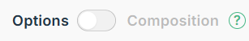

# Cours 11.2 PHASE INTERACTIVITÉ

Vendredi 14 novembre

<!-- 
- considérer repousser tout d'un cours (donc une demi semaine) car celui-ci est trop intense. 
- les remises y compris.
- ce qui ferait en sorte qu'il ny aurait pas de présentation à la fin mais ils gagneraient un cours supp pour travailler et la remise serait faite disons 3 jours après le cours 15.2
-->

## Rappel impotant! *Vue 3*, version *Option API*

Vous codez avec la version *Vue 3* et surtout vous rappeler qu'on utilise présentement l'*Options API*.

Dans le cadre de ce cours, n'oubliez pas de toujours consulter la docmentation avec l'<em>API Options</em> 

N'allez surtout pas prendre des code n'importe où sans vous rappeler de cette importante information.

## Retour sur routes

<!-- 
Donner du data bidon déjà formatté pour qu'ils puissent tester leur route et l'affichage
mais comment récupérer les données complètes autre que le id passé en paramètre d'URL  si la données est au niveau du parent? il semble qu'on va utiliser Pinia sotryStore 

import { useStoryStore } from '../stores/story'

computed (propriété calculée)
chapter() { return this.$pinia.state.value.story.storyData[this.id] ?? this.$pinia.state.value.story.storyData[this.$pinia.state.value.story.currentChapterId] },

utilisation:
{{ chapter.title }}

{{ chapter.text }}

-----

data bidon à donner (possiblement)

 data() {
    return {
        chapterData : {
        "ch-1": {
            "id": "ch-1",
            "title": "Le Hall des Aiguilles",
            "text": "Au Musée de chemins, une grande horloge bat doucement. Un carnet porte votre nom.",
            "image": "/images/bg-hall.jpg",,
            "choices": null,
            "nextChapter": "ch-2"
        },
        "ch-2": {
            "id": "ch-2",
            "title": "La Carte Vivante",
            "text": "Une carte s'illumine. Un Horloger Fantôme vous propose un pacte : « du temps, contre un souvenir ».",
            "image": "/images/bg-map.jpg",
            "choices": [
            {
                "id": "accept",
                "text": "Accepter le pacte",
                "consequence": "Le temps accélère autour de vous.",
                "nextChapter": "ch-3a",
            },
            {
                "id": "refuse",
                "text": "Refuser et observer",
                "consequence": "Vous gardez votre mémoire intacte.",
                "nextChapter": "ch-3b",
            }
            ]
        }
    }
}

-->

## Cours: Pinia

*Pinia* une bibliothèque (`store`) de gestion d'état pour les application Vue.js

  
  <a href="./vue/pinia.html"><em>Pinia</em>: bibliothèque (<code>store</code>)</a>

## Cours: Les méthodes de l'objet Array en JavaScript

[Liste des méthodes de l'objet Array sur w3School](https://www.w3schools.com/js/js_array_reference.asp)

Exemples:

- `length`
- `push()`
- `sort()`
- `slice()`
- `splice()`
- `findIndex()`
- `reduce()`
- `find()`
- `shift()`
- `pop()`
- `concat()`

## Travail en classe Mise en place de store *Pinia*

### *Mémoire interactive*

#### Création des stores Pinia

- `useMuseumStore.js` (structure de base)
- `useMemoryStore.js` (structure de base)

#### Développement des composants clés

- `RoomCard.vue` (carte de salle)
- `MemoryCard.vue` (carte de mémoire)
- `MemoryList.vue` (liste ou grille des mémoires)

### *Trace ton chemin*

#### Création des stores Pinia

- `useStoryStore.js` (chapitres, navigation)
- `usePlayerStore.js` (état du joueur)

