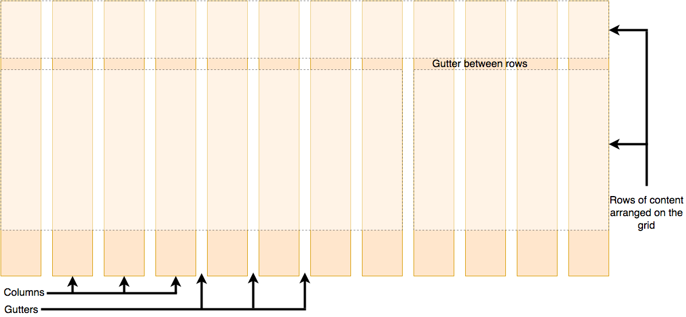
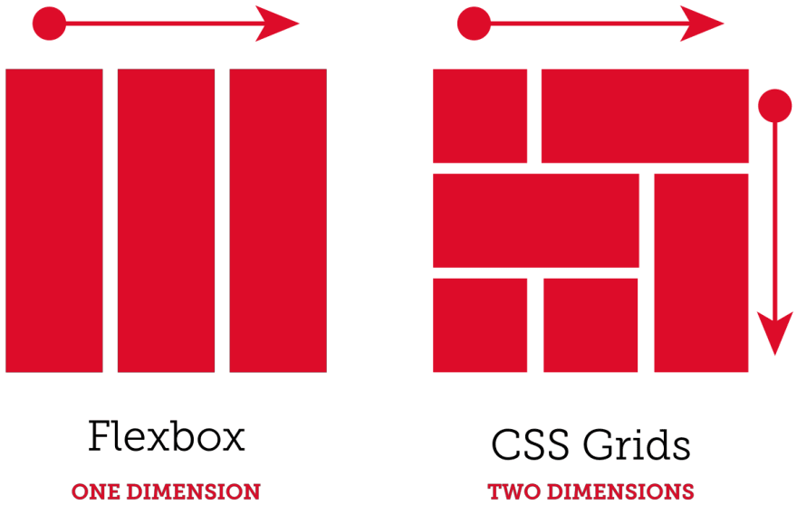

# CSS Grid - Intro

Tout comme [flexbox](https://tim-montmorency.com/timdoc/582-211/css/flexbox/), la propriété `display: grid;`, ou sa variante `display: inline-grid;`, influence l'affichage de ses enfants. Cependant, contrairement à flexbox qui les positionne en fonction d'une seule dimension (x *ou* y), **grid** permet de les positionner sur une grille quadrillée en deux dimensions
(x *&* y).

> « CSS *Grid* Layout » (*Trames* avec les CSS) est donc un système de mise en page *bidimensionnel*. Il vous permet de disposer les contenus en *lignes* et en *colonnes*; il possède de nombreuses fonctionnalités simplifiant la construction de mises en page complexes.
>
> 
> <small>- Source: <cite>[MDN Web Docs](https://developer.mozilla.org/fr/docs/Learn_web_development/Core/CSS_layout/Grids)</cite></small>

> « 1- Pour commencer, vous devez définir un élément conteneur comme une
> grille avec `display: grid`,
>
> 2- définir la taille des colonnes et des lignes avec `grid-template-columns` et `grid-template-rows`,
>
> 3- puis placer ses éléments enfants dans la grille avec `grid-column` et `grid-row`.
>
> Comme dans le cas de flexbox, l'*ordre* source des éléments de la grille *n'a pas d'importance*. Votre CSS peut les placer dans n'importe quel ordre, ce qui facilite grandement la réorganisation de votre grille à l'aide de [requêtes média (@media queries)](https://tim-montmorency.com/timdoc/582-211/css/media-queries/). Imaginez que vous définissiez la disposition de votre page entière, puis que vous la réorganisiez complètement pour l'adapter à une largeur d'écran différente, le tout avec seulement quelques lignes de CSS. La grille est l'un des modules CSS les plus puissants jamais introduits. »
> <small>Source: <cite>https://css-tricks.com</cite></small>