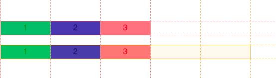

# Unités spécifiques à `grid` (suite)

## Unité `repeat()`

Spécifier individuellement chaque colonne ou rangée n'est pas un
problème lorsqu'une grille est de dimension **modeste**. Cependant,
lorsqu'une grille **grossit**, il peut devenir rapidement **lassant** et
**mêlant** d'écrire la dimension de chaque colonne ou rangée, surtout si
celle-ci est **identique**.

**Exemple verbeux :**

``` css
grid-template-columns: 1fr 1fr 1fr 1fr 1fr 1fr;
```

### `auto-fit` & `auto-fill`

Afin de pouvoir réaliser une **grille responsive** sans avoir à écrire une multitude de [media queries](https://tim-montmorency.com/timdoc/582-211/css/media-queries/), il est possible d'utiliser les valeurs `auto-fit` et `auto-fill` à la place d'un nombre spécifique de colonnes dans un `repeat()`.

**Exemple avec `auto-fit` :**

``` css
grid-template-columns: repeat(auto-fit, 150px);
```

Permet d'afficher **autant d'éléments sur une rangée qu'il y a d'espace
disponible**.


<div style="max-width: 640px"><div style="position: relative; padding-bottom: 56.25%; height: 0; overflow: hidden;"><iframe src="https://cmontmorency365-my.sharepoint.com/personal/mariem_ouellet_cmontmorency_qc_ca/_layouts/15/embed.aspx?UniqueId=fac2cb65-08b1-4fd6-84be-daf1c5a2f8a1&embed=%7B%22af%22%3Atrue%2C%22hvm%22%3Atrue%2C%22ust%22%3Atrue%7D&referrer=StreamWebApp&referrerScenario=EmbedDialog.Create" width="640" height="360" frameborder="0" scrolling="no" allowfullscreen title="grid-repeat-fit-content.mp4" style="border:none; position: absolute; top: 0; left: 0; right: 0; bottom: 0; height: 100%; max-width: 100%;"></iframe></div></div>

!!! Note
    **Différence** :
    - `auto-fit` : **aucune cellule vide** supplémentaire n'est ajoutée dans la grille, même si l'espace le permet.
    - `auto-fill` : des **cellules vides** sont créées pour occuper l'espace.
    Dans la majorité des cas, le résultat sera **similaire**. Cependant, cette particularité peut parfois s'avérer utile lorsque combinée avec d'autres propriétés de grille.



### Combinaison avec d'autres unités

Il est aussi possible de **combiner `repeat()` avec d'autres unités**.

**Exemple :**

``` css
grid-template-columns: repeat(3, minmax(150px, 1fr));
```

<p class="codepen" data-height="500" data-default-tab="result" data-slug-hash="RwEgYwx" data-pen-title="Grid - repeat" data-user="tim-momo" style="height: 500px; box-sizing: border-box; display: flex; align-items: center; justify-content: center; border: 2px solid; margin: 1em 0; padding: 1em;">
  <span>See the Pen <a href="https://codepen.io/tim-momo/pen/RwEgYwx">
  Grid - repeat</a> by TIM Montmorency (<a href="https://codepen.io/tim-momo">@tim-momo</a>)
  on <a href="https://codepen.io">CodePen</a>.</span>
</p>

<script async src="https://public.codepenassets.com/embed/index.js"></script>


<br>
<a href="https://developer.mozilla.org/fr/docs/Web/CSS/repeat" class="md-button ">&nbsp;&nbsp;En savoir plus sur l'unité *repeat()*</a> <br>
