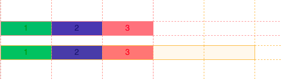

# Unités spécifiques à `grid`

## Unité `fr`

Afin de simplifier la gestion des colonnes et des rangées, une nouvelle
unité CSS a vu le jour. Cette unité, intitulée **`fr`** (pour
*fraction*), permet de **distribuer l'espace disponible de façon
relative** entre chaque élément ayant une valeur de ce type.

**Exemple :** trois colonnes identiques :

``` css
grid-template-columns: 1fr 1fr 1fr;
```

### Combinaison avec `gap`

À priori, cette unité peut sembler similaire aux **pourcentages (`%`)**.
Cependant, puisque les **fractions (`fr`)** basent leurs calculs sur
**l'espace disponible** et non l'espace **total** de leur parent, elles
peuvent être utilisées avantageusement avec les propriétés de type
`gap`.

**Comparaison :** - Avec `column-gap: 5px`, des éléments en `%` vs en
`fr` n'allouent pas l'espace de la même manière.

<p class="codepen" data-height="400" data-default-tab="css" data-slug-hash="OJrgwdv" data-pen-title="Grid - % vs fr gap" data-user="tim-momo" style="height: 400px; box-sizing: border-box; display: flex; align-items: center; justify-content: center; border: 2px solid; margin: 1em 0; padding: 1em;">
  <span>See the Pen <a href="https://codepen.io/tim-momo/pen/OJrgwdv">
  Grid - % vs fr gap</a> by TIM Montmorency (<a href="https://codepen.io/tim-momo">@tim-momo</a>)
  on <a href="https://codepen.io">CodePen</a>.</span>
</p>

<p class="codepen" data-height="400" data-default-tab="result" data-slug-hash="OJrgwdv" data-pen-title="Grid - % vs fr gap" data-user="tim-momo" style="height: 400px; box-sizing: border-box; display: flex; align-items: center; justify-content: center; border: 2px solid; margin: 1em 0; padding: 1em;">
  <span>See the Pen <a href="https://codepen.io/tim-momo/pen/OJrgwdv">
  Grid - % vs fr gap</a> by TIM Montmorency (<a href="https://codepen.io/tim-momo">@tim-momo</a>)
  on <a href="https://codepen.io">CodePen</a>.</span>
</p>

### Combinaison avec des unités différentes (`px`, `vw`, `vh`, etc.)

Lorsqu'une unité **différente** est ajoutée en combinaison, les
**pourcentages (`%`)** continuent de se baser sur la **dimension totale
du parent**, peu importe la dimension prise par cette unité.
**Contrairement** aux **fractions (`fr`)** qui se **partagent l'espace
disponible restant** après que l'unité différente ait pris son espace.

Dans les exemples ci-dessous, la **première colonne** a une unité
différente (`px`), soit `50px`. À gauche, on remarque que la combinaison
avec des **pourcentages** produit un résultat **indésirable**, tandis
qu'à droite, les **fractions** se partagent **équitablement l'espace
restant**, produisant ainsi un résultat **harmonieux**.


<p class="codepen" data-height="400" data-default-tab="css" data-slug-hash="OJrgwdv" data-pen-title="Grid - % vs fr gap" data-user="tim-momo" style="height: 400px; box-sizing: border-box; display: flex; align-items: center; justify-content: center; border: 2px solid; margin: 1em 0; padding: 1em;">
  <span>See the Pen <a href="https://codepen.io/tim-momo/pen/OJrgwdv">
  Grid - % vs fr gap</a> by TIM Montmorency (<a href="https://codepen.io/tim-momo">@tim-momo</a>)
  on <a href="https://codepen.io">CodePen</a>.</span>
</p>

<p class="codepen" data-height="500" data-default-tab="result" data-slug-hash="OJrgwdv" data-pen-title="Grid - % vs fr gap" data-user="tim-momo" style="height: 500px; box-sizing: border-box; display: flex; align-items: center; justify-content: center; border: 2px solid; margin: 1em 0; padding: 1em;">
  <span>See the Pen <a href="https://codepen.io/tim-momo/pen/OJrgwdv">
  Grid - % vs fr gap</a> by TIM Montmorency (<a href="https://codepen.io/tim-momo">@tim-momo</a>)
  on <a href="https://codepen.io">CodePen</a>.</span>
</p>


<br>
<a href="https://developer.mozilla.org/fr/docs/Web/CSS/CSS_grid_layout/Basic_concepts_of_grid_layout#lunit%C3%A9_fr" class="md-button ">&nbsp;&nbsp;En savoir plus sur l'unité *fr*</a> <br>


## Unité `minmax()`

Comme son nom l'indique, l'unité `minmax()` permet de définir une
**dimension minimale et maximale** à une cellule de grille. Cette unité
est particulièrement utile afin de créer une **mise en page responsive**
tout en évitant que certains éléments se retrouvent **trop coincés**.

**Exemple :** deux grilles identiques avec toutes les cellules d'une
largeur de `1fr` à l'exception de la **2e cellule** (verte) ayant une
valeur de `minmax(400px, 1fr)`.


<video src="../assets/grid-minmax.mp4" width="100%" height="auto" controls>


<!-- <hr>

<p class="codepen" data-height="500" data-default-tab="result" data-slug-hash="MWMNbrb" data-pen-title="Grid - minmax" data-user="tim-momo" style="height: 500px; box-sizing: border-box; display: flex; align-items: center; justify-content: center; border: 2px solid; margin: 1em 0; padding: 1em;">
  <span>See the Pen <a href="https://codepen.io/tim-momo/pen/MWMNbrb">
  Grid - minmax</a> by TIM Montmorency (<a href="https://codepen.io/tim-momo">@tim-momo</a>)
  on <a href="https://codepen.io">CodePen</a>.</span>
</p>

<br>
<a href="https://developer.mozilla.org/fr/docs/Web/CSS/minmax" class="md-button ">&nbsp;&nbsp;En savoir plus sur l'unité *minmax()*</a> <br>

-->


## Unité `repeat()`

Spécifier individuellement chaque colonne ou rangée n'est pas un
problème lorsqu'une grille est de dimension **modeste**. Cependant,
lorsqu'une grille **grossit**, il peut devenir rapidement **lassant** et
**mêlant** d'écrire la dimension de chaque colonne ou rangée, surtout si
celle-ci est **identique**.

**Exemple verbeux :**

``` css
grid-template-columns: 1fr 1fr 1fr 1fr 1fr 1fr;
```

### `auto-fit` & `auto-fill`

Afin de pouvoir réaliser une **grille responsive** sans avoir à écrire une multitude de [media queries](https://tim-montmorency.com/timdoc/582-211/css/media-queries/), il est possible d'utiliser les valeurs `auto-fit` et `auto-fill` à la place d'un nombre spécifique de colonnes dans un `repeat()`.

**Exemple avec `auto-fit` :**

``` css
grid-template-columns: repeat(auto-fit, 150px);
```

Permet d'afficher **autant d'éléments sur une rangée qu'il y a d'espace
disponible**.


<video src="../assets/grid-repeat-fit-content.mp4" width="100%" height="auto" controls>

!!! Note
    **Différence** :
    - `auto-fit` : **aucune cellule vide** supplémentaire n'est ajoutée dans la grille, même si l'espace le permet.
    - `auto-fill` : des **cellules vides** sont créées pour occuper l'espace.
    Dans la majorité des cas, le résultat sera **similaire**. Cependant, cette particularité peut parfois s'avérer utile lorsque combinée avec d'autres propriétés de grille.



### Combinaison avec d'autres unités

Il est aussi possible de **combiner `repeat()` avec d'autres unités**.

**Exemple :**

``` css
grid-template-columns: repeat(3, minmax(150px, 1fr));
```

<p class="codepen" data-height="500" data-default-tab="result" data-slug-hash="RwEgYwx" data-pen-title="Grid - repeat" data-user="tim-momo" style="height: 500px; box-sizing: border-box; display: flex; align-items: center; justify-content: center; border: 2px solid; margin: 1em 0; padding: 1em;">
  <span>See the Pen <a href="https://codepen.io/tim-momo/pen/RwEgYwx">
  Grid - repeat</a> by TIM Montmorency (<a href="https://codepen.io/tim-momo">@tim-momo</a>)
  on <a href="https://codepen.io">CodePen</a>.</span>
</p>

<script async src="https://public.codepenassets.com/embed/index.js"></script>


<br>
<a href="https://developer.mozilla.org/fr/docs/Web/CSS/repeat" class="md-button ">&nbsp;&nbsp;En savoir plus sur l'unité *repeat()*</a> <br>
