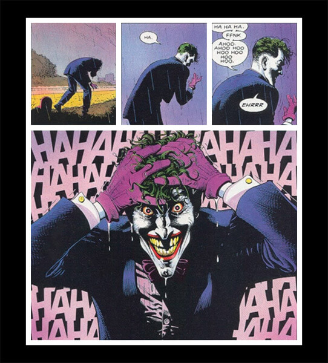

# Grid - Joker: The Killing Joke

Dans le cadre de cet exercice, vous devrez recréer l’une des planches du célèbre roman graphique <a href="https://en.wikipedia.org/wiki/Batman:_The_Killing_Joke">Batman: The killing joke</a> à l’aide d’une grille&nbsp;CSS.

## Aperçu du résultat 👇

## Matériel

[Pen de départ](https://codepen.io/tim-momo/pen/zYypVrz)

### Couleurs 🎨

- Noir #000000
- Blanc #ffffff

## Requis (consignes)

- [ ] La page doit avoir un fond noir et le roman graphique <em>(novel)</em> avoir un fond blanc.
- [ ] Le roman graphique doit mesurer 80% de la largeur disponible, avoir espace blanc de 10px entre chaque case ainsi que tout le tour de lui-même.
- [ ] Chaque image doit prendre toute la largeur disponible dans la case attribuée.

## Notes de cours

- [CSS Grid intro](../css/grid/intro.md)
- [Styles du conteneur: `grid-template-columns` et `grid-template-rows`](../css/grid/grid-template-cols-rows.md)
- [Espacement avec `gap`](../css/grid/gap.md)
- [Unités `fr`, `minmax()`et `repeat()`](../css/grid/unites.md)
- [Styles des éléments enfants à placer: `grid-column` et `grid-row`](../css/grid/grid-col-row.md)
- [Définir les 4 coins de l'élément enfant à placer avec `grid-area`](../css/grid/grid-area.md)
- [Style du conteneur: `grid-template-areas`: : nommer des zones dans une grille](../css/grid/grid-template-areas.md)

