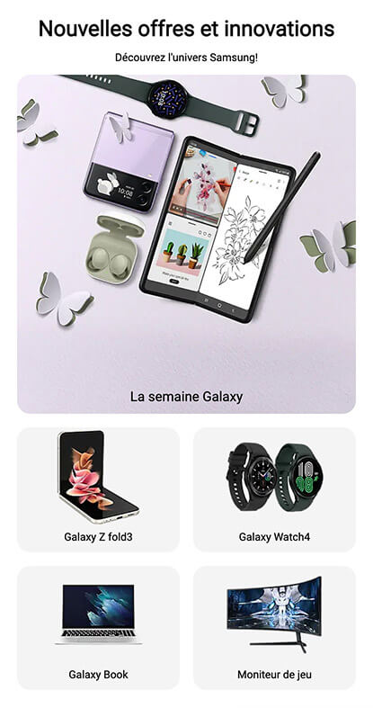
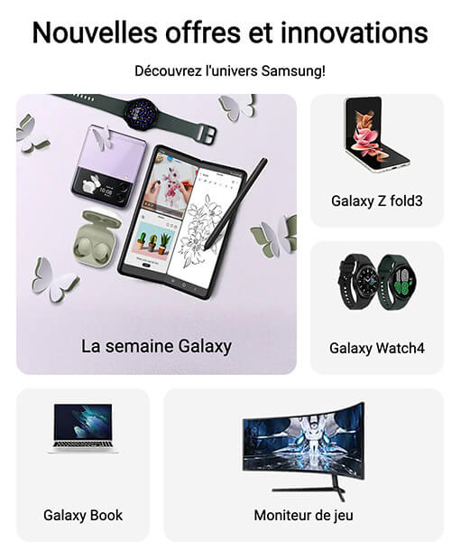

# Grid - Offres Samsung

Pour cet exercice, vous devez compléter une grille d’offres promotionnelles présentant divers produits Samsung mis en vedette lors de la semaine Galaxy. Pour ce faire, vous devez maximiser vos connaissances de SASS et de&nbsp;Grid.

## Aperçu du résultat 👇

<video src="./assets/grid-samsung-apercu.mp4" width="100%" height="auto" controls>

## Matériel

[Pen de départ](https://codepen.io/tim-momo/pen/BavJgpX)

### Couleurs 🎨

- Gris pâle #f4f4f4

## Requis de base

- [ ] 1- Le bloc des offres doit prendre toute la largeur jusqu'à concurrence de 1000px, être centré horizontalement ↔️ et avoir une marge intérieure de 20px <em>(cette marge ne doit pas faire dépasser le bloc de la page)</em>.
- [ ] 2- Tous les textes dans le bloc d'offres doivent avoir une taille de 12px, être centrés et utiliser la police <code>'Roboto', sans-serif</code> <em>(la police est déjà importée pour vous)</em>.
- [ ] 3- Le titre <em>"Nouvelles offres et innovations"</em> doit-être 2x plus gros que le texte normal.

- [ ] 4- Les produits doivent avoir un espace de 15px entre eux, des coins ronds de 15px et une couleur de fond gris pâle.
- [ ] 5- Les descriptions de produit doivent s'afficher par-dessus les images de produits au bas complètement de celle-ci et se garder une marge intérieure de 10px de tous les côtés.
- [ ] 6-Les images de produit doivent prendre 60% de la largeur de leur parent jusqu'à un maximum de 140px, être centrées horizontalement ↔️ et avoir une marge vers le bas de 30px. Cependant, l'image du produit en vedette <em>(featured)</em>, doit échapper à cette règle et prendre 100% de la largeur de son parent, ne pas avoir de largeur maximale ni de marges.
- [ ] 7- Le produit en vedette <em>(featured)</em> doit se démarquer des autres en étant 2x plus large et haut que les autres produits. Son texte doit aussi être 25% plus gros que le texte régulier.

## Requis Intermédiaire 450px et +

- [ ] 1-À partir de cette taille, le texte de base doit devenir en 16px de base. Attention à ce que toutes les règles de texte plus gros continuent de s'appliquer au même ratio.
- [ ] 2-Les marges intérieures des descriptions doivent passer à 20px à partir de cette résolution.
- [ ] 3-L'affichage doit maintenant se faire sur 3 colonnes. Le premier et le dernier produit doivent prendre 2 colonnes de large.

## Requis Final 700px et +

- [ ] 1-Le produit en vedette doit être 2x plus large et haut que les autres produits. 

!!!
    Attention à respecter l’ordre des produits présentés dans les captures&nbsp;d’écran.

## Notes de cours 📚

- [CSS Grid intro](../css/grid/intro.md)
- [Styles du conteneur: `grid-template-columns` et `grid-template-rows`](../css/grid/grid-template-cols-rows.md)
- [Espacement avec `gap`](../css/grid/gap.md)
- [Unités `fr`, `minmax()`et `repeat()`](../css/grid/unites.md)
- [Styles des éléments enfants à placer: `grid-column` et `grid-row`](../css/grid/grid-col-row.md)
- [Définir les 4 coins de l'élément enfant à placer avec `grid-area`](../css/grid/grid-area.md)
- [Style du conteneur: `grid-template-areas`: : nommer des zones dans une grille](../css/grid/grid-template-areas.md)
.
- [Media queries](https://tim-montmorency.com/timdoc/582-211/css/media-queries/)
- [Unités de mesure CSS](https://tim-montmorency.com/timdoc/582-211/css/unites-de-mesure/)