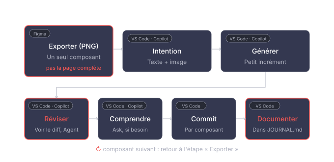

# La boucle IA par composant

Le schéma qui résume tout ce qu'on a vu séparément aux cours 4.1 et 5.1 : comment travailler un composant à la fois avec Copilot, sans jamais laisser l'IA prendre le contrôle du projet au complet.

## Les étapes

**Exporter (Figma)** : dans Figma, activer le Dev Mode, sélectionner **un seul composant**, jamais la page complète. Exporter en PNG, enregistrer dans `exports-composants/`, nommé comme le composant.

**Intention (VS Code · Copilot)** : joindre l'image exportée au chat Copilot, avec une phrase qui décrit ce que le composant doit faire.

**Générer (VS Code · Copilot)** : complétion en ligne, par petits incréments. On accepte une ligne à la fois, pas un fichier au complet d'un coup.

**Réviser (VS Code · Copilot)** : pour un changement plus large (renommer, restructurer), utiliser Agent, mais toujours réviser le diff avant de l'accepter. Jamais une action autonome sans supervision.

**Comprendre (VS Code · Copilot)** : une question sur un bout de code qui n'est pas clair, en Ask. Ça ne modifie jamais vos fichiers.

**Commit (VS Code)** : un commit par composant terminé, avec un message qui décrit le changement.

**Documenter (VS Code)** : dans `JOURNAL.md`, seulement les prompts délibérés (Réviser, Comprendre), jamais les complétions en ligne.

Puis on recommence à « Exporter » pour le composant suivant.

## Pour aller plus loin

[:material-swap-horizontal: Ce que vous voyez selon votre poste](modes-copilot-ancien-nouveau.md){ .md-button }
[:material-github: Paramétrage complet de Copilot](parametrage-copilot.md){ .md-button }
[:material-file-tree: Arborescence du dépôt](../projets/portfolio/arborescence-portfolio.md){ .md-button }
