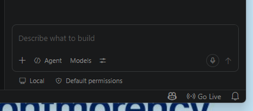
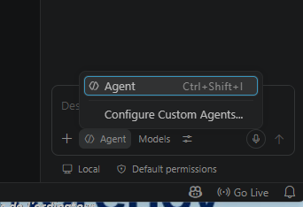
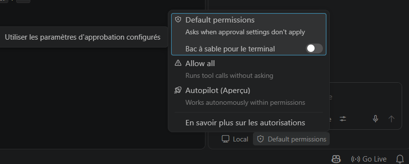
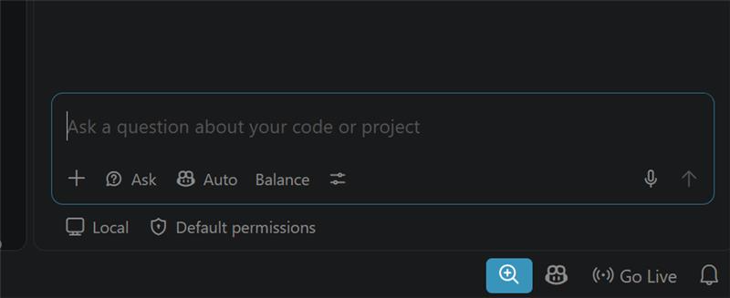
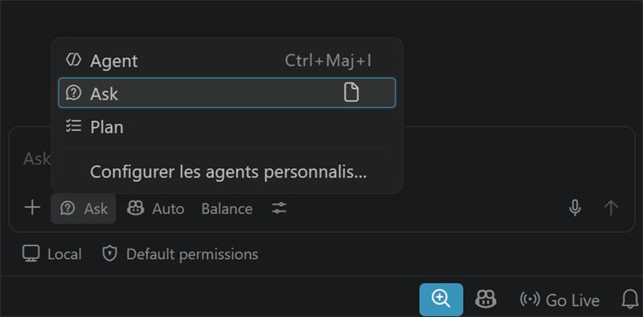

# Modes du chat Copilot : le principe, puis ce que vous voyez réellement

## Le principe, peu importe l'interface

**Toujours réviser un changement avant de l'accepter. Ne jamais laisser Copilot exécuter des commandes ou modifier plusieurs fichiers sans supervision.** C'est ça qui compte pour la boucle IA du cours, pas le nom exact du bouton devant vous.

## Pourquoi les postes de labo et les portables personnels ne montrent pas la même chose

GitHub Copilot est maintenant une extension intégrée directement à VS Code, plus une extension distincte qu'on met à jour soi-même depuis le panneau Extensions. Sa version suit donc celle de VS Code au complet.

Les postes de labo ne sont pas mis à jour pendant la session, alors qu'un portable personnel propose une mise à jour à chaque nouvelle version. Résultat : deux interfaces cohabitent dans la même classe, et ça va rester ainsi jusqu'à la fin de la session pour les postes de labo, pendant qu'un portable personnel va continuer de changer.

## Sur les postes de laboratoire

VS Code 1.132 (ou la version installée par l'école, non mise à jour depuis).

!!! info "Sur la langue de l'interface"
    Les captures utilisées pour ce guide viennent d'un poste où le pack de langue française n'était pas activé (la personne qui les a prises n'utilise pas VS Code elle-même). Les étudiants sont censés avoir installé ce pack, leur écran devrait donc être partiellement en français. Cela dit, GitHub ne traduit pas tout : certains termes propres à Copilot (comme ceux ci-dessous) risquent de rester en anglais même avec le pack activé, on l'a déjà vu ailleurs dans ce guide.

- Bas du chat : boutons **Agent** et **Models**.
- Cliquer sur **Agent** n'ouvre qu'un seul choix, rester en **Agent** (`Configure Custom Agents...`).
- Un bouton **Default permissions** en bas.

!!! danger "Consigne pour le portfolio, sur les postes de labo"
    Cliquez sur **Default permissions** et cherchez l'option qui demande votre accord à chaque changement, pas celle qui exécute automatiquement sans demander. Le nom exact peut varier, le comportement à choisir reste le même : rien ne s'applique sans que vous l'ayez vu passer.

## Sur un portable personnel à jour

Interface partiellement en français si le pack de langue est installé (certains termes propres à Copilot restent en anglais peu importe le pack, voir la note plus haut), VS Code 1.138 ou plus récent au moment d'écrire ce guide.

- Bas du chat : boutons **Ask**, **Auto**, **Balance**.
- Cliquer sur le bouton de mode ouvre trois choix : **Agent**, **Ask**, **Plan**.
- Un bouton **Default permissions** en bas, comme sur les postes de labo.

!!! info "Cette section a déjà changé une fois depuis sa rédaction"
    Il y a deux jours, cette même interface montrait des boutons **Interactif**/**Plan**/**Autopilot** et **Manual permissions**/**Allow all** séparés, plutôt que ce qui est décrit ci-dessus. C'est exactement pourquoi ce guide mène par le principe plutôt que par les noms de boutons : ils ne tiennent pas deux jours, même sur un seul poste.

## Peu importe le poste devant vous

Cherchez le comportement, pas le bouton : une option qui vous demande votre accord avant chaque changement, jamais une qui agit toute seule sur plusieurs fichiers. C'est vrai sur les deux types de poste, et ça restera vrai même si les noms changent encore.
