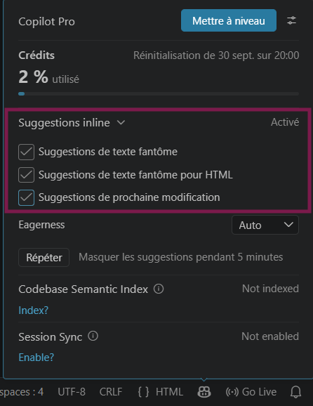
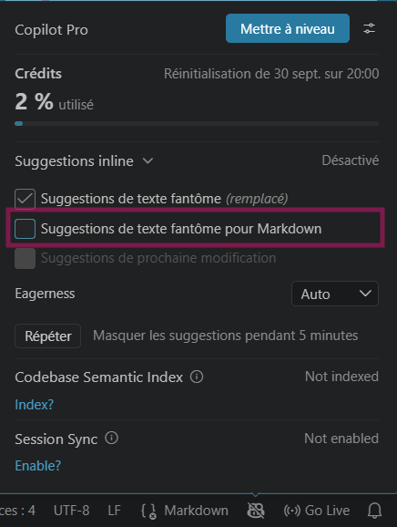
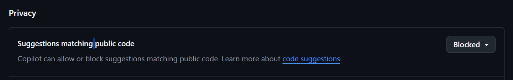

# Paramétrage GitHub Copilot

Ce guide fixe une base commune de paramétrage, pour que tout le monde parte du même pied. Certains réglages sont **obligatoires** (ils protègent l'intégrité de votre démarche ou l'originalité de votre code), d'autres sont **recommandés** (ils rendent Copilot plus utile sans risque particulier).

!!! info "Ce guide suppose que Copilot est déjà activé"
    Si ce n'est pas encore fait, voir d'abord le guide d'activation.

    [:material-github: Activer GitHub Copilot (plan Student)](Guide_GitHub_Education_Copilot.md){ .md-button :target="_blank" }

## Les principes, peu importe l'interface

L'interface de Copilot a changé plusieurs fois depuis la rédaction de ce guide. Elle va changer encore. Ce qui suit reste vrai peu importe le nom des boutons :

1. **La complétion en ligne reste active.** C'est l'outil de base pour générer par petits incréments.
2. **Vos réflexions restent les vôtres.** `JOURNAL.md` et `PLANIFICATION.md` ne doivent jamais être complétés par l'IA.
3. **Vos suggestions ne doivent jamais reproduire du code public** sans que vous le sachiez.
4. **Un changement de code doit toujours être révisé avant d'être appliqué.** Jamais une action autonome et non supervisée sur plusieurs fichiers.
5. **Les conventions de votre projet doivent être écrites quelque part que Copilot peut lire**, pas seulement dans votre tête.

Le reste de ce guide montre comment appliquer ces principes dans l'interface actuelle. Si ce que vous voyez à l'écran ne correspond plus à ce qui est décrit, le principe reste la référence, pas le nom du bouton.

## 1. Dans VS Code, panneau Copilot

*Applique les principes 1 et 2.*

Cliquer sur l'icône **Copilot** en bas à droite de VS Code pour ouvrir ce panneau.

### Suggestions inline

!!! danger "Obligatoire : Suggestions de texte fantôme → activé"
    C'est la complétion en ligne de base, celle qu'on utilise pour générer par petits incréments. Doit rester active.



!!! danger "Obligatoire : Suggestions de texte fantôme pour Markdown → désactivé"
    `JOURNAL.md` et `PLANIFICATION.md` sont vos mots, pas des textes à faire complèter par l'IA. Si Copilot vous souffle vos propres réflexions pendant que vous documentez votre usage de l'IA, ça vide l'exercice de son sens. Décocher cette case précisément pour protéger ça.



!!! tip "Recommandé : Suggestions de prochaine modification → activé"
    Prédit votre prochain changement logique (pas juste la ligne suivante). Utile, faible risque, aucune raison de le désactiver.

!!! tip "Recommandé : Eagerness → Auto"
    Contrôle à quel point Copilot propose des suggestions de façon proactive. Le réglage par défaut convient pour ce cours.

### Le reste du panneau

- **Codebase Semantic Index** : optionnel. Utile sur un gros projet pour que Copilot comprenne l'ensemble du code, pas nécessaire pour la taille d'un portfolio.
- **Session Sync** : pas nécessaire pour ce cours, laisser tel quel.

## 2. Sur [github.com/settings/copilot/features](https://github.com/settings/copilot/features)

*Applique le principe 3.*



!!! danger "Obligatoire : Suggestions matching public code → Block"
    Ce réglage compare vos suggestions à environ 150 caractères de code public sur GitHub. Si un match est trouvé, la suggestion n'est simplement pas montrée. Ça évite de vous retrouver, sans le savoir, avec du code copié d'un dépôt sous licence dans votre portfolio. Question d'intégrité, pas juste de style.

    Marche à suivre : profil → **Copilot Settings** → section **Privacy**, **Suggestions matching public code** → changer la valeur pour **Blocked**.

## 3. Le chat Copilot : quel réglage utiliser pour le portfolio

*Applique le principe 4 : un changement doit toujours être révisé avant d'être appliqué.*

C'est la section la plus susceptible d'être déjà périmée quand vous la lisez, l'interface a changé trois fois dans la même journée pendant qu'on la rédigeait. Le principe reste simple : peu importe les boutons devant vous, cherchez la combinaison qui vous fait réviser chaque changement, pas celle qui agit toute seule.

!!! danger "Le principe, dans les mots à retenir"
    Trouvez l'équivalent de « étape par étape, mon accord à chaque fois ». Évitez l'équivalent de « autonome, sans demander ». Si vous ne savez pas lequel est lequel, testez sur un petit changement avant de l'utiliser sur votre projet.

**Comment ça se traduit dans l'interface actuelle** (sur votre poste précis, voir le détail poste de labo vs portable personnel) :

Cherchez un bouton de permissions (nommé « Default permissions » sur la plupart des postes en ce moment) et une option de mode qui n'agit pas de façon autonome sur plusieurs fichiers sans vous demander. Les noms exacts varient d'un poste à l'autre et changent souvent, le détail concret par type de poste est dans le guide dédié :

[:material-swap-horizontal: Ce que vous voyez selon votre poste (labo ou personnel)](modes-copilot-ancien-nouveau.md){ .md-button :target="_blank" }

!!! danger "Obligatoire pour le portfolio"
    Peu importe les noms de boutons devant vous : choisissez toujours l'option qui vous demande votre accord avant chaque changement, jamais celle qui exécute des commandes ou modifie plusieurs fichiers de façon autonome.

    Si vous utilisez quand même une option autonome pour explorer, documentez-le dans `JOURNAL.md` et pourquoi, au même titre que la frontière déjà établie pour Figma Make.

## 4. Le fichier `.github/copilot-instructions.md`

*Applique le principe 5.*

Un fichier à la racine de votre dépôt, lu automatiquement par Copilot, où vous décrivez les conventions de votre projet. Ça aide Copilot à proposer du code cohérent avec vos choix plutôt que des suggestions génériques.

**Gabarit de départ**, à adapter à votre projet :

```markdown
# Instructions pour GitHub Copilot : Portfolio

- Projet en HTML/CSS/JS vanilla, aucun framework.
- HTML sémantique obligatoire (article, section, nav...), pas de <div> par défaut.
- CSS organisé par composants\* (un fichier ou un bloc de code par composant).
- Convention de nommage des classes : [ex. BEM\*\*, ou la vôtre].
- Commentaires de code en français.
- Ne jamais suggérer de librairie externe sans que je la demande explicitement.
```

!!! tip
    Ce fichier se met à jour au fil du projet. Si vous adoptez une convention en cours de route (nommage, structure de dossiers), ajoutez-la ici plutôt que de compter sur votre mémoire pour rester cohérent d'un composant à l'autre.

\* **Approche par composant pour structurer votre code HTML/CSS/JS**

Un bloc de code HTML/CSS/JS qui représente un élément de l'interface (ex. un bouton, un formulaire, une carte d'un projet). Chaque bloc est commenté et séparé des autres pour faciliter la lecture et la maintenance.

[Approche par composant](https://tim-montmorency.com/compendium/582-211-web2/css/composants.html){ .md-button :target="_blank" }

\* **Nomenclature BEM pour vos classes CSS**

Une convention de nommage des classes CSS qui reflète la structure du composant (ex. `card__title` pour le titre d'une carte).

[Nomenclature BEM pour vos classes CSS](https://tim-montmorency.com/compendium/582-211-web2/css/nomenclature-bem.html){ .md-button :target="_blank" }

## 5. Gérer vos crédits IA

*Rejoint le principe 1.*

Le plan *Copilot Student* inclut un nombre de crédits IA limité chaque mois (200, je crois). Une fois épuisés, plus d'accès aux modèles avancés jusqu'au renouvellement.

!!! danger "Travailler par incrément, c'est aussi moins cher en crédits"
    Un prompt du genre « génère tout mon portfolio » consomme énormément plus de crédits qu'une série de petites demandes ciblées, un composant à la fois. Plus le texte envoyé et reçu est long, plus ça coûte, un gros prompt qui touche tout le projet traite beaucoup plus de contexte qu'une demande sur un seul composant.

!!! tip "Ce n'est pas nouveau : c'est ce que je vous recommande depuis le début"
    Travailler par petits incréments, ce n'est pas une contrainte technique liée aux crédits, c'est la méthode que je vous conseille depuis le premier cours, parce que c'est la meilleure façon d'apprendre : vous contrôlez ce qui se passe à chaque étape, et vous pouvez juger le résultat morceau par morceau, plutôt que de recevoir un gros bloc de code que personne n'a le temps de vraiment comprendre ni réviser. Les crédits limités sont juste une raison de plus qui pointe vers la même bonne pratique.

**Interdit / Ne pas faire :**

- ❌ « Génère tout mon portfolio »
- ❌ « Réécris entièrement mon fichier CSS »
- ❌ Demander un modèle avancé pour une question simple

**À faire :**

- ✅ Une fonctionnalité ou un composant à la fois
- ✅ Réutiliser le contexte déjà établi dans la conversation plutôt que de tout réexpliquer
- ✅ Garder le modèle par défaut la majorité du temps, réserver un modèle plus puissant aux cas qui le justifient vraiment

## En un coup d'œil

| Réglage | Où | Statut |
|---|---|---|
| Suggestions de texte fantôme | VS Code, panneau Copilot | Obligatoire, activé |
| Suggestions de texte fantôme (Markdown) | VS Code, panneau Copilot | Obligatoire, désactivé |
| Suggestions de prochaine modification | VS Code, panneau Copilot | Recommandé, activé |
| Suggestions matching public code | [github.com/settings/copilot/features](https://github.com/settings/copilot/features) | Obligatoire, Block |
| Mode Agent | Chat Copilot, boutons du bas | Obligatoire : l'option qui demande votre accord, jamais l'autonome |
| `.github/copilot-instructions.md` | Racine du dépôt | Recommandé, à créer |
