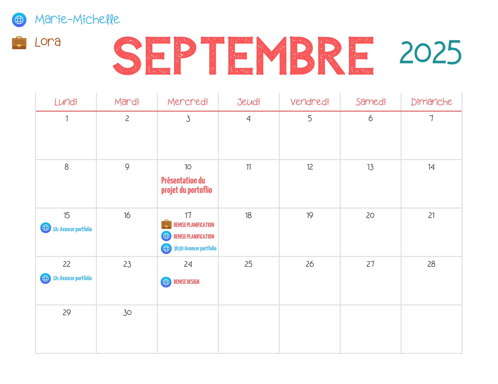
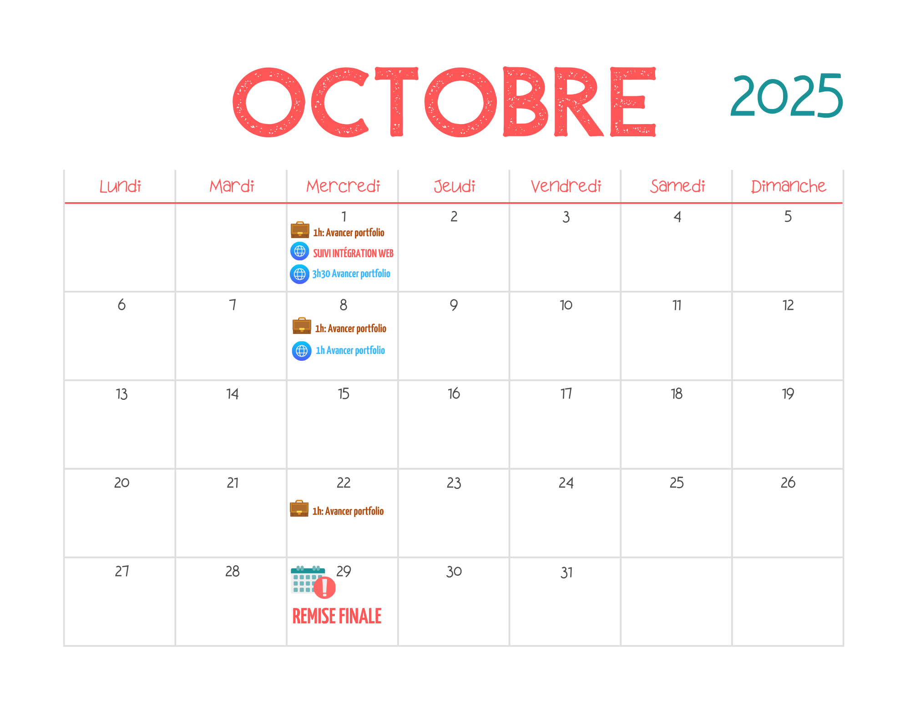

<!--
https://squidfunk.github.io/mkdocs-material/reference/admonitions/
✏️note, 📄abstract, ℹ️info, 🔥tip, ✔️success, ❔question, ⚠️warning, ❌failure, ⚡danger, 🐞bug, 🧪example, ❜❜quote
-->

# Portfolio:Web&nbsp;5

## Description

Dans le cadre des cours **Web 5** et **Préparation au milieu de travail** vous avez à réaliser un portfolio web qui vous permettra de vous présenter aux employeurs potentiels.

Pour le cours de **Préparation au milieu de travail**, c'est le *contenu* de ce portfolio qui sera évalué.

Pour le cours de **Web 5**, c'est la *planification*, le *design*, le *processus*, le *code* qui seront évalués.

[📋✅ Voir les critères d'évaluation complets ci-bas.](#criteres-devaluation){ .md-button }

[Lien vers les instrutions de **Préparation au milieu de travail**](https://tim-montmorency.com/compendium/582-541%E2%80%93preparation-milieu-travail/stages/portfolio.html){ .md-button .x-small }

## Format

**Site web statique fait à la main** (sans CMS ni thème déjà pré-fait)

!!! question "Avantage de ce format"

    C’est la façon la plus claire de démontrer que vous savez concevoir et coder vous-mêmes un site web à partir de zéro.

## Technologies permises

- *HTML5*
- *CSS3*
- *JavaScript*
- *Bootstrap*
- *Vue.js*
- *GSAP* + son plugin *ScrollTrigger*
- *Git*
- *Json*
- *Hébergement web* de votre choix (je recommande simplement GitHub Pages car gratuit)
- Possibilité de s'acheter une *nom de domaine* personnalisé pour éviter d'avoir `github.io` comme nom de domaine et se doter d'un style plus professionnel

    <h3 style="color: #ef5552;">À PROPOS DE L'<em>IA</em> EN ÉDUCATION</h3> 
    
Vous pouvez utiliser l’IA pour apprendre mais <em>pas pour remplacer votre compréhension</em>. Toute aide d’IA doit être documentée dans journal-IA.md ou partagée lors de votre remise via un lien de la conversation avec la dite IA. Vous devez pouvoir expliquer votre code et le modifier en direct. 

    
<strong><em>Un portfolio sert à convaincre un·e employeur·e que vous savez faire. On valorise l’honnêteté et l’apprentissage réel.<em> </strong>

!!! warning "À propos de l'utilisation de l'IA pour le projet"

    L'utilisation de l'IA est permise pour vous aider à vous déboguer SEULEMENT SI vous partagez le lien de votre conversation avec l'IA lors de la remise. Toutes les questions posées doivent être dans le même fil conversationnel. Si par erreur vous posez une question dans un autre fil, veuillez remettre tous les fils conversationnel que vous aurez utilisés. Si l'IA sélectionnée ne vous permet pas de partager la conversation, vous devrez alors fournir un *journal-IA.md* contenant une liste de tous vos prompts.

## Obligatoire pour Web 5

- Utiliser un **dépôt GitHub** avec des commits réguliers et bien nommés.  
- Intégrer au moins une **animation GSAP** déclenchée au défilement (scroll).  
- Séparer les **données des projets** dans un fichier `projects.json` et les charger via l’**API fetch**.  
- Prévoir une **mise en page flexible** permettant d’ajouter facilement des projets ultérieurement.  
- Créer et intégrer un **composant Vue.js** codé par vous-même.  
- **Commenter le code** (HTML, CSS et JavaScript) dans vos propres mots afin de démontrer votre compréhension.  
- S’assurer que le **code est validé** par le validateur **W3C**.  
- Rendre le site **responsive** (adaptable aux différents écrans).  

## Compétences démontrées

- Planification, organisation personnelle, documentation.
- Créativité et minutie au niveau du design.
- Structure sémantique HTML.
- Mise en page CSS (Flexbox, Grid).
- Interactions JavaScript fonctionnelles (menus, carrousel, lightbox, animations, filtres etc).
- Accessibilité, performance et optimisation pour moteur de recherche.
- Responsive design.

## Calendrier

[📥 Téléchargez le calendrier en PDF](./assets/portfolio-calendrier-2025.pdf){ .md-button :target="_blank" }

## Dates de remise pour Web 5

- *17 septembre* : Remise de la planification de portfolio (formatif)
- *24 septembre* : Remise du design du portfolio versions mobile et desktop (formatif)
- *1er octobre* : Remise du contenu intégré (suivi formatif)
- *29 octobre* : Remise du portfolio final (sommatif: 25%)

## Critères d'évaluation

### 1. Planification & recherche  

- **Moodboard visuel** : choix et harmonie des couleurs, typographies, ambiance, références cohérentes.  
- **Justification du concept** : explication des choix visuels/ergonomiques, lien avec la personnalité ou le type de stage visé.  
- **Organisation du contenu** : plan clair (sections du portfolio, hiérarchie de l’information).  

### 2. Design du site  

- **Qualité visuelle** : cohérence graphique, respect du moodboard, esthétique générale.  
- **UX et navigation** : ergonomie, lisibilité, accessibilité de base, responsive design pensé dès la maquette.  
- **Originalité et personnalisation** : effort créatif pour se démarquer, éviter les templates génériques.  

### 3. Codage HTML + CSS 

- **Structure HTML** : sémantique, hiérarchie, respect des standards W3C, titres et balises correctes.  
- **CSS et mise en page** : utilisation claire de Grid/Flexbox, propreté du code, classes nommées nommées logiquement.  
- **Responsive design** : site adapté aux écrans mobiles et desktop, sans bogues majeurs.  
- **Accessibilité & SEO de base** : contraste suffisant, textes alternatifs pour images, métadonnées essentielles.  
- **Nomenclature des fichiers** : dossiers, fichiers et images bien nommés (sans caractères spéciaux, sans espaces ni accents).  

### 4. Composante Vue.js  

- **Fonctionnalité correcte** : la composante fonctionne, interaction fluide, pas de bogue majeur.  
- **Utilisation de Vue** : data, rendu dynamique via `v-for` / `v-if`, interaction avec `@click` ou autres directives.  
- **Pertinence du widget** : apporte une valeur réelle au portfolio.  

### 5. Animation GSAP 

- **Intégration d’une animation GSAP** : déclenchée au scroll ou à l’interaction, correctement intégrée.  

### 6. Documentation & mise en ligne 

- **Déploiement web** : intégration adéquate sur un serveur web.  
- **README.md clair** : description du projet, Documentation claire dans un README.md. 
- **Journal-IA.md** : si utilisation de l’IA, documentation complète des prompts utilisés.  

## Sites de référence d'inspiration

### Inspirations graphiques / Web design

- [Awwwards](https://www.awwwards.com/)  
- [CSS Design Awards](https://www.cssdesignawards.com/)  
- [Dribbble – Web Design (popular shots)](https://dribbble.com/shots/popular/web-design)  
- [Carbonmade – Portfolios](https://carbonmade.com/portfolios)  
- [Behance – Galleries](https://www.behance.net/galleries)  
- [Wow Web](https://wow-web.co.uk/)  
- [Art of the Title](http://www.artofthetitle.com)  
- [Adobe – Behance Galleries](https://www.behance.net/galleries/adobe)  
- [But Does It Float?](https://butdoesitfloat.com/)  
- [Weird, Cool & Bizarre Websites (MakeUseOf)](https://www.makeuseof.com/tag/weird-cool-bizarre-websites/)  
- [The Useless Web](https://theuselessweb.com/)  
- [No­ta Website](http://www.notawebsite.com/)  
- [Weird blogs on Tumblr (Lifewire)](https://www.lifewire.com/weird-blogs-found-on-tumblr-3486368)  
- [Théorie des couleurs – Signification de la couleur (La Cascade)](https://la-cascade.io/theorie-des-couleurs-1-signification-de-la-couleur)  
- [The Creators Project (Vice)](https://www.vice.com/en_ca/topic/the-creators-project)  
- [Publicis Sapient](https://publicis.sapient.com/en-us.html)  
- [Grapheine – Famous Graphic Designers](https://www.grapheine.com/famous-graphic-designers)  
- [Logo Design Love](https://www.logodesignlove.com/)  
- [Design Is History](http://www.designishistory.com/)

---

### Références et tendances

- [10 grandes tendances en design graphique de 2025 – 99designs (Vistaprint)](https://www.vistaprint.fr/hub/tendances-design-graphique)  
- [The 29 Dominating Web Design Trends for 2024 – HubSpot Blog](https://blog.hubspot.com/marketing/web-design-trends-2017) *(le titre indique 2024 malgré l’URL de 2017)*  
- [Top Web Design Trends for 2025 – Designmodo](https://designmodo.com/web-design-trends/)  
- [Web Design Trend 2024 – Medium (Janet Watson)](https://medium.com/@janet.watson/web-design-trends-2024-3c7a2665c45d)  
- [Les 8 meilleures tendances en UX design de 2023 – 99designs.fr](https://99designs.fr/blog/tendances/tendances-design-ux/)  
- [10 Website Design Trends of 2024 to Embrace for Boosting Your Site – LinkedIn](https://www.linkedin.com/pulse/10-website-design-trends-2024-embrace-boosting-inlwc/)  
- [Tendances en design web – 99designs.fr](https://99designs.fr/blog/tendances/)  
- [100 combinaisons de couleurs inspirantes – Canva](https://www.canva.com/fr_fr/decouvrir/couleurs-qui-vont-ensemble/)  
- [Material Design – material.io](https://material.io/)  
- [Dear Design Student](https://deardesignstudent.com/)  
- [Polices modernes gratuites en ligne – Canva](https://www.canva.com/fr_fr/decouvrir/police-ecriture-moderne-en-ligne-gratuite/)  
- [Tendances typographiques 2019 – 99designs.fr](https://99designs.fr/blog/tendances/tendances-typographiques-2019/)  
- [Worst Fonts – WebDesignDev.com](http://www.webdesigndev.com/worst-fonts/)  
- [Règles d’ergonomie web – La Fabrique du Net](https://www.lafabriquedunet.fr/creation-site-vitrine/articles/regles-ergonomie-web-creer-site/)  
- [12 règles pour optimiser l’ergonomie d’un site Internet – PyColors](http://www.pycolors.com/12-regles-optimiser-ergonomie-site-internet-hierarchie-ranger-objectifs-satisfaire-internaute/637)  
- [The 7 Principles of Design – 99designs.fr](https://99designs.fr/blog/conseils-design/the-7-principles-of-design/)  
- [Règles de design de site Internet – Wix.com](https://fr.wix.com/blog/2018/08/07/regles-design-site-internet/)  
- [Graphic Design Trends – Arturth.com](https://arturth.com/design/graphic-design-trends/#brightvividcolorssection)

### Exemples de portfolios d'anciens étudiants

- [💼 Portfolio de Audrey Dandurand](https://audreydandurand.github.io/index.html)
- [💼 Portfolio de Justine Rousseau](https://justinersu.github.io/)
- [💼 Portfolio de Victor Gileau](https://victorgileau.github.io/victorgileau_portfolio/index.html)
- [💼 Portfolio de Joshua Gonzalez-Barrera](https://jxshvfx.github.io/joshuagonzalez.github.io/)
- [💼 Portfolio d'Ikrame Rata](https://ikramert.ca/)
- [💼 Portfolio de Kenza El Harrif](https://kenzaelharrif.github.io/KenzaElHarrif_portfolio/index.html)  
- [💼 Portfolio de Delphine Grenier](https://delphineg-projets.github.io/portfolio)  
- [💼 Portfolio de Ihab Mouhajer](https://ihabmjr.github.io/)
- [💼 Portfolio de Daniel Sébastien Dezemma](https://dezemma.com/)  
- [💼 Portfolio de Sitmonternna Yi](https://sitmonternna.github.io/artist_portfolio/)
