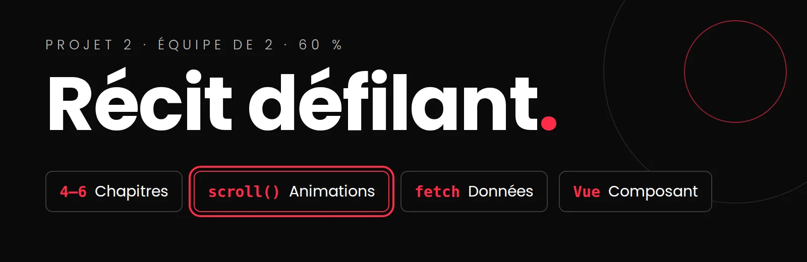

# Le récit défilant : consignes complètes

{.w-100}

<!-- MM : premier jet pour le lancement du ven. 9 oct. La grille critériée détaillée, les questions du journal propres au récit défilant sont à compléter. -->

<div class="essentiel" markdown>
<p class="essentiel__titre">L'essentiel en 3 points</p>

1. En **équipe de 2**, vous concevez et codez un **récit défilant** (*scrollytelling*) : une histoire en chapitres qui se déroule et s'anime au rythme du défilement. Thème au choix.
2. Le travail se fait en équipe, mais **la note est surtout individuelle** (40&nbsp;% sur 60&nbsp;%) : chacun est responsable de ses chapitres, de son média animable, de sa QA et de sa défense.
3. **Première étape : le cahier de charges**, à déposer **au plus tard le ven. 23 oct., 23 h 59**. Vous pouvez le commencer dès aujourd'hui, et on avance ensemble au cours du **mer. 21 oct.**

</div>

!!! danger "C'est votre processus qui est évalué"
    Pas seulement le résultat final : **votre démarche, étape par étape**. Vous me présentez votre projet **à chaque étape**, au rythme du groupe. Si je constate qu'une étape a été sautée (un code généré d'un coup, sans planification ni compréhension), **je vous demanderai de la recommencer**. Pas de passe-droit.

[:material-file-document-edit-outline: Le cahier de charges : gabarit et consignes](cahier-de-charges.md){ .md-button .md-button--primary }
[:material-lightbulb-on-outline: Exemples et inspirations](inspirations.md){ .md-button }

[:material-presentation-play: Présentation de lancement (PowerPoint)](../../assets/documents/Web5_recit-defilant-lancement.pptx){ .md-button }

## Mise en situation

Une organisation (un musée, un organisme, un média, une marque) vous confie un mandat : raconter une histoire sur le web de façon **immersive**. Pas un article qu'on lit, ni une vidéo qu'on regarde : une expérience que le visiteur **fait avancer lui-même en défilant**, où le texte, les images, les animations et les données apparaissent au bon moment.

C'est le format des grands récits interactifs des médias en ligne. Exemples à explorer :

- [The Pudding](https://pudding.cool/){ :target="_blank" } : des essais visuels construits sur des données;
- [Snow Fall (The New York Times, 2012)](https://www.nytimes.com/projects/2012/snow-fall/){ :target="_blank" } : un des premiers récits défilants célèbres.

Ce projet réunit tout ce que vous avez appris : la conception, l'animation, les données, le contrôle de la qualité et le travail d'équipe. C'est aussi une pièce de choix pour votre portfolio.

## Le produit

### Votre récit

Un récit sur un thème de votre choix, par exemple :

- **une cause** (environnement, santé, société);
- **un mini-documentaire** (un lieu, un événement, une personne);
- **une vitrine** (un produit, une œuvre, un artiste);
- **un explicatif** (comment fonctionne quelque chose).

### Ce qui est obligatoire

| Élément | Exigence |
|---|---|
| **Chapitres** | 6 à 8 chapitres, environ 100 à 250 mots chacun. Au moins 3 chapitres par personne. |
| **Données** | Les chapitres et leurs médias sont chargés avec `fetch()` depuis un fichier JSON. |
| **Dataviz** | Au moins un `fetch()` vers une **API externe gratuite**, pour un moment de visualisation de données ou un élément « vivant ». Au cahier de charges, vous décrivez seulement l'idée et le genre de données : l'API se choisit après le cours du mer. 11 nov. |
| **Animations** | Au moins une animation de chaque technique : **CSS au défilement** (`animation-timeline`), **GSAP + ScrollTrigger**, et un déclencheur **IntersectionObserver**. |
| **Vue.js** | Un composant imposé : le **navigateur de chapitres** ou la **barre de progression**. Vue est chargé par CDN, sans *build*. |
| **Média animable** | Un par personne, préparé pour l'animation (voir plus bas). |
| **Responsive** | Le récit fonctionne sur desktop et sur mobile. Les animations peuvent y être simplifiées. |
| **Accessibilité** | Le récit reste lisible **sans animation**, avec `prefers-reduced-motion`. |
| **Déploiement** | En ligne sur GitHub Pages. |

### Les garde-fous

Ils existent pour que le projet reste faisable en 8 semaines, à deux.

- **Au plus 1 animation « signature » par chapitre**, et **au plus 2 sections épinglées** (*pin*) dans tout le récit.
- **Médias légers** : images en WebP, vidéos de 30 secondes au plus (ou hébergées sur YouTube ou Vimeo), **10 Mo au plus** pour tout le récit.
- **Animer seulement `transform` et `opacity`** : ce sont les propriétés que le navigateur anime sans ralentir la page.

Mieux vaut 6 chapitres soignés que 8 chapitres bâclés.

### Un média animable par personne

Chaque personne produit **un** média préparé pour l'animation, intégré dans un de ses chapitres. Au choix :

| Format | Ce que vous préparez | Minimum |
|---|---|---|
| **Image en calques** (parallaxe) | Une image découpée en plans (avant, milieu, fond), sur fond transparent | 3 plans |
| **Spritesheet** | Les images d'une séquence, alignées sur une grille régulière, en WebP | 6 à 24 images |
| **SVG préparé pour GSAP** | Un SVG dont les parties sont regroupées et nommées avec des `id` | 3 parties animées séparément |

!!! info "L'IA comme source, la préparation par vous"
    Une image générée par IA peut servir de point de départ. Mais **la préparation pour l'animation est votre travail** : découpage des plans, assemblage et retouche des images de la séquence, vectorisation et nommage des groupes. Citez l'outil dans votre journal et créditez le média dans le `README.md`.

On verra en classe comment préparer chacun de ces formats. D'ici là, choisissez le vôtre et inscrivez-le dans le cahier de charges.

### Les médias et les crédits

- **Banques d'images libres permises** (ex. [Unsplash](https://unsplash.com/){ :target="_blank" }, [Pexels](https://www.pexels.com/){ :target="_blank" }), selon leur licence.
- **Images générées par IA permises**, si elles sont citées dans votre journal.
- **Tous les médias sont crédités** dans le `README.md`, dans un tableau : média, chapitre, source, auteur, licence, modifié ou non.

```markdown
## Crédits des médias

| Média | Chapitre | Source | Auteur | Licence | Modifié? |
|---|---|---|---|---|---|
| `foret-fond.webp` | 1 | [Unsplash](lien) | Nom de la personne | Licence Unsplash | Découpé en 3 calques |
| `renard.svg` | 3 | Firefly | Généré par IA | : | Vectorisé, groupes nommés |
```

## Travailler en équipe, être évalué individuellement

### Vos zones de responsabilité

Dès le cahier de charges, une **matrice de responsabilités** dit qui possède quoi : chapitres, média animable, composant Vue, *fetch* externe. C'est elle qui permet de vous évaluer individuellement. Chaque personne doit pouvoir expliquer et modifier **tout le code de ses zones**.

### Git

- **Un seul dépôt par équipe**, privé au départ. Invitez votre coéquipier ou coéquipière et `marie-michelle-ouellet` comme collaborateurs.
- Des *commits* réguliers et bien nommés, faits **par la personne qui a écrit le code** : c'est la trace de votre travail.
- On verra en classe le travail avec des **branches par personne**.

### Journal de bord individuel

Chaque personne tient **son propre journal** : `documentation/JOURNAL-prenom.md`. Comme au portfolio, à chaque bloc, vous répondez aux 5 questions et vous inscrivez **chaque question posée à l'IA** (date, prompt, outil, résultat).

1. Qu'est-ce que j'ai accompli depuis le dernier bloc? (Vous pouvez faire référence à vos *commits*.)
2. Quelle a été ma principale difficulté et comment je l'ai surmontée?
3. Qu'est-ce que j'ai appris que je ne savais pas avant?
4. Quelle est ma prochaine étape concrète?
5. Est-ce que j'ai utilisé l'IA? Si oui, pour quoi et qu'est-ce que ça m'a appris?

### Utilisation de l'IA : c'est le processus qui compte

**Ce qui est évalué, c'est votre processus.** Nul besoin de tout faire générer par l'IA sans vous questionner : un projet produit d'un coup ne montre rien de ce que vous savez faire.

- Vous **suivez le groupe** : chaque étape vue en classe se fait dans votre projet, au même rythme.
- Vous me **présentez votre projet à chaque étape** : cahier de charges, storyboard, animations, composant Vue, prototype, bêta.
- **Une étape sautée est à recommencer.** Si je sens qu'une partie a été générée sans passer par les étapes (planifier, coder par incréments, comprendre), je vous demanderai de la refaire. Pas de passe-droit.

L'IA reste **permise**, aux mêmes conditions qu'au portfolio : **documentée** dans votre journal et **comprise**. Copilot est permis si vous travaillez par incréments et comprenez tout le code. Le code généré par Figma Make ou Google Stitch peut servir de référence, jamais être livré tel quel.

!!! danger "Le code que vous ne comprenez pas se voit à la défense"
    Le 9 décembre, en privé, vous devrez montrer, expliquer et modifier en direct le code de **vos** zones, avec des demandes pigées au hasard. Usage de l'IA non documenté : plagiat.

## Évaluation : 60&nbsp;% de la note finale

| Volet | % | Type | Quand |
|---|---|---|---|
| Planification et cahier de charges | 5 | équipe | ven. 23 oct. |
| Produit final et présentation | 15 | équipe | ven. 11 déc. |
| Réalisation de vos zones (chapitres, média animable, code) | 20 | **individuel** | ven. 11 déc. |
| Contrôle de la qualité croisé (tester une autre équipe, corriger vos écarts) | 10 | **individuel** | 25 nov. au 4 déc. |
| Défense individuelle | 10 | **individuel** | mer. 9 déc. |
| **Total** | **60** | **20 équipe, 40 individuel** | |

La grille critériée détaillée sera publiée avant la remise du cahier de charges.

## Calendrier

| Date | Étape |
|---|---|
| **ven. 9 oct.** | Lancement : équipes, thèmes, début du cahier de charges |
| 9 au 20 oct. | **Travail autonome** : concept, chapitres, début du storyboard |
| **mer. 21 oct.** | Cours : storyboard, modèle de données, matrice de responsabilités. Vous me présentez votre avancement. |
| **ven. 23 oct.** | Pas de cours. **Remise 1 : cahier de charges**, déposé au plus tard à 23 h 59 |
| mer. 28 oct. | Rétroaction sur le cahier de charges. Animations CSS : parallaxe, spritesheet. Préparer ses médias. Branches Git. |
| ven. 30 oct. | Animations CSS au défilement. Chargement des chapitres en JSON. |
| mer. 4 nov. | GSAP + ScrollTrigger, IntersectionObserver |
| ven. 6 nov. | Construction des chapitres, point de contrôle d'équipe |
| mer. 11 nov. | Initiation à Vue.js : le composant imposé. Le *fetch* externe : choisir et tester votre API. |
| **ven. 13 nov.** | **Prototype** (formatif) : navigable et animé |
| mer. 18 nov. | Responsive, `prefers-reduced-motion`, performance |
| **ven. 20 nov.** | **Bêta** : médias finaux intégrés, prête pour la QA |
| **mer. 25 et ven. 27 nov.** | **Contrôle de la qualité croisé** (issues GitHub) |
| mer. 2 et ven. 4 déc. | Correctifs, déploiement final, préparation de la défense |
| **mer. 9 déc.** | **Défenses individuelles**, en privé |
| **ven. 11 déc.** | **Remise finale et présentations d'équipe** devant la classe |

## Remise 1 : le cahier de charges (ven. 23 oct., 23 h 59) { #remise-1 }

- [ ] Le **dépôt GitHub de l'équipe** existe, avec votre coéquipier ou coéquipière et `marie-michelle-ouellet` comme collaborateurs.
- [ ] `README.md` : les noms de l'équipe, le titre et le thème du récit, le lien vers le Figma.
- [ ] `documentation/CAHIER-DE-CHARGES.md` est **complet**, à partir du gabarit.
- [ ] Le **storyboard** du défilement est dans Figma, et le lien fonctionne (accès donné à `marie-michelle.ouellet@cmontmorency.qc.ca`).
- [ ] Chaque personne a son `documentation/JOURNAL-prenom.md`, avec les 5 questions de ce premier bloc.

[:material-file-document-edit-outline: Le cahier de charges : gabarit et consignes](cahier-de-charges.md){ .md-button .md-button--primary }
