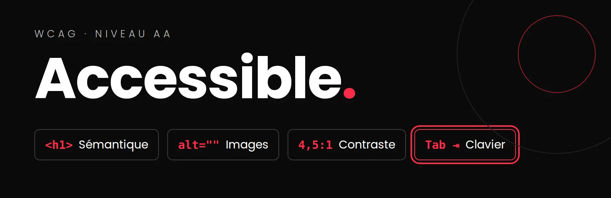

# L'accessibilité : les 4 points de la grille (WCAG AA)

*[WCAG]: Web Content Accessibility Guidelines
*[ARIA]: Accessible Rich Internet Applications

{.w-100}

!!! abstract "L'essentiel en 3 points"
    1. Un site accessible s'utilise **sans souris**, **sans voir les images** et **sans une vue parfaite**. La norme de référence s'appelle WCAG; votre grille exige le **niveau AA**.
    2. La grille nomme **4 points** : la **sémantique** HTML5, les attributs **`alt`**, le **contraste** et la **navigation au clavier**. Chacun se teste en quelques minutes.
    3. Les outils (WAVE, Lighthouse) trouvent une partie des problèmes. Le **test au clavier**, fait par un humain, trouve le reste.

Pour qui? Une personne aveugle qui utilise un lecteur d'écran, une personne qui ne peut pas utiliser de souris, une personne âgée qui voit moins bien les contrastes, quelqu'un qui consulte votre site en plein soleil sur son téléphone... et le recruteur pressé qui navigue avec Tab. L'accessibilité améliore le site pour **tout le monde**.

<div class="grid cards" markdown>

-   :material-file-tree: __1. Sémantique__

    ---

    Le bon élément HTML pour le bon rôle.

    [:octicons-arrow-right-24: La sémantique](#semantique)

-   :material-image-text: __2. Les `alt`__

    ---

    Remplacer l'image pour qui ne la voit pas.

    [:octicons-arrow-right-24: Les attributs alt](#alt)

-   :material-contrast-circle: __3. Le contraste__

    ---

    4,5:1 pour le texte courant, 3:1 pour le gros texte.

    [:octicons-arrow-right-24: Le contraste](#contraste)

-   :material-keyboard-outline: __4. Le clavier__

    ---

    Tout faire sans souris, en voyant toujours le focus.

    [:octicons-arrow-right-24: La navigation au clavier](#clavier)

</div>

[:material-clipboard-check-multiple: Retour aux consignes QA du portfolio](../projets/portfolio/qa-portfolio.md){ .md-button }

## WAVE en ligne (aucune installation)

Allez sur [wave.webaim.org](https://wave.webaim.org/){ :target="_blank" }, collez l'adresse de votre site en ligne (GitHub Pages), puis **Entrée**. Ça fonctionne dans tous les navigateurs, même sur un téléphone. Votre page s'affiche avec des icônes, et un panneau à gauche :

- **Errors** (rouge) : à corriger, sans exception;
- **Contrast Errors** : textes au contraste insuffisant;
- **Alerts** (jaune) : à vérifier, pas toujours un problème;
- l'onglet **Structure** : vos titres (`h1`, `h2`...) et vos régions (`header`, `nav`, `main`...).

!!! info "Ce que WAVE ne voit pas"
    WAVE analyse la page **telle qu'elle se charge**. Une modale fermée ou un menu replié n'est pas analysé : le test au clavier (point 4) s'en charge. En multipages, collez aussi l'adresse d'un détail de projet (ex. `.../project.html?id=biome`).

??? info "Lexique WAVE : anglais → français"
    **Le panneau de gauche**

    | WAVE | En français | Quoi faire |
    |---|---|---|
    | *Errors* | Erreurs | À corriger, sans exception |
    | *Contrast Errors* | Erreurs de contraste | À corriger |
    | *Alerts* | Avertissements | À vérifier : pas toujours un problème |
    | *Features* | Éléments d'accessibilité présents | Rien : c'est positif (ex. un `alt` présent) |
    | *Structural Elements* | Éléments de structure | Vos titres et vos régions |
    | *Details* / *Structure* / *Contrast* | Onglets : détail, plan, contraste | |

    **Les erreurs les plus fréquentes**

    | WAVE | En français |
    |---|---|
    | *Missing alternative text* | Image sans `alt` |
    | *Linked image missing alternative text* | Image dans un lien, sans `alt` |
    | *Empty link* | Lien sans texte (souvent une icône seule) |
    | *Empty button* | Bouton sans texte (ex. le menu hamburger) |
    | *Empty heading* | Titre vide |
    | *Missing form label* | Champ de formulaire sans `<label>` |
    | *Language missing or invalid* | `lang` absent ou invalide sur `<html>` |
    | *Very low contrast* | Contraste insuffisant |

    **Les avertissements les plus fréquents**

    | WAVE | En français |
    |---|---|
    | *Skipped heading level* | Niveau de titre sauté (ex. `h2` → `h4`) |
    | *Missing first level heading* | Aucun `h1` dans la page |
    | *Redundant alternative text* | Le `alt` répète le texte voisin |
    | *Suspicious alternative text* | `alt` douteux (ex. « image », « photo ») |
    | *Redundant link* | Deux liens côte à côte vers la même adresse |

    Pour le détail d'une erreur : cliquez sur son icône dans la page,
    puis sur **Reference** (en anglais, mais avec un exemple de code).

## 1. La sémantique HTML5 { #semantique }

Le bon élément pour le bon rôle. Un lecteur d'écran s'en sert pour annoncer la page et permettre de sauter d'une région ou d'un titre à l'autre.

{data-zoom-image}

| À vérifier | Correct | À éviter |
|---|---|---|
| Les régions de la page | `<header>`, `<nav>`, `<main>` (un seul), `<footer>` | Que des `<div>` |
| Les titres | **Un seul `<h1>`** par page, puis `<h2>`, `<h3>` dans l'ordre | Choisir `<h4>` parce qu'il est plus petit : c'est le CSS qui gère la taille |
| Ce qui se clique pour **aller ailleurs** | `<a href="...">` | `<div onclick>` |
| Ce qui se clique pour **faire une action** (ouvrir le menu, la modale) | `<button>` | `<div>` ou `<span>` cliquable : impossible à atteindre au clavier |
| La langue de la page | `<html lang="fr">` | `lang="en"` laissé par le gabarit de VS Code |

!!! danger "Le bouton du menu mobile (hamburger)"
    Un bouton qui ne contient qu'une icône n'a **pas de nom** pour un lecteur d'écran. Donnez-lui-en un :

    ```html
    <button class="menu-toggle"
            aria-label="Ouvrir le menu"
            aria-expanded="false">
      <svg aria-hidden="true">...</svg>
    </button>
    ```

    `aria-expanded` passe à `"true"` quand le menu est ouvert : c'est une ligne de plus dans votre JS.

**Tester** : WAVE, onglet *Structure*. Vos titres doivent former un plan logique, sans trou.

## 2. Les attributs `alt` { #alt }

Le `alt` remplace l'image pour ceux qui ne la voient pas (et quand elle ne charge pas). La question à se poser : **qu'est-ce que l'image apporte?**

{data-zoom-image}

| Type d'image | `alt` | Exemple |
|---|---|---|
| **Informative** : elle montre quelque chose d'utile | Ce qu'elle montre, en une phrase | `alt="Interface mobile de l'application Biome : carte des sentiers"` |
| **Décorative** : elle ne fait qu'embellir | **Vide**, mais présent | `alt=""` |
| **Dans un lien** : elle est le seul contenu du lien | Où mène le lien | `alt="Voir le projet Biome"` |

!!! tip "Pas de « image de... »"
    Le lecteur d'écran annonce déjà « image ». `alt="Image de mon projet"` ne dit rien d'utile; `alt="Affiche du festival Écho, typographie rouge sur fond noir"` dit tout.

{data-zoom-image}

**Vos cartes générées en JavaScript** : le `alt` vient de vos données. Utilisez le titre du projet, ou ajoutez une propriété `alt` à votre source de données.

```js
``
```

**Tester** : WAVE signale les `alt` manquants (Error). Un `alt` **présent mais inutile** (`alt="img1"`, `alt="photo"`), seul un humain peut le voir : survolez les icônes `alt` dans WAVE pour les lire.

## 3. Le contraste { #contraste }

| Texte | Ratio minimum (AA) |
|---|---|
| Texte courant | **4,5:1** |
| Gros texte : 24 px et plus, ou 18,5 px et plus en gras | **3:1** |
| Bordures de champs, icônes utiles, indicateur de focus | **3:1** |

Les pièges fréquents dans les portfolios : le texte gris pâle « élégant », le texte blanc **sur une image**, la couleur d'accent utilisée pour du texte, le texte des boutons au survol.

<div class="a11y-demo" data-a11y-contrast>
  <div class="a11y-panel">
    <p class="a11y-title">Testez une paire de couleurs</p>
    <label class="a11y-field">Couleur du texte
      <input type="color" value="#999999" data-role="fg">
    </label>
    <label class="a11y-field">Couleur du fond
      <input type="color" value="#ffffff" data-role="bg">
    </label>
    <p class="a11y-title">Pièges fréquents</p>
    <div class="a11y-presets">
      <button type="button" data-fg="#999999" data-bg="#ffffff">Gris pâle</button>
      <button type="button" data-fg="#ff2b47" data-bg="#ffffff">Accent sur blanc</button>
      <button type="button" data-fg="#ffffff" data-bg="#f5b400">Blanc sur jaune</button>
      <button type="button" data-fg="#222222" data-bg="#ffffff">Bon contraste</button>
    </div>
    <div class="a11y-code" data-role="code"></div>
  </div>
  <div class="a11y-stage">
    <div class="a11y-sample" data-role="sample">
      <p class="a11y-big">Gros titre</p>
      <p>Texte courant d'une carte de projet, en 16 px.</p>
    </div>
    <div class="a11y-result" aria-live="polite">
      <p class="a11y-ratio" data-role="ratio"></p>
      <p data-role="normal"></p>
      <p data-role="large"></p>
    </div>
  </div>
</div>

**Tester** sur votre site :

=== "Chrome ou Edge"

    1. Inspecteur → sélectionnez le texte → onglet **Styles**.
    2. Cliquez sur le petit carré de couleur à côté de `color`.
    3. La fenêtre affiche le **Contrast ratio**, avec un crochet ✔️ ou un ✖️ pour AA. Elle propose même une couleur corrigée (les deux lignes dans le dégradé).

=== "Firefox"

    1. Inspecteur → onglet **Accessibilité**.
    2. Menu **Vérifier les problèmes** → **Contraste**.
    3. Chaque texte au contraste insuffisant est listé, avec son ratio. Cliquez sur une ligne pour le retrouver dans la page.

WAVE liste aussi les erreurs de contraste, mais il ne peut pas mesurer un texte posé sur une image : celui-là, vérifiez-le à l'œil et à l'inspecteur.

## 4. La navigation au clavier { #clavier }

Mettez la souris de côté, hors de portée de la main, et ne la touchez plus. Cliquez une dernière fois dans la barre d'adresse, puis appuyez sur ++tab++ pour entrer dans la page. Sur votre site :

| Touche | Ce qu'elle doit faire |
|---|---|
| ++tab++ / ++shift+tab++ | Passer à l'élément interactif suivant / précédent, dans un ordre logique |
| ++enter++ | Suivre un lien, activer un bouton |
| ++space++ | Activer un bouton |
| ++esc++ | Fermer une modale ou un menu ouvert |

Ce qu'on vérifie :

- [ ] **Tout** ce qui se clique est atteignable avec Tab (liens, boutons, cartes, menu).
- [ ] On voit **toujours** où est le focus.
- [ ] L'ordre suit la lecture de la page.
- [ ] Une modale ouverte garde le focus à l'intérieur, et Échap la ferme.

### Le focus visible

Le contour du focus est souvent retiré parce qu'on le trouve laid. C'est l'erreur la plus fréquente :

```css
/* ✖️ À ne jamais faire seul : le focus devient invisible */
button:focus { outline: none; }

/* ✔️ Un focus visible, à vos couleurs,
   seulement pour la navigation au clavier */
:focus-visible {
  outline: 3px solid var(--color-accent);
  outline-offset: 3px;
}
```

`:focus-visible` s'affiche au clavier, mais pas au clic de la souris : le meilleur des deux mondes.

<div class="a11y-demo" data-a11y-focus>
  <div class="a11y-panel">
    <p class="a11y-title">Essayez au clavier</p>
    <p class="a11y-hint">Cliquez sur <strong>Départ</strong>, puis appuyez sur <kbd>Tab</kbd> plusieurs fois. Décochez la case et recommencez.</p>
    <label class="a11y-check">
      <input type="checkbox" data-role="toggle" checked>
      Focus visible (<code>:focus-visible</code>)
    </label>
    <div class="a11y-code" data-role="code"></div>
  </div>
  <div class="a11y-stage">
    <div class="a11y-nav" data-role="nav">
      <button type="button">Départ</button>
      <button type="button">Accueil</button>
      <button type="button">Projets</button>
      <button type="button">À propos</button>
      <button type="button">Contact</button>
    </div>
    <p class="a11y-hint" data-role="status" aria-live="polite"></p>
  </div>
</div>

### La modale : utilisez `<dialog>`

Si votre détail de projet est une modale, l'élément `<dialog>` ouvert avec `showModal()` fait le travail difficile à votre place : le focus entre dans la modale, le reste de la page devient inactif, **Échap la ferme**, et les navigateurs récents redonnent le focus au bouton qui l'a ouverte.

```js
const dialog = document.querySelector('.project-dialog');
dialog.showModal(); // et non dialog.show(), qui n'est pas modal
```

Prévoyez quand même un `<button>` de fermeture visible.

### Selon votre navigateur

=== "Chrome ou Edge"

    Rien à régler : ++tab++ parcourt les liens et les boutons.

=== "Firefox"

    Rien à régler. En bonus, l'inspecteur peut **afficher l'ordre de tabulation** : onglet **Accessibilité** → cochez **Afficher l'ordre de tabulation**. Chaque élément atteignable reçoit un numéro, directement sur la page.

=== "Safari (Mac)"

    Par défaut, Safari ne fait **pas** passer ++tab++ sur les liens. Activez **Safari → Réglages → Avancés → « Appuyer sur Tab pour mettre en évidence chaque élément »**, ou utilisez ++option+tab++.

## Bonus : le mouvement

<div style="max-width: 640px"><div style="position: relative; padding-bottom: 56.25%; height: 0; overflow: hidden;"><iframe src="https://cmontmorency365-my.sharepoint.com/personal/mariem_ouellet_cmontmorency_qc_ca/_layouts/15/embed.aspx?UniqueId=67cf1a3d-0060-44c0-b289-a5f91aa47e9a&embed=%7B%22hvm%22%3Atrue%2C%22ust%22%3Atrue%7D&referrer=StreamWebApp&referrerScenario=EmbedDialog.Create" width="640" height="360" frameborder="0" scrolling="no" allowfullscreen title="parametres-accessibilité-preferred-reduced-motion.mp4" style="border:none; position: absolute; top: 0; left: 0; right: 0; bottom: 0; height: 100%; max-width: 100%;"></iframe></div></div>

Vos animations au défilement respectent-elles `prefers-reduced-motion`? C'est vu dans la page [Animations pilotées par le défilement](../css/animations-scroll.md).

## Lighthouse : un point de départ

=== "Chrome ou Edge"

    Inspecteur → onglet **Lighthouse** → cochez **Accessibility** → *Analyze page load*.

=== "Firefox"

    Firefox n'a pas Lighthouse, mais son inspecteur a un onglet **Accessibilité** → **Vérifier les problèmes** (contraste, clavier, libellés).

Utile pour un premier ménage, mais rappelez-vous : un score de 100 ne veut pas dire que votre site est accessible. Le test au clavier et la lecture des `alt` restent indispensables.

## Références

- [WCAG 2.2 en bref (W3C, en anglais)](https://www.w3.org/WAI/standards-guidelines/wcag/){ :target="_blank" }
- [Accessibilité (MDN, en français)](https://developer.mozilla.org/fr/docs/Web/Accessibility){ :target="_blank" }
- [WebAIM : vérificateur de contraste](https://webaim.org/resources/contrastchecker/){ :target="_blank" }

<style>
  .a11y-demo {
    display: grid;
    grid-template-columns: minmax(240px, 300px) 1fr;
    gap: 1rem;
    margin: 1rem 0 1.5rem;
    padding: 1rem;
    border: 1px solid var(--md-default-fg-color--lightest, #ddd);
    border-radius: 8px;
  }
  @media screen and (max-width: 44.9em) {
    .a11y-demo { grid-template-columns: 1fr; }
  }
  .a11y-demo p { margin: 0; }
  .a11y-demo .a11y-title {
    margin: .9rem 0 .4rem;
    font-size: .62rem;
    font-weight: 700;
    letter-spacing: .06em;
    text-transform: uppercase;
    opacity: .7;
  }
  .a11y-demo .a11y-panel > .a11y-title:first-child { margin-top: 0; }
  .a11y-demo .a11y-field {
    display: flex;
    justify-content: space-between;
    align-items: center;
    margin-bottom: .4rem;
    font-size: .72rem;
  }
  .a11y-demo input[type="color"] {
    width: 3rem;
    height: 1.8rem;
    padding: 0;
    border: 1px solid var(--md-default-fg-color--lighter, #ccc);
    border-radius: 4px;
    background: none;
    cursor: pointer;
  }
  .a11y-demo .a11y-presets {
    display: flex;
    flex-wrap: wrap;
    gap: .35rem;
  }
  .a11y-demo .a11y-presets button {
    padding: .25rem .55rem;
    font: inherit;
    font-size: .66rem;
    color: inherit;
    background: var(--md-code-bg-color, #f5f5f5);
    border: 1px solid var(--md-default-fg-color--lighter, #ccc);
    border-radius: 999px;
    cursor: pointer;
  }
  .a11y-demo .a11y-code {
    margin-top: .9rem;
    padding: .55rem .7rem;
    font-family: var(--md-code-font-family, monospace);
    font-size: .68rem;
    white-space: pre;
    background: var(--md-code-bg-color, #f5f5f5);
    border-radius: 4px;
  }
  .a11y-demo .a11y-stage {
    display: grid;
    align-content: center;
    gap: .9rem;
  }
  .a11y-demo .a11y-sample {
    padding: 1.2rem 1.4rem;
    border-radius: 6px;
    font-size: 16px;
    line-height: 1.5;
  }
  .a11y-demo .a11y-big {
    margin-bottom: .4rem;
    font-size: 24px;
    font-weight: 700;
    line-height: 1.2;
  }
  .a11y-demo .a11y-result p { font-size: .75rem; }
  .a11y-demo .a11y-ratio {
    font: 700 1.6rem/1.2 var(--md-code-font-family, monospace);
  }
  .a11y-demo .a11y-pass,
  .a11y-demo .a11y-fail {
    display: inline-block;
    min-width: 5.5rem;
    margin-right: .4rem;
    padding: .05rem .5rem;
    font-weight: 700;
    color: #0a0a0a;
    text-align: center;
    border-radius: 999px;
  }
  .a11y-demo .a11y-pass { background: #7fd4a0; }
  .a11y-demo .a11y-fail { background: #ff8a99; }
  .a11y-demo .a11y-hint {
    font-size: .72rem;
    line-height: 1.45;
    opacity: .85;
  }
  .a11y-demo .a11y-check {
    display: flex;
    gap: .4rem;
    align-items: center;
    margin-top: .8rem;
    font-size: .72rem;
    cursor: pointer;
  }
  .a11y-demo .a11y-nav {
    display: flex;
    flex-wrap: wrap;
    gap: .5rem;
    padding: 1rem;
    background: var(--md-code-bg-color, #f5f5f5);
    border-radius: 6px;
  }
  .a11y-demo .a11y-nav button {
    padding: .45rem .9rem;
    font: inherit;
    font-size: .75rem;
    color: inherit;
    background: var(--md-default-bg-color, #fff);
    border: 1px solid var(--md-default-fg-color--lighter, #ccc);
    border-radius: 6px;
    cursor: pointer;
  }
  .a11y-demo .a11y-nav button:focus { outline: none; }
  .a11y-demo.a11y-focus-on .a11y-nav button:focus-visible {
    outline: 3px solid var(--md-accent-fg-color, #ff2b47);
    outline-offset: 3px;
  }
</style>

<script>
  (function () {
    function luminance(hex) {
      var rgb = [1, 3, 5].map(function (i) {
        var c = parseInt(hex.substr(i, 2), 16) / 255;
        return c <= 0.03928 ? c / 12.92 : Math.pow((c + 0.055) / 1.055, 2.4);
      });
      return 0.2126 * rgb[0] + 0.7152 * rgb[1] + 0.0722 * rgb[2];
    }

    function ratio(a, b) {
      var l1 = luminance(a), l2 = luminance(b);
      return (Math.max(l1, l2) + 0.05) / (Math.min(l1, l2) + 0.05);
    }

    function badge(ok) {
      return ok
        ? '<span class="a11y-pass">✔ Réussi</span>'
        : '<span class="a11y-fail">✖ Échoue</span>';
    }

    function buildContrast(root) {
      if (root.dataset.ready) return;
      root.dataset.ready = "1";
      var q = function (r) { return root.querySelector('[data-role="' + r + '"]'); };
      var fg = q("fg"), bg = q("bg");

      function render() {
        var r = ratio(fg.value, bg.value);
        var shown = (Math.floor(r * 100) / 100).toFixed(2).replace(".", ",");
        q("sample").style.color = fg.value;
        q("sample").style.background = bg.value;
        q("ratio").textContent = shown + ":1";
        q("normal").innerHTML = badge(r >= 4.5) + "Texte courant (minimum 4,5:1)";
        q("large").innerHTML = badge(r >= 3) + "Gros texte (minimum 3:1)";
        q("code").textContent = ".card {\n  color: " + fg.value +
          ";\n  background: " + bg.value + ";\n}";
      }

      fg.addEventListener("input", render);
      bg.addEventListener("input", render);
      root.querySelectorAll("[data-fg]").forEach(function (b) {
        b.addEventListener("click", function () {
          fg.value = b.dataset.fg;
          bg.value = b.dataset.bg;
          render();
        });
      });
      render();
    }

    function buildFocus(root) {
      if (root.dataset.ready) return;
      root.dataset.ready = "1";
      var q = function (r) { return root.querySelector('[data-role="' + r + '"]'); };
      var toggle = q("toggle");

      function render() {
        root.classList.toggle("a11y-focus-on", toggle.checked);
        q("code").textContent = toggle.checked
          ? "button:focus-visible {\n  outline: 3px solid var(--accent);\n" +
            "  outline-offset: 3px;\n}"
          : "button:focus {\n  outline: none; /* ✖ */\n}";
      }

      q("nav").addEventListener("focusin", function (e) {
        q("status").textContent = "Focus sur : " + e.target.textContent +
          (toggle.checked ? "" : " (mais le voyez-vous?)");
      });
      toggle.addEventListener("change", render);
      render();
    }

    function initAll() {
      document.querySelectorAll("[data-a11y-contrast]").forEach(buildContrast);
      document.querySelectorAll("[data-a11y-focus]").forEach(buildFocus);
    }

    if (window.document$ && window.document$.subscribe) {
      window.document$.subscribe(initAll);
    } else if (document.readyState !== "loading") {
      initAll();
    } else {
      document.addEventListener("DOMContentLoaded", initAll);
    }
  })();
</script>
