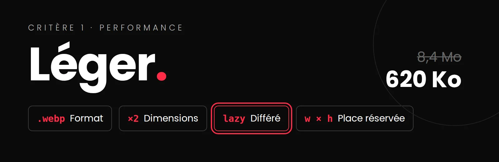
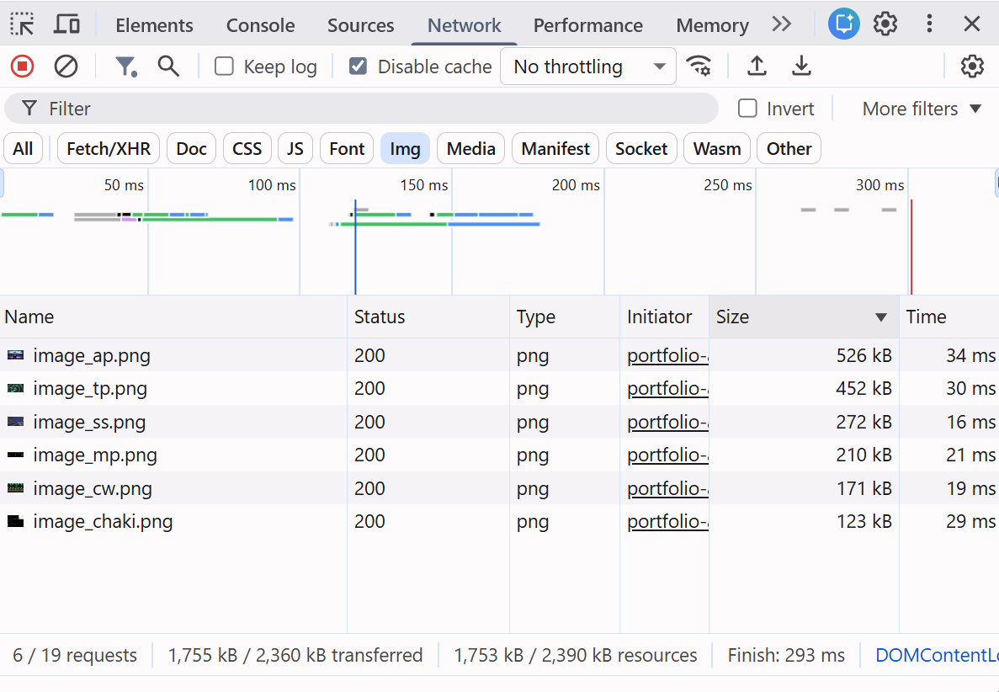
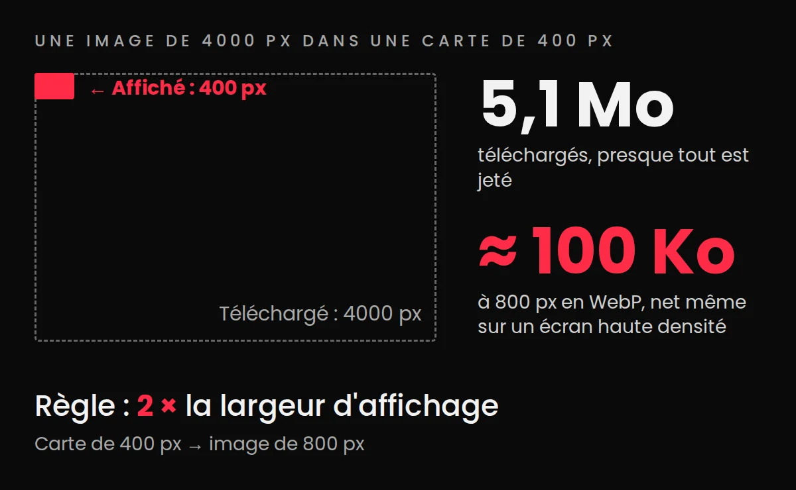

# Optimiser les médias

{.w-100}

!!! abstract "L'essentiel en 3 points"
    1. Les images et les vidéos pèsent presque toujours plus lourd que tout le reste du site réuni. Les optimiser, c'est le gain de vitesse le plus facile à obtenir.
    2. Quatre gestes : le **bon format**, les **bonnes dimensions**, le **chargement différé** (`loading="lazy"`) et la **place réservée** (`width` et `height`).
    3. On **mesure avant et après** dans l'onglet Réseau (Network) : c'est la preuve à inscrire dans l'onglet Correctifs de votre fichier QA.

<div class="grid cards" markdown>

-   :material-speedometer: __Mesurer__

    ---

    Le poids total, avant et après, dans l'onglet Réseau.

    [:octicons-arrow-right-24: Mesurer d'abord](#mesurer)

-   :material-file-image-outline: __1. Le bon format__

    ---

    WebP pour les photos, SVG pour les logos.

    [:octicons-arrow-right-24: Le format](#format)

-   :material-resize: __2. Les bonnes dimensions__

    ---

    Environ 2 fois la largeur d'affichage, pas plus.

    [:octicons-arrow-right-24: Les dimensions](#dimensions)

-   :material-timer-sand: __3. Le chargement différé__

    ---

    `loading="lazy"` : seulement ce qui approche de l'écran.

    [:octicons-arrow-right-24: Le chargement différé](#lazy)

-   :material-crop-free: __4. La place réservée__

    ---

    `width` et `height` : la page ne saute plus.

    [:octicons-arrow-right-24: Réserver la place](#dimensions-html)

-   :material-video-outline: __Les vidéos__

    ---

    Hébergées sur YouTube ou Vimeo, ou un court MP4 compressé.

    [:octicons-arrow-right-24: Les vidéos](#videos)

</div>

## Pourquoi optimiser les médias ?

Optimiser les médias est crucial pour améliorer la performance d'un site web. Les images et vidéos sont souvent les éléments les plus lourds d'un site, et leur optimisation peut avoir un impact significatif sur le temps de chargement et l'expérience utilisateur.

### Dans le cadre du projet portfolio

**Critère d'évaluation**: C'est un indicateur du **critère 1** de votre grille : [«Traitement optimisé des médias pour le web : format adapté à l'usage, compression appropriée, dimensions adéquates»](https://tim-montmorency.com/compendium/582-511-web5/projets/portfolio/index-textuel.html#critere-1-conception-structuree-et-complete-du-projet-015t-15). 

**Contrôle de la qualité (QA)**: Le [scénario 11 du gabarit QA](https://cmontmorency365-my.sharepoint.com/:x:/r/personal/mariem_ouellet_cmontmorency_qc_ca/Documents/01_cours/Cours%20Web%205%20-%20Projet%20Web/04_projets/01-projet-portfolio/qa-2026/_GABABIT-NE-PAS-MODIFIER%20Copier.xlsx?d=w073f93e8bd63477783fd8b9bbdc0cb6e&csf=1&web=1&e=5tfnUF&nav=MTJfQjE1X3swMDAwMDAwMC0wMDAxLTAwMDAtMDEwMC0wMDAwMDAwMDAwMDB9){ :target="_blank" } le teste.

[:material-clipboard-check-multiple: Retour aux consignes QA du portfolio](../projets/portfolio/qa-portfolio.md){ .md-button }

## Mesurer d'abord { #mesurer }

<div class="grid grid-1-2">
  
  <ol>
    <li>Ouvrez votre site en ligne, puis l'inspecteur (F12) → onglet <strong>Réseau</strong> (Network).</li>
    <li>Cochez <strong>Désactiver le cache</strong> (Disable cache), puis filtrez sur <strong>[Img]</strong>.</li>
    <li>Rechargez la page (Ctrl + F5).</li>
    <li>En bas de l'onglet : le <strong>nombre <em>x</em></strong> d'images (<em>x</em> / y requests) et le <strong>poids total <em>x</em></strong> transféré (<em>x</em> kB / y kB transferred).</li>
    <li>Triez la colonne <strong>Taille</strong> (Size) : les plus lourdes en haut. Ce sont elles qu'on traite en premier.</li>
  </ol>
</div>

!!! tip "Un repère"
    Une image de carte de projet devrait peser **quelques dizaines de Ko**, et une grande image d'en-tête rarement plus de **200 à 300 Ko**. Une photo de 3 Mo sortie directement de l'appareil ou de Figma, c'est un écart **majeur**. C'est trop lourd et ça ralentit le site. On peut facilement descendre à 100 à 200 Ko, voire moins, sans perte visible.

!!! warning "Important: Notez le poids total **avant** vos corrections"
    <span class="label-important">IMPORTANT à cette étape</span>: Notez le poids total **avant** vos corrections : vous le comparerez après. Vous pouvez déjà l'inscrire dans l'onglet **Correctifs** de [votre fichier QA](https://cmontmorency365-my.sharepoint.com/:f:/r/personal/mariem_ouellet_cmontmorency_qc_ca/Documents/01_cours/Cours%20Web%205%20-%20Projet%20Web/04_projets/01-projet-portfolio/qa-2026?d=w4a3f50b34edd4cb1a4014fafe79b1ea2&csf=1&web=1&e=HML1yB){ :target="_blank" }, comme preuve de votre travail.

## 1. Le bon format { #format }

| Contenu | Format | Pourquoi |
|---|---|---|
| Photo, capture, visuel de projet | **WebP** (ou AVIF) | Beaucoup plus léger que JPG ou PNG, à qualité égale. Supporté par tous les navigateurs récents. |
| Logo, icône, illustration vectorielle | **SVG** | Net à toutes les tailles, très léger. |
| Image avec transparence | **WebP** | Remplace le PNG, en plus léger. |
| Vidéo | **MP4** (H.264) | Lu partout. |

### Convertir et compresser : deux options

=== "Rapide : en ligne"

    [Squoosh](https://squoosh.app/){ :target="_blank" } : gratuit, dans le navigateur, sans compte ni installation.

    1. Glissez votre image dans la page.
    2. À droite, choisissez **WebP**, qualité **75 à 80** (la différence est souvent invisible).
    3. **Resize** : réduisez la largeur à 2 fois la taille d'affichage (voir la section suivante).
    4. Comparez avec le curseur au centre, puis téléchargez.

    Le poids avant et après s'affiche en bas : notez-le pour votre onglet Correctifs.

=== "Plus de contrôle : Photoshop"

    1. **Image → Taille de l'image** : réduisez la largeur à 2 fois la taille d'affichage.
    2. **Fichier → Enregistrer une copie**, format **WebP**, qualité environ 75 à 80.
    3. Ou **Fichier → Exporter → Exporter sous** pour un JPG ou un PNG, avec un aperçu du poids avant d'enregistrer.

    Pour un **logo ou une icône vectorielle** : dans Illustrator, **Fichier → Exporter → Exporter sous**, format **SVG**.

## 2. Les bonnes dimensions { #dimensions }

<div class="grid grid-1-2">
  
  <div>
    <p>Une image de 4000px de large affichée dans une carte de 400px : le navigateur télécharge 10 fois trop de pixels en largeur (100 fois trop au total), puis les jette.</p>
    <p><strong>Règle simple</strong> : environ <strong>2 fois</strong> la largeur d'affichage, pour rester net sur les écrans haute densité (ex. une carte affichée à 400px → une image de 800px).</p>
  </div>
</div>

Pour connaître la largeur d'affichage : inspecteur → survolez l'image dans l'onglet Éléments, sa taille s'affiche. Redimensionnez ensuite avec l'une des deux options ci-dessus.

## 3. Le chargement différé : `loading="lazy"` { #lazy }

Par défaut, le navigateur télécharge **toutes** les images de la page dès l'ouverture, même celles tout en bas que le visiteur ne verra peut-être jamais. Avec `loading="lazy"`, une image n'est téléchargée qu'à l'approche du défilement.

```html

```

### Dans vos cartes générées en JavaScript

Une seule ligne de plus dans le gabarit de `createProjectCard()`, et toutes vos cartes en profitent :

```js
return `
  <article class="project-card">
    
    ...
  </article>
`;
```

!!! danger "Pas de `lazy` sur l'image du haut de la page"
    L'image d'en-tête (le *hero*), visible dès l'ouverture, doit s'afficher **tout de suite**. Avec `loading="lazy"`, elle arriverait en retard. Le chargement différé, c'est pour ce qui est **plus bas** dans la page.

## 4. Réserver la place : `width` et `height` { #dimensions-html }

Sans dimensions dans le HTML, le navigateur ne sait pas quelle place prendra l'image avant qu'elle arrive : le texte s'affiche, puis **saute** vers le bas quand l'image se charge. Avec `width` et `height`, la place est réservée d'avance.

```html

```

Ce sont les dimensions **réelles du fichier**. Votre CSS garde le contrôle de la taille affichée :

```css
.project-card__image {
  width: 100%;
  height: auto;
}
```

Le navigateur s'en sert seulement pour connaître la **proportion** (ici 4:3) et réserver la bonne hauteur.

## Les vidéos { #videos }

Une vidéo pèse souvent plus lourd que tout le reste du site réuni. La règle de base : **hébergez vos vidéos de projet sur YouTube ou Vimeo**, et intégrez-les dans votre portfolio. C'est leur serveur qui fait le travail : compression, qualité adaptée à la connexion, lecture sur tous les appareils.

### 1. YouTube ou Vimeo : récupérer le code d'intégration

=== "YouTube"

    1. Sous la vidéo : **Partager** → **Intégrer**.
    2. Copiez le code. Il ressemble à ceci :

    ```html
    <iframe width="560" height="315"
      src="https://www.youtube.com/embed/ID_DE_LA_VIDEO"
      title="YouTube video player"
      frameborder="0"
      allow="accelerometer; autoplay; clipboard-write;
             encrypted-media; gyroscope; picture-in-picture;
             web-share"
      referrerpolicy="strict-origin-when-cross-origin"
      allowfullscreen></iframe>
    ```

    Une vidéo de projet qui ne doit pas apparaître dans les recherches de YouTube? Mettez-la **Non répertoriée** : elle reste visible dans votre portfolio.

=== "Vimeo"

    1. Sous la vidéo : **Partager** (l'avion en papier) → **Intégrer**.
    2. Copiez le code. Il ressemble à ceci :

    ```html
    <div style="padding:56.25% 0 0 0;position:relative;">
      <iframe
        src="https://player.vimeo.com/video/ID_DE_LA_VIDEO"
        frameborder="0"
        allow="autoplay; fullscreen; picture-in-picture"
        style="position:absolute;top:0;left:0;
               width:100%;height:100%;"
        title="Titre de la vidéo"></iframe>
    </div>
    <script src="https://player.vimeo.com/api/player.js"></script>
    ```

    Vimeo n'affiche pas de publicité ni de vidéos suggérées : c'est souvent le choix des créatifs pour un portfolio.

### 2. Adapter le code avant de le coller

Le code copié tel quel fonctionne, mais il n'est pas prêt pour votre portfolio. Trois ajustements :

| Ajustement | Pourquoi |
|---|---|
| Retirer `width` et `height`, et gérer la taille en CSS | Avec `width="560"`, la vidéo déborde sur mobile |
| Ajouter `loading="lazy"` | La vidéo ne se charge qu'à l'approche du défilement |
| Remplacer le `title` par un vrai titre | C'est ce qu'annonce le lecteur d'écran (voir la [page Accessibilité](accessibilite.md)) |

```html
<iframe class="project-video"
  src="https://www.youtube.com/embed/ID_DE_LA_VIDEO"
  title="Biome : démonstration de l'application"
  loading="lazy"
  allow="encrypted-media; picture-in-picture; fullscreen"
  allowfullscreen></iframe>
```

```css
.project-video {
  width: 100%;
  aspect-ratio: 16 / 9;  /* garde la proportion, sans calcul */
  border: 0;
}
```

!!! tip "Dans vos données : seulement l'ID"
    Dans votre source de données, la propriété `video` n'a besoin que de l'ID (ex. `dQw4w9WgXcQ`). Votre JavaScript construit l'adresse : `` `https://www.youtube.com/embed/${project.video}` ``. Un seul gabarit, toutes les vidéos de vos projets.

### 3. Une courte vidéo dans votre site : la balise `<video>`

Pour un **court extrait** (une animation en boucle, un aperçu de quelques secondes), un fichier `.mp4` dans votre dépôt peut remplacer une vidéo hébergée, ou un GIF.

Mais comme pour les images, **on n'ajoute jamais une vidéo telle qu'elle sort du logiciel** : une exportation de 20 secondes peut peser 50 Mo. Visez :

- **court** : 30 secondes au plus;
- **léger** : quelques Mo au plus;
- **la bonne taille** : la résolution d'affichage (souvent 1280 px de large suffit), pas du 4K;
- **sans son**, s'il joue tout seul.

**Compresser : deux options**

=== "Rapide : en ligne"

    [Adobe Express : compresser une vidéo](https://www.adobe.com/express/feature/video/compress){ :target="_blank" } (connectez-vous avec votre compte Adobe du Collège).

    1. Téléversez votre vidéo.
    2. Choisissez une qualité **moyenne** : c'est souvent suffisant pour un aperçu.
    3. Téléchargez le MP4, et comparez le poids avant et après.

    Rien à installer, environ 2 minutes.

=== "Plus de contrôle : Media Encoder"

    Dans la suite Adobe, **Media Encoder** (ou **Exporter** dans Premiere Pro) :

    1. Format **H.264**, préréglage *Débit adaptatif moyen* ou *YouTube 720p*.
    2. Réduisez la taille de l'image si votre vidéo est en 4K.
    3. Décochez **Exporter l'audio** si la vidéo joue sans son.

    Plus long à ouvrir, mais vous réglez tout.

Ensuite, deux usages, deux codes :

=== "Aperçu en boucle (remplace un GIF)"

    ```html
    <video autoplay muted loop playsinline
           poster="assets/images/biome-poster.webp">
      <source src="assets/videos/biome-apercu.mp4"
              type="video/mp4">
    </video>
    ```

    `muted` est **obligatoire** : les navigateurs bloquent la lecture automatique d'une vidéo avec du son. `playsinline` évite le plein écran forcé sur iPhone.

=== "Vidéo lancée par le visiteur"

    ```html
    <video controls preload="none"
           poster="assets/images/biome-poster.webp">
      <source src="assets/videos/biome.mp4" type="video/mp4">
    </video>
    ```

    `preload="none"` : rien n'est téléchargé avant le clic sur Lecture. `poster` : l'image affichée en attendant.

!!! tip "Un GIF? Remplacez-le par un MP4"
    Pour la même animation, un MP4 est souvent **beaucoup plus léger** qu'un GIF (souvent 10 fois moins lourd).

## Mesurer après, et le documenter { #documenter }

Refaites la mesure de la [première section](#mesurer). Dans l'onglet **Correctifs** de votre fichier QA :

- **Correctif apporté** : « Images converties en WebP et redimensionnées à 800px, `loading="lazy"` sur les cartes »;
- **Comment j'ai validé** : « Onglet Réseau (Network), filtre Img : 8,4 Mo → 620 Ko ».

Un avant et un après chiffrés : c'est exactement la preuve qu'attend la grille.

## Références

- [Chargement différé des images (lazy loading) (MDN)](https://developer.mozilla.org/fr/docs/Web/Performance/Guides/Lazy_loading){ :target="_blank" }
- [L'élément `` (MDN)](https://developer.mozilla.org/fr/docs/Web/HTML/Reference/Elements/img){ :target="_blank" }
- [Squoosh: outil en ligne pour compresser vos images](https://squoosh.app/){ :target="_blank" } : convertir et compresser dans le navigateur
