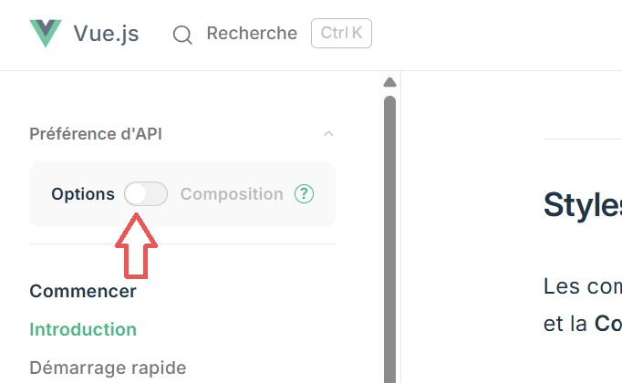

<!--https://squidfunk.github.io/mkdocs-material/reference/admonitions/
✏️note, 📄abstract, ℹ️info, 🔥tip, ✔️success, ❔question, ⚠️warning, ❌failure, ⚡danger, 🐞bug, 🧪example, ❜❜quote
-->

<!--
 Considérer intégrer des templates genre: https://www.landingfolio.com/library/all/vue pour exercices Vue, peiut-être un TP qui se build à mesure qu'ils apprenent un nouveau concept...
-->

# Intro à Vue.js 

**Vue** (prononciation: View) est un framework JavaScript progressif utilisé pour construire des interfaces utilisateur. Il est conçu pour être adaptable et peut être intégré dans des projets existants ou utilisé pour créer des applications web complètes.

<iframe width="315" height="560"
src="https://www.youtube.com/embed/_1-GRjQROAw?si=Etou1mPTlyThUbau"
title="YouTube video player"
frameborder="0"
allow="accelerometer; autoplay; clipboard-write; encrypted-media; gyroscope; picture-in-picture; web-share"
allowfullscreen></iframe>

## Quelques exemples Vue

* [Démos sur vuejsexamples.com](https://vuejsexamples.com/)  

* [Made with Vue.js](https://madewithvuejs.com/) 

Quelques exemples que j'ai sélectionnés pour vous :

* [Une table de données interactive: Easy Data Table](https://hc200ok.github.io/vue3-easy-data-table-doc/)
* [Un jeu de Pokémons construit avec Vue.js et Tailwind CSS](https://vuejsexamples.com/a-pokemon-game-built-with-vue-and-tailwind-css/)
* [Une composante Vue.js qui affiche une list des personnages de Rick and Morty.](https://vuejsexamples.com/a-vue-js-component-that-displays-a-list-of-rick-and-morty-characters/)
* [Composante de formulaire](https://vueform.com/examples/accomodation-and-travel-create-listing)
* [Composante de shopping  de matériel informatique](https://www.eloshapes.com/mouse/browse)
* [Unicorn: Convertisseurs d'unités de mesure](https://unicon.pages.dev/)
* [Quelques exemples de projets Vue.js regroupés sur une collection CodePen.](https://codepen.io/collection/kNQdop)

## Vidéo: Vue.js en 2 minutes

[:material-play-circle: Voir une vidéo](https://www.youtube.com/watch?v=KgcKB7ZrPvw){ .md-button :target="_blank" }

## Vue: version 3

Attention, dans le cadre de ce cours vous allez apprendre la *version 3* de Vue.js. Assurez vous toujours de vérifier la version lorsque vous cherchez de la documentation ou des réponses à vos questions.

!!! note "Nous utiliserons Options API"

    Il existe 2 styles d'API pour coder en VUE.js: *Options API* et *Composition API*. Donc si vous parcourez la documentation de VUE.js il est possible que vous tombiez sur l'un et l'autre, ne soyez pas intimidé.

    Les deux styles d'API sont tout à fait capables de couvrir les cas d'utilisation courants. Il s'agit d'interfaces différentes alimentées par le même système sous-jacent. En fait, l'*Options API* est mise en œuvre au-dessus de la **Composition API** ! Les concepts fondamentaux sont partagés entre les deux styles et ils sont équivalents.

    Dans le cadre de ce cours, nous utiliserons le style *Options API*. [Plus d'info ici.](https://fr.vuejs.org/guide/introduction.html#api-styles)

    Dans la documentation Vue, en haut à gauche sous *Préférence d'API*, assurez-vous de toujours activer *Options*.

    

## Installation

Comme pour toute librairie, afin d'avoir accès à ses fonctionnalités, il est nécessaire de l'inclure dans notre&nbsp;projet.

Pour ce faire, il est possible&nbsp;:

- d'<a target="_blank" rel="noopener noreferrer" href="https://vuejs.org/guide/quick-start.html#using-vue-from-cdn">utiliser un **CDN** (<em>Content Delivery Network</em>)</a> 
- d'utiliser le gestionnaire de paquets JavaScript **NPM** [pour ajouter le paquet Vue.js](https://tim-montmorency.com/timdoc/582-518MO/javascript/npm/#installation-de-npm).

!!! tip "Quoi utiliser pour le moment?"

    En début de session, nous allons commencer avec l'<a target="_blank" rel="noopener noreferrer" href="https://vuejs.org/guide/quick-start.html#using-vue-from-cdn">utilisation du CDN (<em>Content Delivery Network</em>)</a> plutôt que le NPM. Nous reviendrons sur la méthode NPM un peu plus tard.

### Installer Vue avec CDN

<a target="_blank" rel="noopener noreferrer" href="https://vuejs.org/guide/quick-start.html#using-vue-from-cdn">Suivre ce lien</a> pour récupérer la balise <code>script</code> à copier et à ajouter à votre page HTML. Collez-le en bas, juste avant la fermeture de la balise <code>body</code> mais AVANT le fichier **script.js** dans lequel vous allez créer votre instance Vue et coder par la suite.

### Installer Vue avec la commande NPM

Pour utiliser la NPM [pour ajouter le paquet Vue.js](https://tim-montmorency.com/timdoc/582-518MO/javascript/npm/#installation-de-npm) et l'installer dans votre projet, tapper la ligne de commande suivante: 
`npm install vue`

!!! warning "NPM et Node.js"

    Avant d'aller plus loin si vous décidez d'utiliser NPM, assurez-vous d'abord d'avoir préalablement installé NodeJS et NPM. 
    
    Voir les liens suivant pour vérifier si [Node.js est installé](https://tim-montmorency.com/timdoc/582-518MO/javascript/npm/#installation-de-nodejs) et si [NPM est installé](https://tim-montmorency.com/timdoc/582-518MO/javascript/npm/#installation-de-npm).

1. Ouvrez votre terminal (vous pouvez utiliser celui de Visual Studio Code)
2. Exécutez la commande suivante : `npm install vue`

## Concepts de base

Une fois installé, vous pouvez commencer à explorer les concepts de base de Vue.js :

* *Instance Vue* : La base de toute application Vue.js est une instance Vue.
* *La syntaxe de templates* : Utilisez des templates pour lier des données à l'interface utilisateur.
* *Directives* : Les directives sont des attributs spéciaux dans Vue.js qui permettent de manipuler le DOM (bref le HTML et son contenu).
* *Composantes/Components* : Les composants sont des blocs réutilisables de code qui peuvent être utilisés pour construire des interfaces complexes.

## Ressources supplémentaires

Voici quelques ressources utiles :

* [https://fr.vuejs.org/guide/introduction.html](https://fr.vuejs.org/guide/introduction.html)​
* ​[https://www.vuemastery.com/](https://www.vuemastery.com/)​
* [https://www.udemy.com/topic/vuejs/)](https://www.udemy.com/topic/vuejs/)​

## Alternatives à Vue.js

* [React](https://react.dev/)
* [Svelte](https://svelte.dev/)
* [Angular](https://angular.dev/)