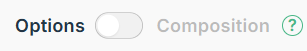

# Interpolation de données [](assets/logo-vue.svg)

## Données {{ }}

Afin de définir le comportement de l'app, un objet contenant diverses propriétés doit lui être passé en paramètre. Parmi ces propriétés se trouve <code>data</code>: une fonction retournant les données susceptibles de changer dans l'application.


Par exemple, pour définir une valeur de nom, il est possible d'écrire:
```
const app = Vue.createApp({
  data: function() {
    return {
      firstName: "Willy",
      lastName: "Wonka",
      picture: "willy-wonka.jpg"
    }
  }
});
```


<br>

Pour des raisons de lisibilité, il est cependant suggéré d'utiliser la nouvelle syntaxe ES6, soit:

```
const app = Vue.createApp({
  data() {
    return {
      firstName: "Willy",
      lastName: "Wonka",
      picture: "willy-wonka.jpg"
    }
  }
});
```


<p><code>data</code> est donc une fonction retournant un objet constitué dans ce cas-ci des propriétés: <code>firstName</code>, <code>lastName</code> et <code>picture</code>.</p>


[En savoir plus sur <code>data()</code>](https://vuejs.org/guide/essentials/template-syntax.html#dynamically-binding-multiple-attributes){ .md-button :target="_blank" }

<small style="vertical-align: bottom">Dans le cadre de ce cours, n'oubliez pas de toujours consulter la docmentation avec l'<em>API Options</em> </small>


## Interpolation des données {{ }}

Une fois, les données définies, il est possible d'y faire référence à l'aide de moustaches <code style="white-space: nowrap;">{{...}}</code>. Leurs contenus, incluant les moustaches elles-mêmes, seront remplacés par la donnée qui lui est associée. Qui plus est, si la valeur de cette donnée vient à changer, celle-ci se mettra automatiquement à jour dans le HTML.

Par exemple, le code suivant:
```
<div id="app">
    Salut {{ firstName }}
</div>
```


<br><br>
Affichera en fait:
```
<div id="app">
    Salut Willy
</div>
```


[En savoir plus sur l'interpolation](https://vuejs.org/guide/essentials/template-syntax.html#text-interpolation){ .md-button :target="_blank" }

<small style="vertical-align: bottom">Dans le cadre de ce cours, n'oubliez pas de toujours consulter la docmentation avec l'<em>API Options</em> </small>


!!! warning
    <strong>Erreur fréquente</strong>
    Les moustaches ne sont fonctionnelles qu’à l’intérieur de la balise HTML assignée à&nbsp;l’app (la balise qui est <code>mount</code>)

   

<br><br>
<p>Voici une petite démo d'un minuteur automatique.</p>

<p class="codepen" data-height="600" data-theme-id="light" data-default-tab="html,result" data-slug-hash="bGXJeOp" data-pen-title="DEMO Vue.js: Données moustache et minuteur setInterval" data-user="tim-momo" style="height: 300px; box-sizing: border-box; display: flex; align-items: center; justify-content: center; border: 2px solid; margin: 1em 0; padding: 1em;">
  <span>See the Pen <a href="https://codepen.io/tim-momo/pen/bGXJeOp">
  DEMO Vue.js: Données moustache et minuteur setInterval</a> by TIM Montmorency (<a href="https://codepen.io/tim-momo">@tim-momo</a>)
  on <a href="https://codepen.io">CodePen</a>.</span>
</p>
<script async src="https://public.codepenassets.com/embed/index.js"></script>


## Attributs des balises HTML via <span style="white-space: nowrap;">:v-bind&nbsp;ou&nbsp;:</span>

Les données peuvent aussi être insérées dynamiquement dans un attribut HTML <em>(class, src, alt, style, etc.)</em>. Cependant, les moustaches ne sont pas fonctionnelles dans ce contexte ❌. Il faut donc plutôt utiliser une directive <code>v-bind</code> en début d'attribut afin que son contenu se popule avec une donnée présente dans l'objet data.


Par exemple, pour afficher l'image contenue dans la propriété <code>picture</code>:

```
<div id="app">
    
</div>
```


ou encore la syntaxe courte avec <code>:</code>&nbsp;:

```
<div id="app">
    
</div>
```


<br><br>
Si plusieurs données doivent être combinées dans le cadre d'un attribut, il est nécessaire d'utiliser un *littéraux de gabarit* afin de gérer la combinaison.

Par exemple, pour inscrire le prénom et le nom dans le <code>alt</code> d'une image:

```
<div id="app">
    
</div>
```

<p class="codepen" data-height="360" data-theme-id="light" data-default-tab="html,result" data-slug-hash="oNJKqxv" data-pen-title="DEMO VueJS | Données" data-user="tim-momo" style="height: 300px; box-sizing: border-box; display: flex; align-items: center; justify-content: center; border: 2px solid; margin: 1em 0; padding: 1em;">
  <span>See the Pen <a href="https://codepen.io/tim-momo/pen/oNJKqxv">
  DEMO VueJS | Données</a> by TIM Montmorency (<a href="https://codepen.io/tim-momo">@tim-momo</a>)
  on <a href="https://codepen.io">CodePen</a>.</span>
</p>
<script async src="https://public.codepenassets.com/embed/index.js"></script>


!!! warning
    Si un attribut est associé à une donnée dont la valeur équivaut à <code>null</code> ou <code>undefined</code>, l’attribut ne sera pas&nbsp;créé.


[En savoir plus sur Attributs](https://vuejs.org/guide/essentials/template-syntax.html#attribute-bindings){ .md-button :target="_blank" }

<small style="vertical-align: bottom">Dans le cadre de ce cours, n'oubliez pas de toujours consulter la docmentation avec l'<em>API Options</em> </small>


## Données en format HTML
<p>Si vous souhaitez envoyer une donnée en HTML, plutôt que d'utiliser les moustaches, vous devrez utiliser l'attribut <incode>v-html</incode> sur la balise qui contiendra votre donnée.</p>

```
const app = Vue.createApp({
  data() {
    return{
      monTitre: '<h2>Vue.js est formidable!</h2>'
    }
  }
});
app.mount('#app');
```


<p>Ce qui va générer ce résultat:</p>


```
<div>
    <h2>Vue.js est formidable!</h2>
</div>
```
