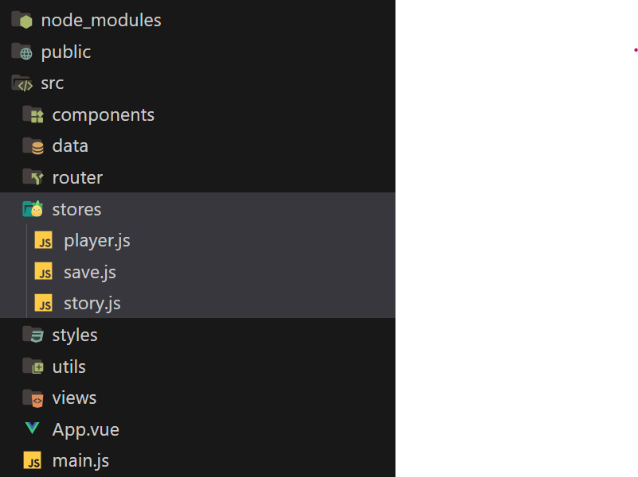

# Pinia en bref

<!-- https://laconsole.dev/formations/vue/pinia -->

> *Pinia = le "cerveau central" de votre application Vue*

[Pinia](https://pinia.vuejs.org/) est une *bibliothèque de stockage* et/ou un *gestionnaire d'état* pour Vue.js. Il permet de partager un état entre les composants ou les views (pages) de l'application par l'intermédiaire d'une zone de stockage partagée appelé *store*.

Le partage de données entre un composant parent et enfant peut-être réalisé classiquement via des `props`et `emit`. Cependant, si nous souhaitons partager un état entre de nombreuses pages/composants, cela devient un peu complexe à gérer.

Voilà pourquoi Pinia existe!

C'est un endroit où vous pouvez stocker des données qui devront être *partagées entre plusieurs composants* Vue.

??? question "Pourquoi Pinia, quel problème résout-il?"
    ## 🤔Le problème qu'il résout

    ### Sans Pinia (le cauchemar)

    Imaginez que vous avez:

    - Un composant `Header.vue` qui affiche le nom de l'utilisateur
    - Un composant `Sidebar.vue` qui liste les salles du musée
    - Un composant `MemoryList.vue` qui affiche les mémoires
    - Un composant `AddMemoryForm.vue` qui ajoute une mémoire

    *Comment faire circuler les données entre tous ces composants?*

    ```
    App.vue (parent)
    ├── Header.vue (affiche userName)
    ├── Sidebar.vue (affiche rooms)
    └── MainContent.vue
    ├── MemoryList.vue (affiche memoryList (la liste des souvenirs))
    └── AddMemoryForm.vue (ajoute une memory (un souvenir))

    ```


    Sans Pinia, vous devez:

    1. Passer les données de parent en enfant avec `props` (fastidieux!)
    2. Remonter les événements avec `emits` (complexe!)
    3. Dupliquer les données dans plusieurs composants (cauchemar de synchronisation!)

    *Exemple sans Pinia (`props` hell):*

    ```vue
    <!-- App.vue -->
    <template>
      <Header :userName="userName" />
      <Sidebar :rooms="rooms" @room-added="addRoom" />
      <MainContent 
        :rooms="rooms" 
        :memories="memories"
        @memory-added="addMemory"
      />
    </template>

    <script>
    export default {
      data() {
        return {
          userName: 'Alice',
          rooms: [...],
          memories: [...]
        };
      },
      methods: {
        addRoom(room) { /* ... */ },
        addMemory(memory) { /* ... */ }
      }
    }
    </script>
    ```

    Vous devez passer TOUT contenu à travers les `props`, même aux composants profondément imbriqués! 😱

    ## Avec Pinia (la solution élégante)

    *Vous créez un "store" (magasin) central* où TOUS les composants peuvent:

    - Lire les données directement
    - Modifier les données directement
    - S'abonner aux changements automatiquement

    ```vue
    <!-- Dans n'importe quel composant, n'importe où -->
    <script setup>
    /* On importe la méthode use...Store depuis le store 
    qu'on aura préalablement créé */
    import { useMuseumStore } from '@/stores/museumStore';

    // On stock la méthode dans une constante interne
    const museumStore = useMuseumStore();

    // Lire des données du store
    console.log(museumStore.rooms);

    // Ajouter une données au store (ici on ajoute une mémoire)
    museumStore.addMemory(roomId, memoryData);
    </script>
    ```

    *Magique!* Tous les composants qui utilisent `museumStore` se mettent à jour automatiquement. ✨


    ## 🔄Comparaison: Composant vs Store

    |     Composant Vue    |      Store Pinia     |
    |:--------------------:|:--------------------:|
    | data()               | state()              |
    | computed             | getters              |
    | methods              | actions              |
    | Local à un composant | Global à toute l'app |

    #### C'est comme un composant Vue, mais partagé partout!


## Installation de Pinia

Vérifiez si vous ne l'avez pas déjà installé avec le package Vite. Pour ce faire, ouvrez le ficheir `package.json` et vérifiez si `"pinia"` fait partie de la liste des `"dependencies"`.

Si *Pinia* n'est pas déjà installé, vous pouvez l'installer en entrant cette commande dans votre terminal

```bash
npm install pinia
```

## Initialisation de Pinia

Pour initialiser Pinia, vous devez importer la méthode `createApp()` dans votre fichier `main.js` puis l'enregistrer avec `app.use()`.

*`src/main.js`*

```
import { createApp } from 'vue'
import { createPinia } from 'pinia'
import App from './App.vue'

// ...

const app = createApp(App)
app.use(createPinia())
app.mount('#app')
```

## Définir un store Pinia

Un store Pinia a **3 parties principales:**

### `STATE`

`STATE`: Les données (comme `data()` dans un composant classique Vue)

### `GETTERS`

`GETTERS`:  Données calculées (comme les propriétés calculées `computed` dans un composant classique Vue)

Dans un `getter`, si on veut accéder au données `state`, on doit écrire préfixer le nom de la données par `state.`. 
Par exemple `state.dataName` où `dataName` est le nom de la données à laquelle on se réfère.

### `ACTIONS`

`ACTIONS`: Fonctions qui modifient le state (comme `methods` dans un composant classique Vue)

Dans un `action`, si on veut accéder au données `state`, on doit écrire préfixer le nom de la données par `this.`. 
Par exemple `this.dataName` où `dataName` est le nom de la données à laquelle on se réfère.

---

### Définir un store Pinia: le fichier .js

Pour définir un nouveau store Pinia, il faut créer un nouveau fichier JavaScript. Ces fichiers JavaScript doivent être placés dans le un dossier `stores` dans `src` juste à coté des dossiers `components`, `router`, `views` etc.




Par exemple un store Pinia qui s'appellerait `museumStore` serait défini dans un fichier placé ici:

*`src/stores/museum.js`*

```javascript
// On importe la méthode defineStore depuis le module `pinia` 
import { defineStore } from 'pinia';

// On défnit un store appelé "museum" 
// (ou autre nom adapté à votre projet)
export const useMuseumStore = defineStore('museum', {
  /* 
  1️⃣ STATE - Les données 
  (comme data() dans un composant classique Vue)
  */
  state: () => ({
    rooms: [],
    currentRoomId: null,
    userName: 'Alice'
  }),

  /* 
  2️⃣ GETTERS - Données calculées 
  (comme computed dans un composant classique Vue)
  */
  getters: {
    currentRoom: (state) => {
      /* find() recherche dans l'array des salles (state.rooms)
      la salle courante (state.currentRoomId) */
      return state.rooms.find(room => room.id === state.currentRoomId);
    },
    
    totalMemories: (state) => {
      /* reduce() additionne le nombre de memories accumulées jusqu'à présent
      dans toutes les salles au nombre de memories de la salle actuelle */
      return state.rooms.reduce((sum, room) => 
        sum + room.memories.length, 0
      );
    }
  },

  /*
  3️⃣ ACTIONS - Fonctions qui modifient le state
  (comme methods dans un composant classique Vue)
  */
  actions: {
    addRoom(room) {
      this.rooms.push(room);
    },
    
    deleteRoom(roomId) {
      // On cherche l'INDEX (la position) de la room dans l'array des salles
      const index = this.rooms.findIndex(r => r.id === roomId);
      // On le retire du tableau des salles
      this.rooms.splice(index, 1);
    }
  }
});
```

## Accéder au stores

Pour accéder aux éléments d'un store dans un composant Vue, il faut d'abord importer ce fameux store.

Ensuite, on fait appel à la fonction helper de pinia nommée `mapStore()` afin de mapper l'ensemble des éléments du store  (`state`, `getters`) au sein de propriétés calculées `computed` du composant.

On fait appel

```vue
import { mapStores } from 'pinia'
import { useMuseumStore } from '../stores/museum'

export default {
	computed: {
		// Store accessible via l'objet this.useMuseumStore
		...mapStores(useMuseumStore),
	}
}
```

Ensuite, ces propriétés calculées sont accessibles via un objet nommé: *identifiant du store + `Store`*. Par exemple, ici ce serait `museumStore`.

Par exemple:

```
museumStore.rooms // Pour le state qui contient la liste des salles
museumStore.currentRoom // Pour un getter qui retourne le contenu de la salle courante
museumStore.deleteRoom(4) // Pour une action qui supprime la salle ayant l'id 4
```

## Exemple complet d'un compteur utilisant un store Pinia

<div style="max-width: 1280px"><div style="position: relative; padding-bottom: 56.25%; height: 0; overflow: hidden;"><iframe src="https://cmontmorency365-my.sharepoint.com/personal/mariem_ouellet_cmontmorency_qc_ca/_layouts/15/embed.aspx?UniqueId=68bf5ed9-94bf-4dca-9cab-aa01eff5e8f8&embed=%7B%22hvm%22%3Atrue%2C%22ust%22%3Atrue%7D&referrer=StreamWebApp&referrerScenario=EmbedDialog.Create" width="1280" height="720" frameborder="0" scrolling="no" allowfullscreen title="demo-pinia-counter.mp4" style="border:none; position: absolute; top: 0; left: 0; right: 0; bottom: 0; height: 100%; max-width: 100%;"></iframe></div></div>

On enregistre les composants `componentA.vue` et `componentV.vue`

*Fichier `src/main.js`*

```vue
import { createApp } from 'vue'
import { createPinia } from 'pinia'
import App from './App.vue'
import ComponentA from './components/ComponentA.vue'
import ComponentB from './components/ComponentB.vue'

import './assets/main.css'

const app = createApp(App)

app.use(createPinia())

app.component('ComponentA', ComponentA)
app.component('ComponentB', ComponentB)

app.mount('#app')
```

On utilise ces 2 composants dans `App.vue`

*Fichier `src/App.vue`*

```
<template>
	<ComponentA/>
	<ComponentB/>
</template>
```

On déclare un store `counter.js`

*Fichier `src/stores/counter.js`*

```
import { defineStore } from 'pinia'

export const useCounterStore = defineStore('counter', {
	state: () => ({
		counter: 0
	}),
	actions: {
		increment() {
			this.counter++
		}
	},
	getters: {
		isEven: (state) => {
			return state.counter % 2 == 0
		}
	}
})
```

On peut désormais utiliser ce store partagé dans plusieurs composants.

Par exemple, j'incrémente le compteur du store depuis `ComponentA`

*Fichier `src/components/ComponentA.vue`*

```
<template>
	<h1>Component A</h1>
	<button @click="counterStore.increment()">Ajouter</button>
</template>

<script>
	import { useCounterStore } from '../stores/counter'
	import { mapStores } from 'pinia'
	
	export default {
		computed: {
			...mapStores(useCounterStore),
		}
	}
</script>
```

Je récupère la valeur du compteur du store depuis `ComponentB`:

*Fichier `src/components/ComponentB.vue`*

```
<template>
	<h1>Component B</h1>
	<p>{{ counterStore.counter }}</p>
</template>

<script>
	import { useCounterStore } from '../stores/counter'
	import { mapStores } from 'pinia'
	
	export default {
		computed: {
			...mapStores(useCounterStore),
		}
	}
</script>
```


## Configuration de stores pour le projet *App web créative*

### Pour *Mémoires interactives*

*Structure des stores suggérée:*

1. *`useMuseumStore`*
   - State (équivalent de data()):
     - `rooms`
     - `currentRoomId`
     - `museumName`
     - `theme`
   - Actions (équivalent de methods):
     - `addRoom()` (optionnel car certains projets ne le permettent pas)
     - `updateRoom()`
     - `deleteRoom()`
     - `setCurrentRoom()`

2. *`useMemoryStore`*
   - State (équivalent de data()):
     - `memories`
     - `filters`
     - `searchQuery`
   - Actions (équivalent de methods):
     - `addMemory()`
     - `updateMemory()`
     - `deleteMemory()`
     - `searchMemories()`
   - Getters (équilavent de computed):
     - `filteredMemories`
     - `memoriesByRoom`
     - `memoriesByTag`

3. *`useAuthStore`* (optionnel)
   - State (équivalent de data()): 
     - `user`
     - `isAuthenticated`
   - Actions (équivalent de methods): 
     - `login()`
     - `logout()`
     - `register()`

#### Checklist *Mémoires interactives*

- [ ] Création des 2 *stores* obligatoires:
  - [ ] `useMuseumStore.js` (structure de base)
  - [ ] `useMemoryStore.js` (structure de base)

- [ ] Développement des *composants clés* qui utilisent les stores:
  - [ ] `RoomCard.vue` (carte de salle)
  - [ ] `MemoryCard.vue` (carte de mémoire)
  - [ ] `MemoryList.vue` (grille de mémoires)

### Pour *Trace ton chemin*

*Structure des stores suggérée:*

1. *`useStoryStore`* (le plus important du projet)

   - State (équivalent de data()):
     - `currentChapterId`
     - `visitedChapters`
     - `storyData`
     - `availableChoices`
   - Actions (équivalent de methods):
     - `loadChapter()`
     - `makeChoice()`
     - `goToChapter()`
   - Getters (équilavent de computed):
     - `currentChapter`
     - `isChapterUnlocked()`

2. *`usePlayerStore`* (commencez simple d'abord, juste avec le nom)
   - State (équivalent de data()):
     - `playerName`
     - `karma`
     - `stats`
     - `inventory`
     - `flags`
     - `relationships`
   - Actions (équivalent de methods):
     - `addToInventory()`
     - `updateStat()`
     - `setFlag()`
     - `updateRelationship()`
   - Getters (équilavent de computed):
     - `hasItem()`
     - `getRelationship()`
     - `canAccessEnding()`

3. *`useSaveStore`*
   - State (équivalent de data()):
     - `saveSlots` (array de 3 slots)
   - Actions (équivalent de methods): 
     - `saveGame()`
     - `loadGame()`
     - `deleteSave()`
     - `getSaveInfo()`
   - Getters (équilavent de computed):
     - `hasSaves`
     - `latestSave`

4. *`useAudioStore`* (optionnel)
   - State (équivalent de data()):
     - `currentMusic`
     - `soundEffects`
     - `volume`
     - `isMuted`
   - Actions (équivalent de methods):
     - `playMusic()`
     - `playSound()`
     - `toggleMute()`
     - `setVolume()`

#### Checklist *Trace ton chemin*

- [ ] Création des 2 premier *stores*:
  - [ ] `useStoryStore.js` (chapitres, navigation)
  - [ ] `usePlayerStore.js` (état du joueur, commencez réalistement, juste avec son nom)

- [ ] Création du *fichier JSON avec les chapitres*

- [ ] Développement des *composants clés* qui utilisent les stores:
  - [ ] `ChoiceButton.vue` (bouton de choix)
  - [ ] `ChoicePanel.vue` (panel de choix)


## Store Pinia de base

Utilisez ce template générique de base pour débuter:

```javascript
import { defineStore } from 'pinia';

export const useExampleStore = defineStore('example', {
  state: () => ({
    items: [],
    currentItem: null,
    isLoading: false,
    error: null
  }),

  getters: {
    // Retourne le nombre d'items dansle array state.items
    itemCount: (state) => state.items.length,

    /* Retourne true si l'array state.items contient des items
    et false s'il est vide */
    hasItems: (state) => state.items.length > 0,

    /* Récupére un item spécifique de l'array state.items
    par son id */
    getItemById: (state) => (id) => {
      return state.items.find(item => item.id === id);
    }
  },

  actions: {
    // ajoute un items au tableau this.items
    addItem(item) {
      this.items.push({
        ...item,
        id: Date.now().toString(),
        createdAt: new Date().toISOString()
      });
    },

    /* modifie un item spécifique du tableau this.items 
    en lui spécifiant son id */
    updateItem(id, updates) {
      const index = this.items.findIndex(item => item.id === id);
      if (index !== -1) {
        this.items[index] = { ...this.items[index], ...updates };
      }
    },

    /* supprime un item du tableau this.items
    en lui spécifiant son id */
    deleteItem(id) {
      const index = this.items.findIndex(item => item.id === id);
      if (index !== -1) {
        this.items.splice(index, 1);
      }
    },

    /* modifie l'item actuel à afficher (storé dans this.currentItem) 
    en lui spécifiant le id */
    setCurrentItem(id) {
      this.currentItem = this.getItemById(id);
    }
  }
});
```

## Exemple d'un composant intégrant un store Pinia

<small>Ajout du 13 novembre 2025</small>

```vue
<template>
  <div class="items-list">
    <h1>Liste des items ({{ exampleStore.itemCount }})</h1>
    
    <div v-if="exampleStore.isLoading">Chargement...</div>
    
    <div v-else-if="exampleStore.hasItems">
      <div 
        v-for="item in exampleStore.items" 
        :key="item.id"
        class="item-card"
      >
        <h3>{{ item.name }}</h3>
        <button @click="selectItem(item.id)">Voir</button>
        <button @click="removeItem(item.id)">Supprimer</button>
      </div>
    </div>
    
    <div v-else>
      <p>Aucun item</p>
    </div>
    
    <ButtonPrimary @click="addNewItem">
      Ajouter un item
    </ButtonPrimary>
  </div>
</template>

<script>
import { useExampleStore } from '@/stores/exampleStore';
import { mapStores } from 'pinia';
import ButtonPrimary from '@/components/ui/ButtonPrimary.vue';

export default {
  name: 'ItemsList',
  
  components: {
    ButtonPrimary
  },
  
  computed: {
    // Mapper le store complet
    // Cela donne accès à : exampleStore.state, exampleStore.getters, exampleStore.actions
    ...mapStores(useExampleStore)
  },
  
  methods: {
    addNewItem() {
      // Accès aux actions via exampleStore
      this.exampleStore.addItem({
        name: `Item ${this.exampleStore.itemCount + 1}`,
        description: 'Nouvel item'
      });
    },
    
    removeItem(id) {
      if (confirm('Supprimer cet item?')) {
        // Accès aux actions via exampleStore
        this.exampleStore.deleteItem(id);
      }
    },
    
    selectItem(id) {
      // Accès aux actions via exampleStore
      this.exampleStore.setCurrentItem(id);
      this.$router.push(`/item/${id}`);
    }
  }
};
</script>

<style scoped>
.items-list {
  padding: 2rem;
}

.item-card {
  border: 1px solid #ddd;
  padding: 1rem;
  margin: 1rem 0;
  border-radius: 8px;
}
</style>
```
