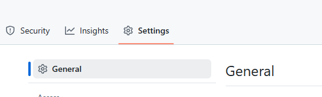
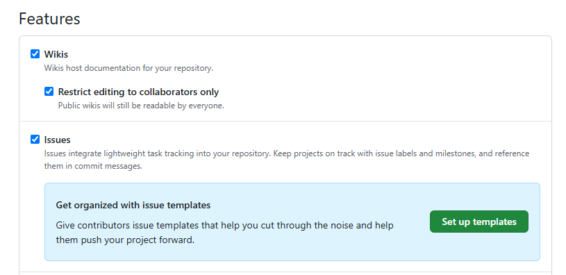

# Cours 14
## ⚠️ Heure des cours modifiée
Cours Lora: 12h40 à 15h20

Cours Charlène: 14h20 à 17h

## Conférence de Synthèse
14h20 à 15h20: C-1712     

[📁 Informations sur Arristage](https://polesynthese.com/arrimage/arristage){ .md-button }    

[📁 Plateforme Boussole](https://polesynthese.com/boussole){ .md-button }     

[📁 Fiches métier et capsules vidéo](https://polesynthese.com/boussole/fiches-metiers-numerique){ .md-button }     

[📁 Parcours professionnels](https://polesynthese.com/boussole/faire-le-bon-choix-de-carriere){ .md-button }     

[📁 Platerforme Experts (l'offre est gratuite pour un an aux diplômés des programmes de nos secteurs)](https://polesynthese.com/fr/experts/){ .md-button }    

[📁 Répertoire de formations](https://polesynthese.com/repertoire/formations){ .md-button }    

[📁 Répertoire de métiers](https://polesynthese.com/repertoire/metiers){ .md-button }    

[📁 Répertoire d'entreprises](https://polesynthese.com/repertoire/entreprises){ .md-button }    

## Guide du travailleur autonome
[📁 Accéder au guide](https://cmontmorency365-my.sharepoint.com/:b:/g/personal/lora_boisvert_cmontmorency_qc_ca/Edg24C6YapVOiRO9agjLVsoBkFHpwhdj7osLAUoZNOf7jA?e=VFV52N){ .md-button }

## Avancer le projet final
[📁 Voir la présentation](https://cmontmorency365-my.sharepoint.com/:b:/g/personal/lora_boisvert_cmontmorency_qc_ca/EbORw7nH2j9Epj5s-m1xY58BtO5SrE7HiO0TXAMxanut8g?e=YAEyth){ .md-button }

#### Activer les issues    

#### Précision sur les issues     
<iframe width="560" height="315" src="https://www.youtube.com/embed/ht0oIyg2Byw?si=YdaC-VSENiH8o1UQ" title="YouTube video player" frameborder="0" allow="accelerometer; autoplay; clipboard-write; encrypted-media; gyroscope; picture-in-picture; web-share" referrerpolicy="strict-origin-when-cross-origin" allowfullscreen></iframe>
