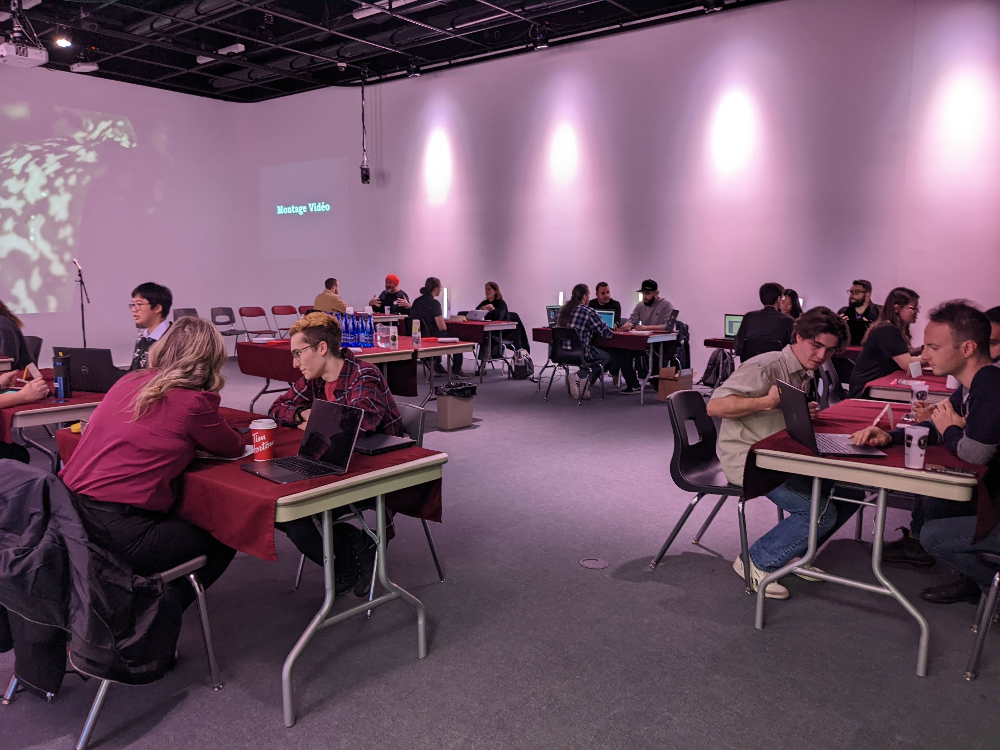

# Cours 1 - Bienvenue! 
## Wooclap

## Plan de cours
 
[📋 Consulter le plan de cours](https://cmontmorency365-my.sharepoint.com/:b:/g/personal/lora_boisvert_cmontmorency_qc_ca/EUWwACJgnypNg84pk8frp5gB4ozDwHnxN9N1rCoDW1BLiA?e=rNFy0U){ .md-button }             

## Capsule du cours
[🎥 Une capsule](https://polesynthese.com/orientation-professionnelle-en-creation-numerique/capsules-videos-les-metiers-du-numerique){ .md-button }     

## Créer son journal de bord
Ajout à l'équipe GitHub des stages

[🛠️ Copier le template du journal de préparation](https://github.com/tim-montmorency-preparation-stage/modele_journal_preparation_stage){ .md-button }      

## Créer son profil     
Suivre les consignes du document mon_profil.md

      
## Chasse aux compétences douces

## 5 à 7
[🛠️ Inscription](https://www.eventbrite.ca/e/billets-activite-de-maillage-laval-carrefour-des-talents-1412761771489?aff=oddtdtcreator){ .md-button }   

Planification de la séance photo
Invitations pour la journée carrière? 

## Journée carrière     
Formation des comités   

Répartition des tâches

Visite de la salle

## Devoir
Recherche de projets pour votre portfolio. Au prochain cours vous devez apporter les images, captures écrans et vidéos.

[STOP]

Design: Mise en page d'une invitation pour les employeurs et de cartes d'affaires

Communication: Rédaction de l'invitation pour les employeurs et mise au point de l'horaire, suivi des invitations

Photo: Préparation de la séance photo

Réception: Financement et achats

Studio: Création de la liste d'équipements. Montage de la salle. Rédaction des courriels pour l'emprunt de matériel.

