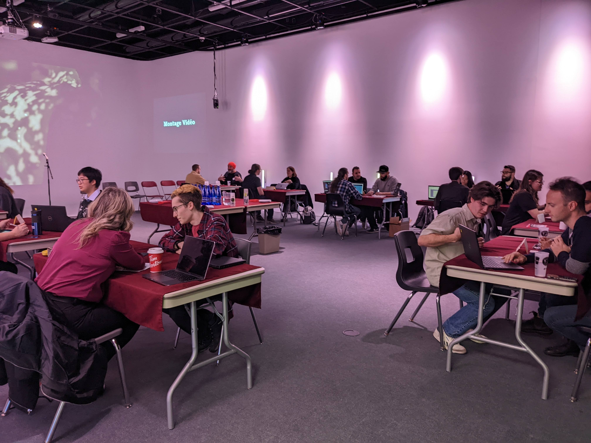

# Cours 1 - Bienvenue! 

!!! info "Dates"

    - Groupe Enric : 24 août.
    - Groupe Lora : 27 août.

## Wooclap

## Plan de cours
 
[📋 Consulter le plan de cours de Lora](https://cmontmorency365-my.sharepoint.com/:b:/g/personal/lora_boisvert_cmontmorency_qc_ca/IQCz6WAkD5eyQ7dWShQvGLUXAdOaINIT0Dfu1bv5Dy1S3Us?e=doGy9u){ .md-button }         

[📋 Consulter le plan de cours d'Enric](https://cmontmorency365-my.sharepoint.com/:b:/g/personal/egllagostera_cmontmorency_qc_ca/IQCvYgk_SZlLRpbl8wJdC-J_AfzySn5GocbbD3AjPifrS3w?e=Yb6Qz6){ .md-button } 

[🛠️ Choix visite université](https://forms.cloud.microsoft/r/bJxtFbJuGr){ .md-button }    

## Médiagraphie
[📋 Guide sur la recherche d'emploi](https://la-voie.cssdm.gouv.qc.ca/wp-content/uploads/sites/42/2022/10/CV_guide_recherche_emploi.pdf){ .md-button }             

[📋 Activités pour aller plus loin](https://cdn.careercruising.com/clientservice/Activit%C3%A9s%20de%20recherche%20d'emploi.pdf){ .md-button }

## Créer son profil     

[🛠️ Miro Profil](https://miro.com/app/board/uXjVHxlfmaY=/?share_link_id=629734370388){ .md-button }    

### Consignes
- [ ] Crée une copie du tableau nommé Prénom, nom
- [ ] Remplace Prénom, nom par ton nom.
- [ ] Pour la classe, choisis un des éléments suivants: Designer, intégrateur web, modélisateur 3D, Monteur vidéo, concepteur sonore...
- [ ] Va sur le [site 16 personnalités](https://www.16personalities.com/fr/test-de-personnalite) et effectue le test de personnalité.
- [ ] Change la couleur de fond du tableau à ton nom par celle de ton type de personnalité.
- [ ] Fait une capture-écran de la section Traits de personnalité et remplace la cadre 16 personnalités par celle-ci.
- [ ] Dans la section type, inscrit le type que le test t'a donné.
- [ ] Pour les sections parcours professionnel, développement personnel et relations, choisis un point fort et un point faible qui te correspondent et transcris-les dans ta fiche.
- [ ] Pour les compétences, change la couleur des cercles pour indiquer ta compétence avec chaque élément. Tu peux changer les titres et les logiciels. Le but est d'avoir un aperçu de tes meilleures compétences.
- [ ] Pour ton environnement idéal, voici des choix: petite entreprise, grande entreprise, travailleur autonome, organisme culturel, milieu scolaire...
- [ ] Mode de travail: Hybride, présence ou à distance?
- [ ] Stage idéal: un stage encadré ou avec une grande autonomie?
- [ ] Futur: Milieu du travail, université, voyage, ou indécis?
- [ ] Territoire: Encercle la zone idéale pour ton stage.
- [ ] Transport: Comment te déplaces-tu?
- [ ] Intérêts: Coche les cases des domaines qui t'intéressent pour ton stage.
- [ ] Compagnies: Trouve 5 compagnies qui pourraient t'intéresser pour ton stage. Insère leur logo avec le lien vers leur site web. Voici des sites pour t'aider à trouver des ressources:
  - [XN Québec](https://www.xnquebec.co/repertoire-des-membres/) 
  - [Guilde du jeu vidéo](https://www.laguilde.quebec/fr/membres/) 
  - [Synthèse](https://polesynthese.com/repertoire/studio-creatif)
- [ ] Quête: Tente de trouver une quête pour ton personnage! Quel est son objectif dans sa recherche de stage?

## Capsule du cours
[🎥 Une capsule](https://polesynthese.com/orientation-professionnelle-en-creation-numerique/capsules-videos-les-metiers-du-numerique){ .md-button }     
 

## Journée carrière     
Discussion sur les comités   

## Présentation sur le portfolio    
[📁 Voir la présentation](https://cmontmorency365-my.sharepoint.com/:b:/g/personal/lora_boisvert_cmontmorency_qc_ca/EfuGrArFjcNNo8O5EU8_nlIBscRdiKx7aGiCC1lV7bEGVA?e=ilMnWo){ .md-button }  

## Consignes pour le portfolio    
[🛠️ Consignes portfolio](./evaluations/portfolio.md){ .md-button }        

## Activité sur l'identité visuelle
* En équipe, chacun doit choisir des cartes avec des mots qui représentent l'esthétique souhaitée pour son portfolio.
* Ensuite, faire une recherche internet et collecter des images qui représentent cette esthétique.
* Assembler les images dans un moodboard avec une palette de couleur et des typos pour définir votre identité visuelle.

Voici des inspirations pour la présentation de votre identité:     

[📁 Exemples identites](https://canva.link/umecx1hp5xrxf71){ .md-button }     

## Devoir
* Recherche de projets pour votre portfolio. Au prochain cours vous devez apporter les images, captures écrans et vidéos. 
* Compléter votre identité visuelle. 

[STOP]

Design: Mise en page d'une invitation pour les employeurs et de cartes d'affaires

Communication: Rédaction de l'invitation pour les employeurs et mise au point de l'horaire, suivi des invitations

Photo: Préparation de la séance photo

Réception: Financement et achats

Studio: Création de la liste d'équipements. Montage de la salle. Rédaction des courriels pour l'emprunt de matériel.

