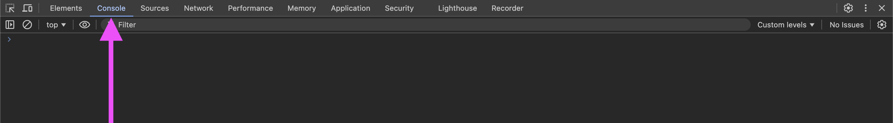

---
tags:
  - Exercice
---

# Les variables et les types


## Matière à connaître

!!! example "Variable"

    C'est un mot qui sauvegarde une valeur. Vous pouvez lui donner le nom que vous voullez.

    Ex: `let profDeWeb = "Marie-Michelle";`. Dans cet exemple, `profDeWeb` est le nom de la variable et `Marie-Michelle` est sa valeur.

!!! example "Déclaration de variable"

    C'est la partie (ou l'endroit) dans le code où une variable est créée et est rendue disponible pour être utilisée.

    Important : Il n'est pas possible de redéclarer une variable existante.

!!! example "Initialisation de variable"

    C'est le processus d'assigner une valeur initiale à une variable au moment de sa déclaration ou plus tard dans le code.

    ```js
    let age = 25;  // Déclaration et initialisation
    let nom;       // Déclaration
    nom = "Alice"; // Initialisation
    ```

!!! example "Type de variable"

    Un type c'est comme une catégorie de variable. Les types de base sont les nombres, les textes, les booléens, les tableaux et les objets.

    ```js
    let age = 25;                               // Type : Nombre (number)
    let nom = "Alice";                          // Type : Texte (string)
    let estEtudiant = true;                     // Type : Booléen (boolean)
    let fruits = ["Pomme", "Banane", "Orange"]; // Type : Tableau (array)
    let personne = { nom: "Alice", age: 25 };   // Type : Objet (object)
    ```

!!! example "Console"

    C’est un espace dans le navigateur où tu peux afficher des messages pour comprendre ce que fait ton programme. C’est aussi là que s’affichent les messages d’erreur si ton programme rencontre un problème.

    { data-zoom-image }

    [Comment ouvrir les outils pour les développeurs Chrome ?](https://developer.chrome.com/docs/devtools/open?hl=fr)

## Exercice

Déclarer des **variables** de différents **types** et les afficher dans la **console**.

## Résultat attendu

```console
Nom : Alice
Âge : 25
Est étudiante : true
```

## Instructions

- [ ] Déclarez une variable de type chaîne de caractères (string) pour stocker votre nom.
- [ ] Déclarez une variable de type nombre (number) pour stocker votre âge.
- [ ] Déclarez une variable de type booléen (boolean) pour indiquer si vous êtes étudiant.
- [ ] Affichez, une ligne à la fois, chacune des variables dans la console.

[STOP]

## Solution

```js
let nom = "Alice";
let age = 25;
let estEtudiant = true;
console.log("Nom : " + nom);
console.log("Âge : " + age);
console.log("Est étudiante : " + estEtudiant);
```
