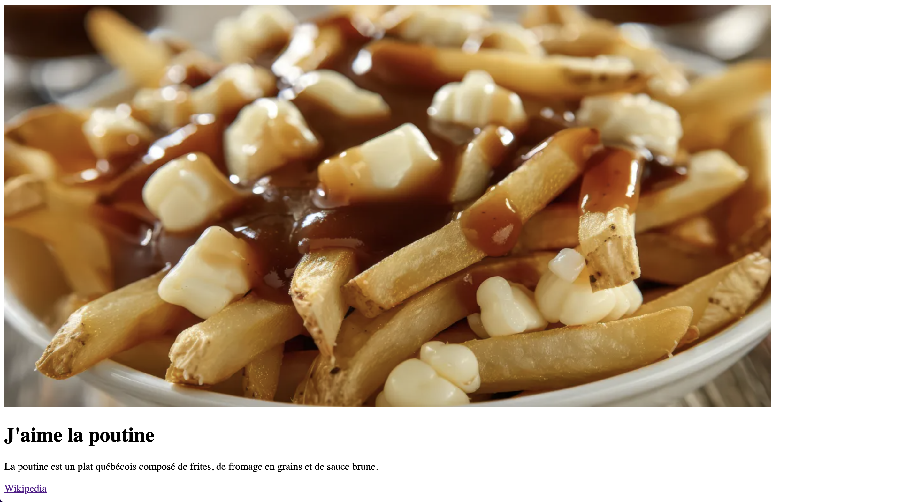
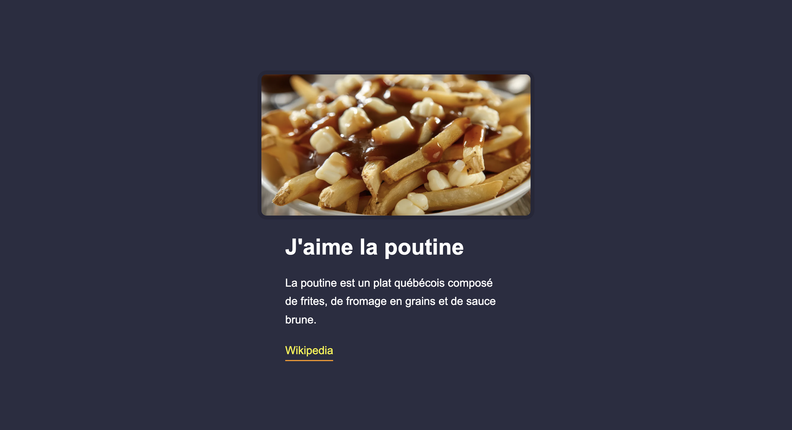

# Ma première page Web

C’est l’heure de programmer votre toute première page Web !

## Étape 1 – Créer le fichier

- [ ] Créez un fichier nommé `index.html` sur votre ordinateur.
- [ ] Ouvrez Visual Studio Code et ouvrez ce fichier.
- [ ] Écrivez le code suivant :

```html
<p>J'aime la poutine</p>
```

- [ ] Sauvegardez.
- [ ] Abaissez VSCode, puis double-cliquez sur `index.html`. Le navigateur devrait alors s'ouvrir affichant la mention "J'aime la poutine".

!!! info

    Juste que là, rien de très impressionnant, mais vous venez tout de même de créer votre première par Web avec un paragraph !

## Étape 2 – Ajouter la structure HTML de base

Ajoutez maintenant la structure HTML complète d’un site Web. Elle ressemble à ceci :

```html
<!DOCTYPE html>
<html lang="fr">
  <head>
    <meta charset="UTF-8">
    <meta name="viewport" content="width=device-width, initial-scale=1.0">
    <title>Poutine</title>
  </head>
  <body>
    <!-- Votre contenu ira ici -->
  </body>
</html>
```

- [ ] Copiez cette structure dans votre fichier.
- [ ] Déplacez votre phrase `<p>J'aime la poutine</p>` à l’intérieur de la balise `<body>`.

## Étape 3 – Ajouter les autres éléments

Ajoutez maintenant les éléments suivants à l’intérieur de `<body>`, dans l’ordre :

- [ ] Une image (avec la balise ``)

```html

```

- [ ] Un titre principal (balise `<h1>`)

```html
<h1>J'aime la poutine</h1>
```

- [ ] Un paragraphe descriptif (balise `<p>`)

```html
<p>La poutine est un plat québécois composé de frites, de fromage en grains et de sauce brune.</p>
```

- [ ] Un lien vers la page Wikipédia de la poutine (balise `<a>`)

```html
<a href="https://fr.wikipedia.org/wiki/Poutine_(plat)">Wikipedia</a>
```

Après avoir sauvegardé et rafraîchi la page dans votre navigateur, vous devriez voir un résultat similaire à ceci :



## Étape 4 – Ajouter des styles

Dans cette étape, vous **n’avez pas besoin d’écrire du CSS vous-même**.  

Un fichier de styles a déjà été préparé pour le cours.

- [ ] Ajoutez la ligne suivante **à l’intérieur de la balise `<head>`** de votre document HTML :

```html
<link rel="stylesheet" href="https://tim-montmorency.com/compendium/developpement-web/exercices/styles.css">
```

Après avoir sauvegardé et rafraîchi la page dans votre navigateur, vous devriez voir un résultat similaire à ceci :


