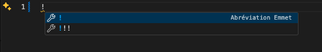

# Ma première page Web

C’est l’heure de programmer sa toute première page Web !

## Étape 1 – Créer le fichier

- [ ] Créer un fichier nommé `index.html` sur l'ordinateur.
- [ ] Ouvrir Visual Studio Code et ouvrir ce fichier.
- [ ] Écrire le code suivant : `<p>J'aime la poutine</p>`.
- [ ] Sauvegarder.
- [ ] Abaisser VSCode, puis double-cliquer sur `index.html`. Le navigateur devrait alors s'ouvrir affichant la mention "J'aime la poutine".

!!! info

    Juste que là, rien de très impressionnant, mais vous venez tout de même de créer votre première page Web avec un paragraph ! 

## Étape 2 – Ajouter la structure HTML de base

- [ ] Ajouter maintenant la structure HTML de base d’un site Web.

!!! tip

    Dans VSCode, dans le fichier html, si on écrit le caractère « ! », ceci devrait apparaitre : 

    

    Appuyer ensuite sur ++enter++ pour ajouter la structure automatiquement.
    
    Sinon, voici le résultat attendu :

    ```html
    <!DOCTYPE html>
    <html lang="fr">
    <head>
        <meta charset="UTF-8">
        <meta name="viewport" content="width=device-width, initial-scale=1.0">
        <title>Poutine</title>
    </head>
    <body>
        <!-- Le contenu de votre site ira ici -->
    </body>
    </html>
    ```

- [ ] Finalement, ajouter le paragraphe `<p>J'aime la poutine</p>` à l’intérieur de la balise `<body>`.
- [ ] Sauvegarder.
- [ ] Rafraichir la page du navigateur. Le résultat devrait être identique.

## Étape 3 – Ajouter les autres éléments

Ajouter les éléments suivants à l’intérieur de la balise `<body>`:

- [ ] Une image (avec la balise ``)

```html

```

- [ ] Un titre principal (balise `<h1>`)

```html
<h1>J'aime la poutine</h1>
```

- [ ] Un paragraphe descriptif (balise `<p>`)

```html
<p>La poutine est un plat québécois composé de frites, de fromage en grains et de sauce brune.</p>
```

- [ ] Un lien vers la page Wikipédia de la poutine (balise `<a>`)

```html
<a href="https://fr.wikipedia.org/wiki/Poutine_(plat)">Wikipedia</a>
```

- [ ] Sauvegarder.
- [ ] Rafraichir la page du navigateur.

Le résultat devrait ressembler à ceci :

{.w-50 data-zoom-image}

## Étape 4 – Ajouter des styles

Un fichier de styles a déjà été préparé pour l'atelier.

- [ ] Ajouter la ligne suivante **à l’intérieur de la balise `<head>`** du document HTML :

```html
<link rel="stylesheet" href="https://tim-montmorency.com/compendium/developpement-web/exercices/styles.css">
```

- [ ] Sauvegarder.
- [ ] Rafraichir la page du navigateur.

Le résultat devrait ressembler à [ceci](./index.html) :

{.w-50 data-zoom-image}
