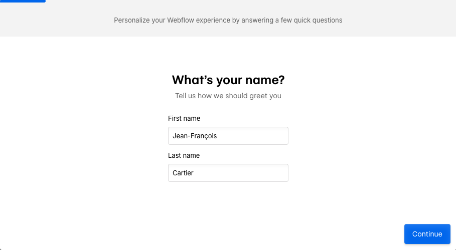
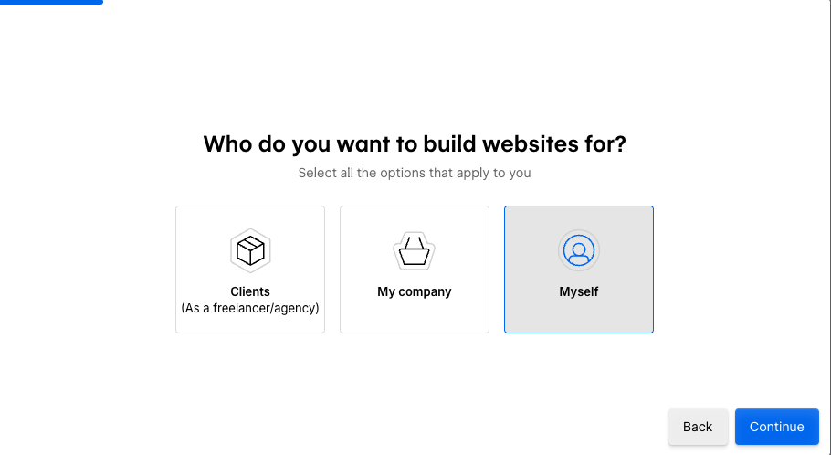
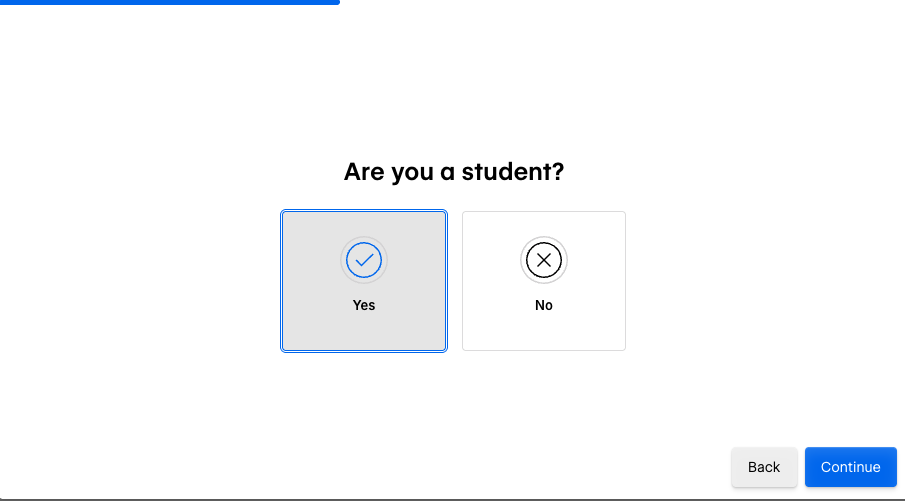
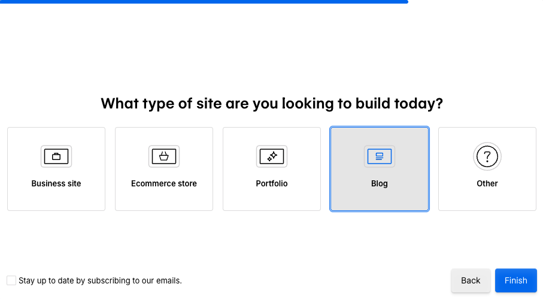
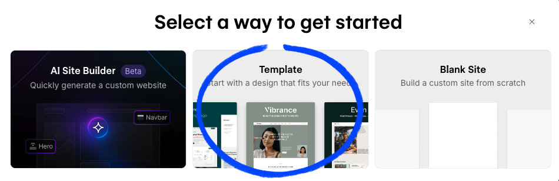
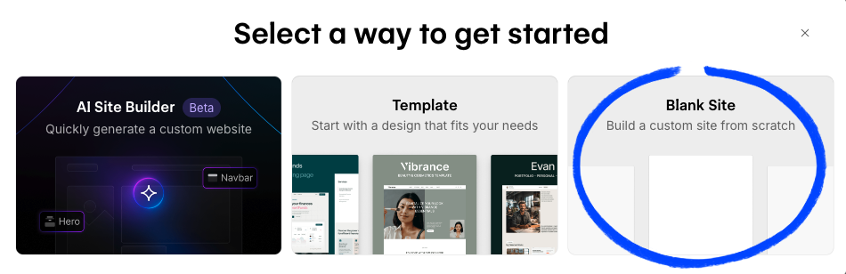

# Webflow

L’objectif de cette section est de vous familiariser avec un Website Builder, afin de mieux comprendre les principes fondamentaux de la construction d’un site.

Vous aurez l’occasion d’explorer par vous-même les différentes fonctionnalités offertes par Webflow.

Cet atelier se déroule en trois parties :

1. Création de compte (évidente, mais nécessaire)
2. Modification d’un site créé à partir d’un modèle (template)
3. Création d’un site Web à partir de zéro (blank site)

## 1. Création de compte

Inscription : https://webflow.com/signup

<figure markdown>
{data-zoom-image}

<figcaption>Entrez votre prénom et nom de famille</figcaption>
</figure>

<figure markdown>
{data-zoom-image}

<figcaption>Choisir « Myself »</figcaption>
</figure>

<figure markdown>
{data-zoom-image}

<figcaption>Choisir « Yes »</figcaption>
</figure>

<figure markdown>
{data-zoom-image}

<figcaption>Choisir « Blog »</figcaption>
</figure>

## Créer un site à partir d'un _Template_

<figure markdown>
{data-zoom-image}

<figcaption>Choisir « Template »</figcaption>
</figure>

Pour cette partie, vous n'aurez qu'à modifier la page d'accueil de votre site !

- [ ] Nommer votre projet avec créativité !
- [ ] Dans barre navigateur situé dans la partie gauche, supprimez tous les éléments qui ne sont pas « Navigation » ou «Footer / Section»
- [ ] Supprimer 

- publication

## Créer un site à partir d'un _Blank site_

<figure markdown>
{data-zoom-image}

<figcaption>Choisir « Blank Site »</figcaption>
</figure>