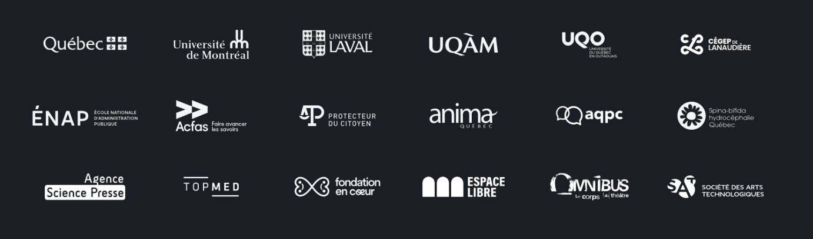
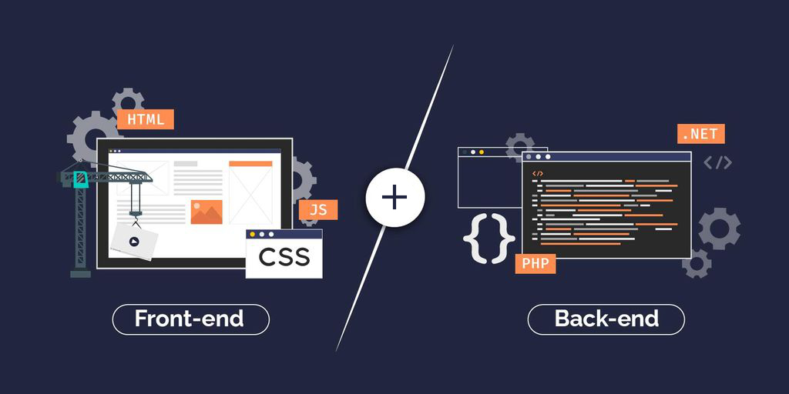
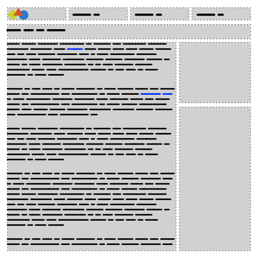
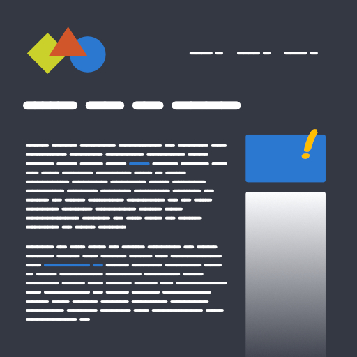
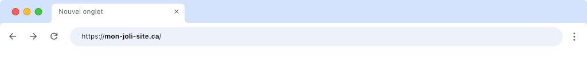

# Introduction au développement Web

## Présentation du conférencier

  

  **Jean-François Cartier** 
  _Vice-président chez [Kiwad inc.](https://kiwad.com)_ 
  _Enseignant en [Techniques d'intégration multimédia](https://tim-montmorency.com/) au Collège Montmorency_ 
  :material-email-variant: [jfcartier@kiwad.com](mailto:jfcartier@kiwad.com) 
  :material-linkedin: [LinkedIn](https://www.linkedin.com/in/jfcartier/)

### Kiwad inc.

  

  Depuis 2008, l'entreprise concentre ses efforts dans les secteurs de la culture🎭, l’éducation 🎓 et le développement social responsable 🌱🤝.

{ data-zoom-image }

## Qu’est-ce que le développement Web ?

Le développement Web consiste à créer des sites et applications accessibles via le réseau Internet.

La création d'un site Web implique de nombreux acteurs comme des designer Web, des adminitrateurs de système, des gestionnaires de projet et bien sur, des programmeurs.

La programmation Web, ou développement Web se catégorise traditionnellement en 2 parties, soit la partie dite Front-end et Back-end.

* **Frontend** : Partie visible et interactive d’un site (design, textes, images).
* **Backend** : Partie invisible gérant les données et la logique (serveurs, bases de données).

Il existe aussi la notion de développeur Full-Stack qui implique les deux parties, mais on devient développeur Full-Stack avec beaucoup d'expérience.

## Langages de programmation

> Un langage de programmation est un langage informatique destiné à formuler des algorithmes et produire des programmes informatiques qui les appliquent[^prog].

C'est comme apprendre une nouvelle langue, mais l'interlocuteur est l'ordinateur !

[^prog]: (en) Kenneth C. Louden et Kenneth A. Lambert, Programming Languages: Principles and Practices, Cengage Learning, 2011 ([ISBN 9781111529413](https://www.cengage.ca/c/programming-languages-3e-louden-lambert/9781111529413/))

<figure markdown>
  
  <figcaption>HTML</figcaption>
</figure>

<figure markdown>
  
  <figcaption>CSS</figcaption>
</figure>

<!-- * `HTML` : Structure de la page.
* `CSS` : Apparence et mise en forme.
* `JavaScript` : Interactivité et dynamisme. 
* Langages backend : `PHP`, `Python`, etc. -->

## Outils

### Programmation

Vscode

### Framework

CMS - Wordpress

## Mise en ligne

Pour mettre un site en ligne, il faut 2 choses. Un nom de domaine et un serveur.

### Nom de domaine

Le nom de domaine c'est une adresse qui permet de trouver un site sur Internet.

https://www.ovhcloud.com/fr-ca/domains

https://www.godaddy.com/fr-ca/domaines

https://www.godaddy.com/fr-ca/domaines/generateur-nom-domaine

questcequonsefaitasoir.ca

### Hébergement

Le hébergement c'est le terrain sur lequel le site est construit. C'est à cet endroit qu'on ajoute le code de notre site Web.

Un server c'est une sorte ordinateur qui connecte votre site à Internet et celui-ci est ouvert 24/7.

Dans les hébergeur on compte OVH

## Ateliers

### Page Web en 5 minutes

### Webflow

## Formations

## Marché du travail

[Quebec.ca](https://www.quebec.ca/emploi/informer-metier-profession/explorer-metiers-professions/21234-developpeurs-developpeuses-et-programmeurs-programmeuses-web) :

* 70k en 2020
* Perspectives d’emploi en 2023-2027 : Excellentes

[Talent.com](https://ca.talent.com/fr/salary?job=developpeur+web)

* Entre 60k et 115k

[jobbank.gc.ca](https://www.jobbank.gc.ca/jobsearch/jobsearch?fn21=21234&sort=M&fprov=QC#results-list-content)

* Entre 60k et 115k

| Source                                                               | Salaire annuel débutant | Salaire annuel expérimenté |
|----------------------------------------------------------------------|-------------------------|----------------------------|
| [**Guichet-Emplois Canada**](https://www.guichetemplois.gc.ca/)      | 50 000 $ - 65 000 $ CAD | 90 000 $ - 110 000 $ CAD   |
| [**Emploi-Québec (IMT)**](https://imt.emploiquebec.gouv.qc.ca/)      | 54 000 $ - 60 000 $ CAD | 85 000 $ - 100 000 $ CAD   |
| [**Indeed Canada**](https://ca.indeed.com/)                          | 55 000 $ - 60 000 $ CAD | 85 000 $ - 95 000 $ CAD    |
| [**Glassdoor Canada**](https://www.glassdoor.ca/)                    | 50 000 $ - 65 000 $ CAD | 85 000 $ - 100 000 $ CAD   |
| [**TechnoCompétences Québec**](https://www.technocompetences.qc.ca/) | 52 000 $ - 60 000 $ CAD | 80 000 $ - 100 000 $ CAD   |

### Travail autonome

SEAO (Appels d'offres public)

[STOP]

	•	Simplicité :
	•	✅ Google Sites, Carrd.co, ou Weebly
	•	Sesign et personnalisation visuelle :
	•	✅ Framer ou Squarespace
	•	Pour une expérience proche de Webflow (visuelle mais professionnelle) :
	•	✅ Wix ou Framer
