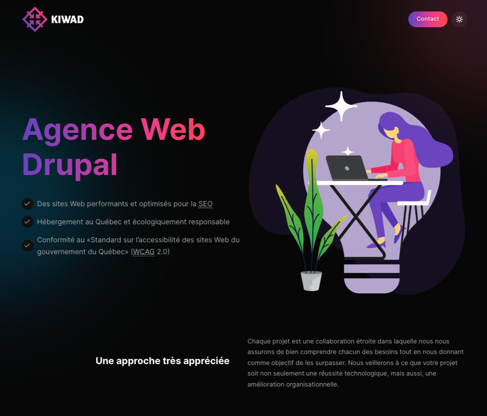
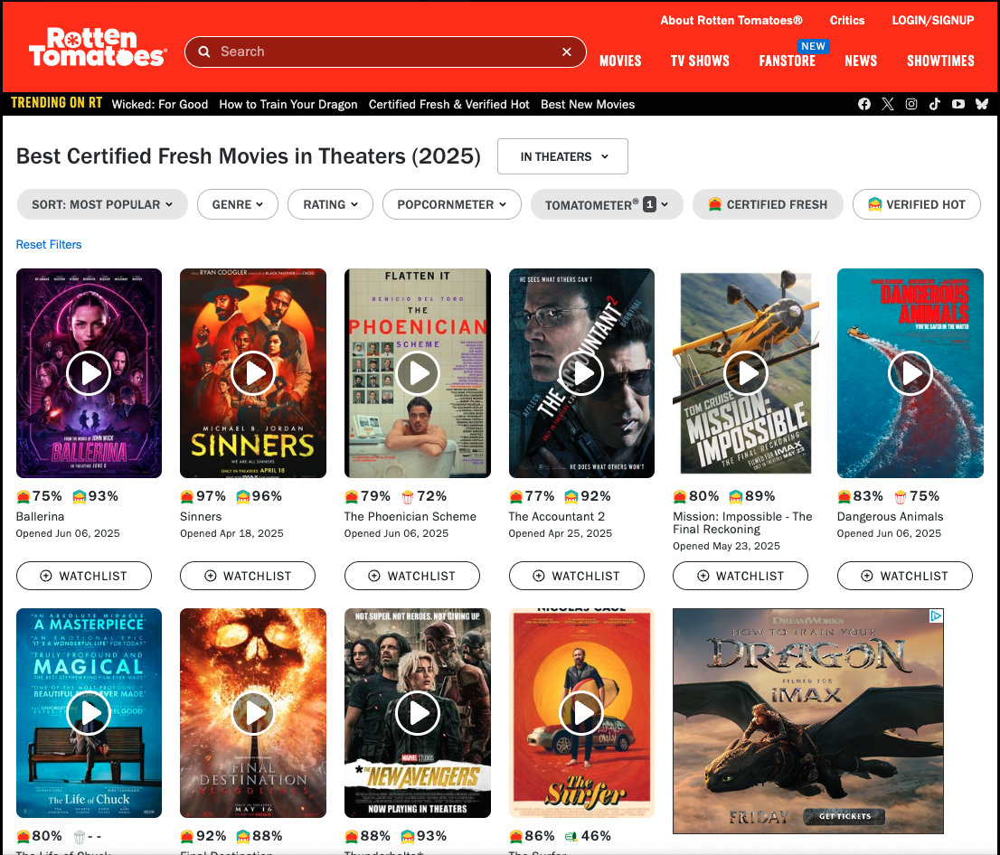
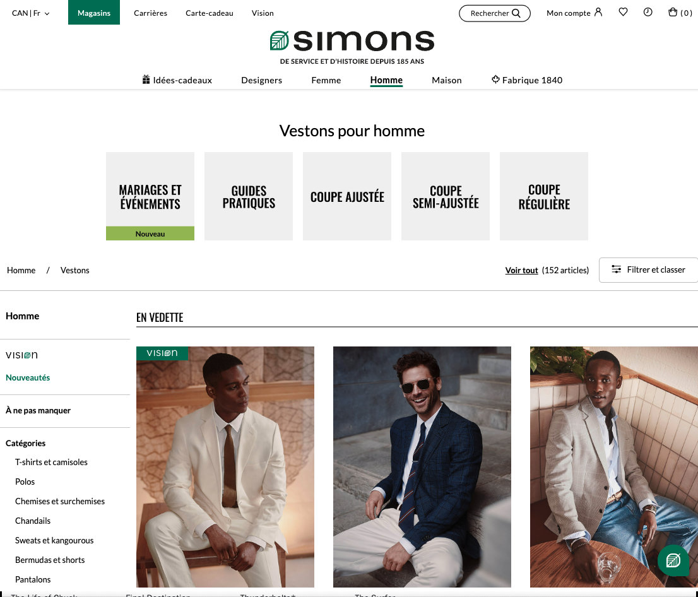
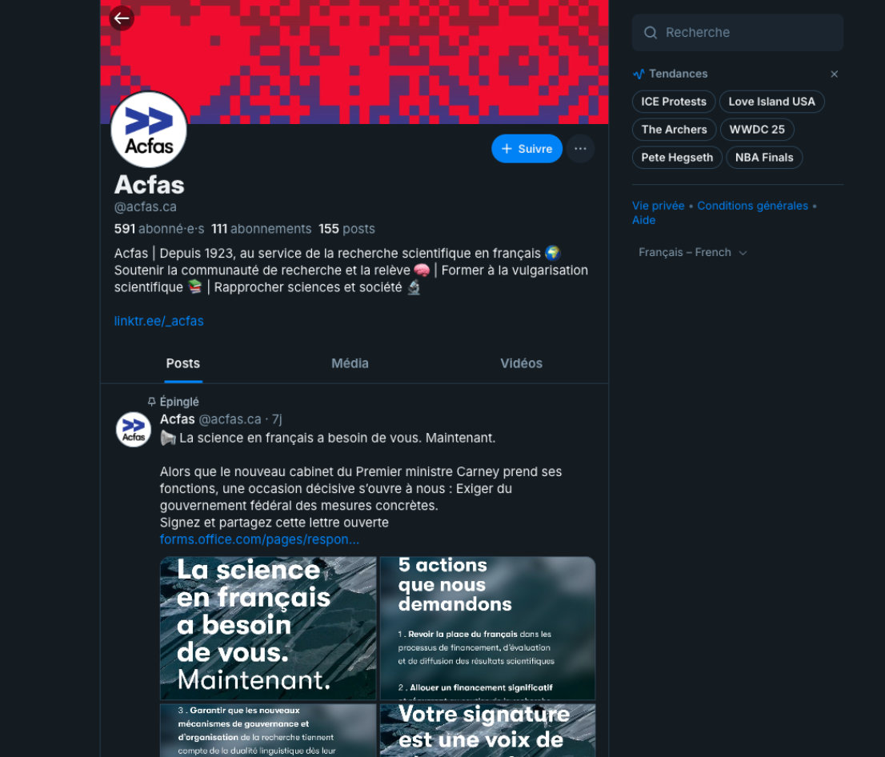
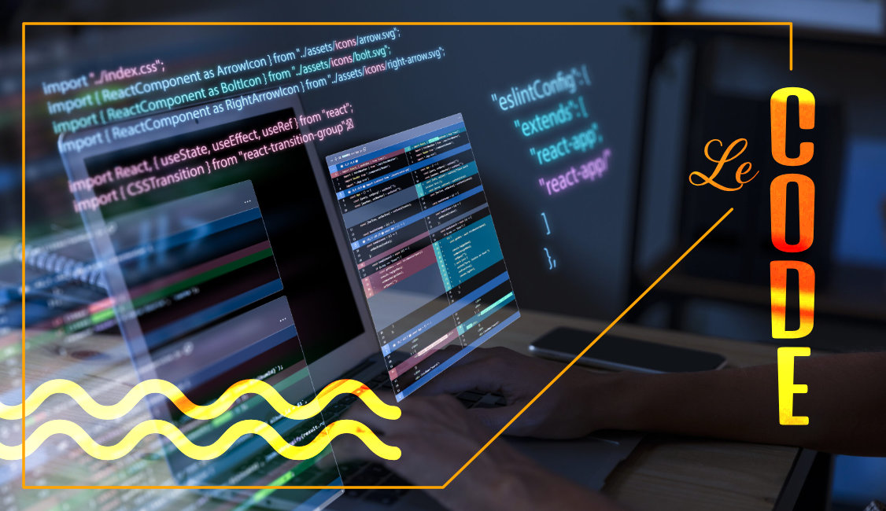
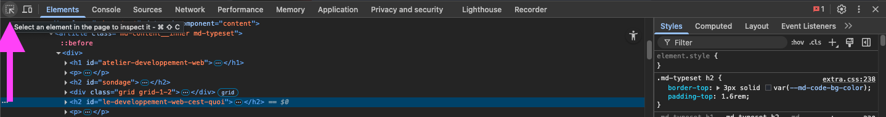
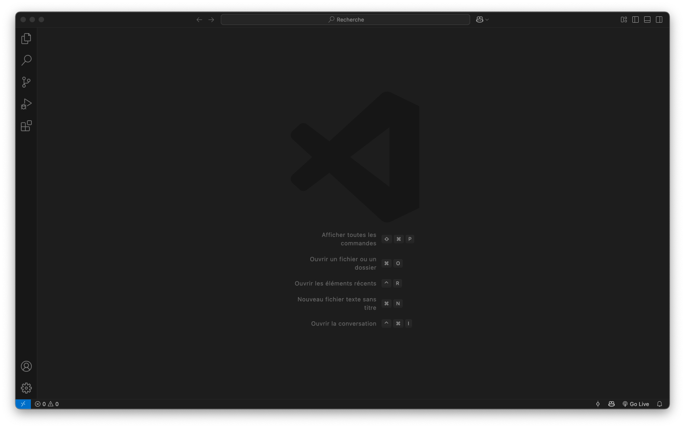
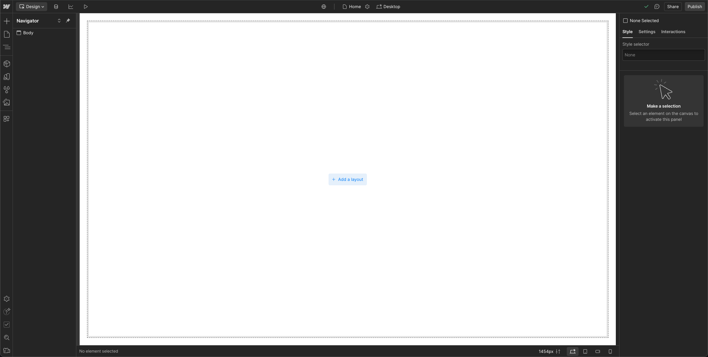
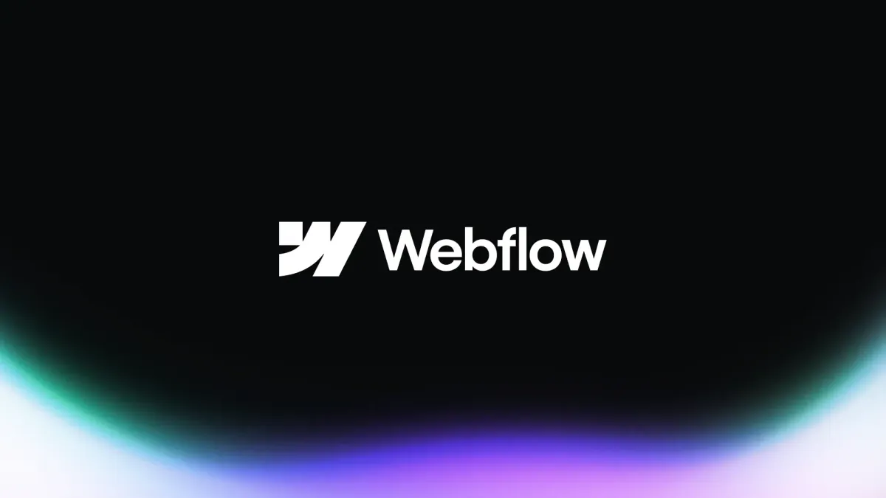

# Atelier Développement Web

<style>.md-sidebar--primary, .md-header__topic, .md-copyright{ display: none !important; }</style>

*[HTML]: HyperText Markup Language
*[CSS]: Cascading Style Sheets
*[UX]: Expérience utilisateur (User eXperience)
*[UI]: Interface utilisateur (User Interface)
*[CMS]: Content Management System
*[ANI]: Artificial Narrow Intelligence
*[AGI]: Artificial General Intelligence
*[ASI]: Artificial Super Intelligence
*[IA]: Intelligence Artificielle
*[LLM]: Large Language Model (ex: ChatGPT)
*[LLMs]: Large Language Models (ex: ChatGPT)
*[URL]: Uniform Resource Locator


## Sondage

<div class="grid grid-1-2" markdown>
  

  <small>Sondage Wooclap</small><br>
  **[app.wooclap.com/ADEVWEB](https://app.wooclap.com/ADEVWEB)**
</div>

## Le développement Web, c’est quoi ?

Le développement Web, c’est tout ce qu’on peut créer pour le Web : des sites, des outils ou des applications accessibles depuis un navigateur, peu importe l’appareil.

Voici quelques exemples classiques :

<div class="grid grid-1-4" markdown>


<div markdown>
**Site vitrine**
> Exemple : [Kiwad.com](https://www.kiwad.com)
</div>
</div>

<div class="grid grid-1-4" markdown>


<div markdown>
**Blogue ou forum**
> Exemple : [Rotten Tomatoes](https://www.rottentomatoes.com)
</div>
</div>

<div class="grid grid-1-4" markdown>


<div markdown>
**Site e-commerce**
> Exemple : [Simons](https://www.simons.ca)
</div>
</div>

<div class="grid grid-1-4" markdown>


<div markdown>
**Réseaux sociaux**
> Exemple : [Bluesky](https://bsky.app/profile/acfas.ca)
</div>
</div>

Mais ce n’est pas tout. Le développement Web permet aussi de concevoir des interfaces à usage multiple.

* Tableaux de bord interactifs : [Interface de gestion domotique résidentielle](https://www.home-assistant.io/)
* Systèmes d’automatisation : Par exemple, une alerte SMS envoyée automatiquement lorsqu’un formulaire est rempli.
* Jeux : [Jeu vidéo publié sur itch.io](https://mraosix.itch.io/combattrials)
* Application interactive : [Plateforme de réservation de la Place des Arts](https://www.placedesarts.com/programmation)
* Outils pédagogiques interactifs : Quiz en ligne (comme le Wooclap de tantôt)
* Explorateurs de données : [Visualisations de données interactives sur l'économie | World Economic Forum](https://intelligence.weforum.org/topics/a1Gb0000000pTDREA2/key-issues/a1Gb00000017LD8EAM)
* Générateurs de contenu ou d’outils : un générateur de cocardes pour un congrès.
* Plateformes participatives : vote en ligne pour une élection d'OBNL.
* Expériences immersives et artistiques.

!!! info "À propos des applications Web"

	De plus en plus d’organisations créent des applications Web pour remplacer des logiciels installés (comme sous Windows par exemple). On pourrait penser à Google Docs qui pourrait remplacer Word dans une certaine mesure.

	Ces outils, accessibles depuis un navigateur, fonctionnent sur tous les types d’appareils et ne nécessitent aucune installation. La connexion à Internet n'est même pas obligatoire dans certains cas.

## Les métiers


Créer un site Web demande souvent plusieurs expertises. Voici les trois rôles principaux :

<div class="grid grid-auto" markdown>
<div style="font-size:3rem">👨‍💻</div>

**Développement Front-End**  
Conception de l’interface visible par l’utilisateur. Transformation des maquettes graphiques en pages interactives, compatibles sur différents navigateurs et appareils.
</div>

<div class="grid grid-auto" markdown>
<div style="font-size:3rem">👩‍💻</div>

**Développement Back-End**  
Logique côté serveur : gestion des bases de données, de la sécurité, de l’authentification.
</div>

<div class="grid grid-auto" markdown>
<div style="font-size:3rem">👨‍🎨</div>

**Design UX/UI**  
Création l’expérience utilisateur (UX) et les interfaces graphiques (UI). Conception de la navigation, la lisibilité, les couleurs, l’esthétique et l’adaptation aux différents écrans.
</div>

{data-zoom-image}

!!! question "Et pour les débutants ?"

	Quand on débute, on touche souvent à un peu de tout. 
	
	Avec le temps, on découvre ce qu’on préfère : le design, le code, l’organisation… 
	
	On peut aussi commencer par des outils simples (ex. : [no-code](https://fr.wikipedia.org/wiki/D%C3%A9veloppement_No_code)) avant de se spécialiser.

## Les langages de programmation



Un langage de programmation est un ensemble d’instructions rédigées sous forme de texte afin d’être interprétées ou exécutées par un appareil électronique (ordinateur, tablette, téléphone, etc.).

Chaque langage possède une **syntaxe** (semblable à la grammaire d’une langue normale) ainsi que des règles strictes (analogues aux règles d’orthographe et de ponctuation) qu’il est nécessaire de respecter pour que le programme fonctionne correctement.

Il existe plusieurs centaines de langages de programmation. Pour le Web, trois langages sont particulièrement importants dans la partie front-end : le **HTML**, le **CSS** et le **JavaScript**.

### HTML

Le HTML est un langage utilisé pour structurer le contenu d’une page Web.

Il indique, grâce à des **balises**, la nature du contenu (titre, paragraphe, lien, etc.).

Les balises HTML utilisent les caractères  `<`, `>`, `/`, `=` et `"`.

Des balises, il en existe tout plein. Voici une courte liste de balises :

| Balise         | Description                                      | Exemple minimal                           |
|----------------|--------------------------------------------------|-------------------------------------------|
| `<h1>`         | Titre (h1 à h6)                                  | `<h1>Titre</h1>`                          |
| `<p>`          | Paragraphe                                       | `<p>Du texte ici.</p>`                    |
| `<br>`         | Saut de ligne                                    | `Ligne 1<br>Ligne 2`                      |
| `<strong>`     | Texte en gras                                    | `<strong>Important</strong>`              |
| `<em>`         | Texte en italique                                | `<em>À retenir</em>`                      |
| `<a>`          | Lien hypertexte                                  | `<a href="https://example.com">Lien</a>`  |
| ``        | Image                                            | ``   |

<iframe class="aspect-16-9" height="300" style="width: 100%;" scrolling="no" title="Untitled" src="https://codepen.io/tim-momo/embed/pvJpbqg?default-tab=html%2Cresult&editable=true&theme-id=50210" frameborder="no" loading="lazy" allowtransparency="true" allowfullscreen="true">
</iframe>

#### Structure initiale d'un site Web

```html
<!DOCTYPE html>
<html lang="fr">
	<head>
		<meta charset="UTF-8">
		<meta name="viewport" content="width=device-width, initial-scale=1.0">
		<title>Immersion TI</title>
	</head>
	<body>

		Contenu de ma page Web ici!

	</body>
</html>
```

### CSS

Le langage CSS permet de modifier l’apparence du site. On peut changer la police, les couleurs, les marges, etc.

Le langage utilise une syntaxe avec des accolades `{` `}`, des deux-points `:` et des points-virgules `;`.

Voici une courte liste de styles CSS :

| Propriété       | Description                                  | Exemple                                    |
|-----------------|----------------------------------------------|--------------------------------------------|
| `color`         | Couleur du texte                             | `color: red;`                              |
| `background`    | Couleur ou image de fond                     | `background: orange;`                      |
| `font-size`     | Taille de la police                          | `font-size: 20px;`                         |
| `font-weight`   | Épaisseur du texte (normal, bold…)           | `font-weight: bold;`                       |
| `font-style`    | Style de la police (italic, normal…)         | `font-style: italic;`                      |
| `text-align`    | Alignement du texte                          | `text-align: center;`                      |
| `margin`        | Marge extérieure (autour de l’élément)       | `margin: 10px;`                            |
| `padding`       | Marge intérieure (dans l’élément)            | `padding: 15px;`                           |
| `border`        | Bordure autour de l’élément                  | `border: 1px solid black;`                 |

<iframe class="aspect-16-9" height="300" style="width: 100%;" scrolling="no" title="HTML" src="https://codepen.io/tim-momo/embed/YPXapWo?default-tab=css%2Cresult&editable=true&theme-id=50210" frameborder="no" loading="lazy" allowtransparency="true" allowfullscreen="true">
</iframe>

### L'inspecteur

{data-zoom-image}

L’inspecteur est un outil de développement Web intégré dans le navigateur.

Il permet d’examiner, tester et modifier en temps réel le code HTML, CSS ou JavaScript d’un site Web.

On peut y accéder de plusieurs façons. Dans Google Chrome, par exemple :

* Clic droit sur un élément et choisir l'option « Inspecter »
* Raccourci clavier : ++ctrl+shift+i++
* Touche : ++f12++

!!! example "Exercice express"

	1. Allez sur un site Web de votre choix. N'importe lequel !
	2. Ouvrez le panneau d’inspection du navigateur.  
	3. Cliquez sur l’outil de sélection (en haut à gauche du panneau). 
	4. Choisissez un élément sur la page.  
	5. Dans la colonne de droite, cliquez dans la section `element.style {}`  
	6. Ajoutez un style de votre choix. Exemple : `background: aqua;`

	Comme vous l'avez constaté, il est possible de modifier temporairement n’importe quel site sur son navigateur. Cette technique est très utile en développement Web pour tester rapidement des styles ou diagnostiquer un problème.

### Outils de développement

Il est possible de programmer avec notepad si on le désire 🤷, mais personne ne le fait.

Il est préférable d'utiliser le bon outil pour la tâche, un peu comme on utiliserait Word pour écrire un devoir de français.

Pour de la programmation Web, l'outil le plus populaire s'appelle **[Visual Studio Code](https://code.visualstudio.com/)** ou **VSCode**.

{data-zoom-image}

<div class="grid grid-1-2" markdown>
  

  <small>Atelier A</small><br>
  **[Ma première page Web](./exercices/exercice_1.md){.stretched-link .back}**
</div>

## Mise en ligne d’un site web

Mettre un site en ligne, ce n’est pas aussi compliqué qu’on pourrait le croire.

En gros, il faut deux choses : un endroit pour héberger les fichiers (le serveur) et une adresse Web (le nom de domaine) pour que les gens puissent y accéder.

### Hébergement Web

C’est sur un serveur Web que l’on place les fichiers de son site pour qu’il soit accessible sur Internet.

On peut comparer cela à un terrain sur lequel on construit sa maison : c’est là que « vit » le site.

Hébergeurs Web canadiens : [Web Hosting Canada 🇨🇦](https://whc.ca/fr), [HostPapa 🇨🇦](https://www.hostpapa.ca/fr), [PlanetHoster 🇨🇦🇫🇷](https://www.planethoster.com/fr)

### Nom de domaine

Pour qu’un site soit trouvable par les internautes via un URL, il faut lui associer une adresse Web unique appelée nom de domaine, aussi appelée nom de domaine.

C’est l’équivalent d’une adresse postale : elle permet aux gens de « trouver » votre site sur Internet.

Fournisseurs canadiens de noms de domaine : [Webnames 🇨🇦](https://www.webnames.ca/), [CanSpace 🇨🇦](https://www.canspace.ca/).

## Intelligence artificielle


Avec l’essor de l’intelligence artificielle, plusieurs se demandent si la programmation en général est toujours pertinente.

Concernant les petits projets de programmation, ce sera souvent réglé par IA. C'est même déjà le cas dans plusieurs cas de figure (ex: [Bold.new](https://bolt.new/)).

Pour les projets plus complexes, la programmation reste essentielle.

Une IA peut générer du code, mais elle ne comprend pas toujours les besoins d’un projet, son contexte, ni les contraintes à long terme. Dans ces cas, c'est plus un bon assistant qu'autre chose.

**L’architecture de système, c’est un art**

{.w-50 data-zoom-image}

Dans les projets d’envergure, il ne suffit pas que le site “fonctionne”.

L’architecture du code devient une composante critique du produit : **performance**, **sécurité**, **évolutivité**, **lisibilité**.

### Vibe Coding

{.w-50}

Le *vibe coding* est une approche intuitive et spontanée de la programmation, où l’on génère du code assisté par un agent.

Cette méthode, popularisée comme un assistant de programmation, cette méthode est particulièrement efficace pour les petits projets ou les prototypes rapides.

Mais pour des projets plus complexes, l’absence de structure ou de plan clair peut devenir problématique. Les LLMs, par exemple, ont parfois du mal à maintenir le contexte sur de longues sessions, ce qui peut entraîner des incohérences ou des limitations techniques.

### État de l'IA en 2025

| Niveau  | Description |
|---------|-------------|
| **ANI** | IA spécialisée dans une tâche unique (reconnaissance d’image, assistants vocaux, recommandations…). C'est la forme d’IA **réellement existante aujourd’hui**. |
| **AGI** | IA à **niveau cognitif humain**, capable de généraliser, raisonner et s’adapter à de nombreux domaines. Encore **théorique**, mais objet de recherche importante.<br><br> Compréhension du monde physique<br>Mémoire persistante<br>Raisonnement<br>Planification |
| **ASI** | IA surpassant l’humain **dans tous les domaines** (créativité, jugement, compétences sociales…). Purement **hypothétique**, souvent associée à des risques existentiels . |

## Systèmes de gestion de site Web

Il n’est pas nécessaire d’être programmeur pour gérer un site Web !

Grâce à des outils comme les CMS, il est possible de créer et mettre à jour des contenus sans écrire une seule ligne de code.
Des plateformes comme [WordPress](https://wordpress.com/fr/) ou [Drupal](https://new.drupal.org/home) ont rendu la gestion de site accessible à un plus grand nombre depuis le début des années 2000.

Pour aller encore plus loin en simplicité, certains outils intègrent directement la création visuelle, l’hébergement et la mise en ligne dans une seule interface.
On les appelle des _Website Builders_ (Ex: [Wix](https://fr.wix.com/), [Webflow](https://webflow.com/) ou [Shopify](https://www.shopify.com/ca-fr)), particulièrement adaptée aux débutants ou aux petites entreprises.

### Webflow

Présentation de l'interface Webflow

{data-zoom-image}

<div class="grid grid-1-2" markdown>
  

  <small>Atelier B</small><br>
  **[Webflow](./exercices/exercice_2.md){.stretched-link .back}**
</div>
