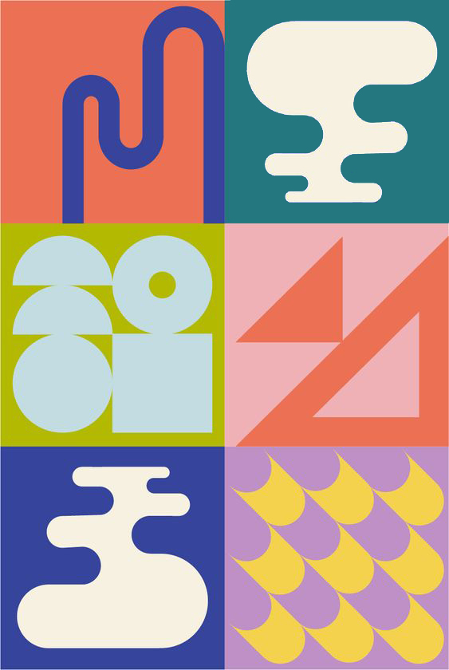

## Le but de ce devoir est de reproduire une image avec l'outil plume

## Matériel

Télécharger et ouvrer le fichier suivant:

[📁 Document de départ](../assets/image/devoir_bauhaus.jpg){ .md-button }    

**Reproduire précisément l’image suivante en utilisant les techniques de création vectorielle enseignées. Suivez chaque étape avec attention pour respecter les consignes techniques.**

## Liste des consignes à suivre :

- [ ] **Utilisation des points d’ancrage :**
  - [ ] Les points d’ancrage doivent être utilisés uniquement pour tracer des courbes.
  - [ ] Ajuster les poignées pour des lignes fluides et précises.
  - [ ] Pour les lignes droites, utiliser des segments sans courbe.

- [ ] **Outils autorisés :**
  - [ ] **Interdiction** d’utiliser les formes automatiques (cercles, rectangles, etc.).
  - [ ] Utiliser uniquement l'outil **Plume (Pen Tool)** pour tracer les formes.
  - [ ] Utiliser uniquement le nombre nécessaire de points d'ancrage pour tracer les courbes et les angles droits, en évitant d'ajouter des points superflus.

- [ ] **Couleurs :**
  - [ ] Utiliser uniquement les couleurs présentes dans l’image fournie.
  - [ ] Utiliser l'outil **Pipette** pour échantillonner les couleurs précises.
  - [ ] Appliquer les couleurs aux bonnes formes pour correspondre à l’image d’origine.

- [ ] **Organisation des calques :**
  - [ ] Chaque forme doit être sur un calque séparé.
  - [ ] Nommer correctement chaque calque en fonction de l’élément (ex. : *Contour visage*, *Fond*).
  - [ ] Organiser les calques pour faciliter d’éventuelles modifications.

- [ ] **Précision des formes :**
  - [ ] Tracer les contours avec précision et gérer les courbes soigneusement.
  - [ ] Respecter les proportions et positions des éléments originaux.

- [ ] **Validation finale :**
  - [ ] Comparer votre travail à l’image de référence pour vérifier la correspondance des couleurs, des formes, et des détails.

## Sauvegarde du travail :

- [ ] Sauvegarder le fichier final au format **.psd** pour conserver les calques et permettre l'évaluation. 
