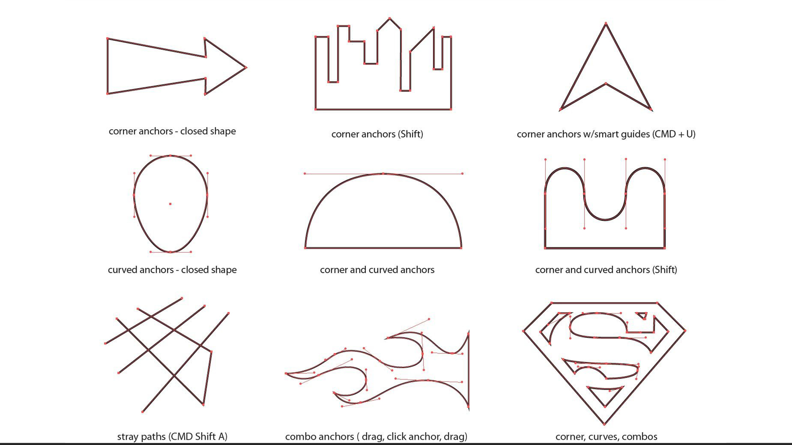

Le but de cet exercice est de recréer des formes avec l'outils (P) avec toutes les notions vues précédemment. 

***

## Matériel

Télécharger et ouvrer le fichier suivant:

[📁 Document de départ_01](../assets/image/devoir_gym.jpg){ .md-button }       

## Étapes

### Retracer les formes en utilisant les outils de Plume (il est interdit d'utiliser les outils de forme)

- [ ] **Amener l'image dans Photoshop, agrandisser l'image. 
- [ ] **Sélectionner l'outil Plume (P)** dans la barre d'outils ou appuyer sur la touche **P**.
- [ ] **Commencer à tracer** en cliquant pour créer des points d'ancrage. Relie les points pour former les contours des formes en suivant l'image de référence. Vous ne devez pas avoir plus de points ou de poignées que l'image de référence. 
- [ ] Pour créer des courbes, **cliquer et faire glisser** à chaque point pour tirer des poignées et contrôler la courbure.
  - Utilise les poignées pour ajuster la courbe de manière précise.
- [ ] **Si tu veux une courbe plus subtile**, utilise l'outil **Courbure** (Maj + P) :
  - Clique à chaque changement de direction et ajuste les courbes en glissant les points ou en cliquant pour enlever les courbes.
- [ ] **Utilise l'outil Plume libre** pour des tracés plus rapides et intuitifs :
  - Active-le depuis la barre d'outils et dessine librement les contours de la forme en maintenant le clic de la souris. Le tracé suivra tes mouvements.
- [ ] **Pour ajuster ou affiner les points d'ancrage**, utilise l'outil **Sélection directe (A)** :
  - Clique sur les points ou poignées pour les déplacer et ajuster le tracé avec précision.
- [ ] Si nécessaire, utilise l'outil **Convertir les points** pour transformer une poignée en angle (ou l'inverse) :
  - Sélectionne-le et clique sur un point d'ancrage pour basculer entre courbe et angle.
- [ ] **Fermer le tracé** en reliant le dernier point au premier pour boucler la forme.
- [ ] Assure-toi d'avoir retracé chaque contour avec précision en ajustant les courbes et lignes droites selon les besoins.

### Appliquer le Contour et la Couleur
- [ ] **Appliquer un contour noir** de **4 points** d'épaisseur à toutes les formes, en laissant l'intérieur des formes vide (sans couleur de remplissage). 

## Sauvegarde du travail :

- [ ] Sauvegarder le fichier final au format **.psd** pour conserver les calques et permettre l'évaluation. 

