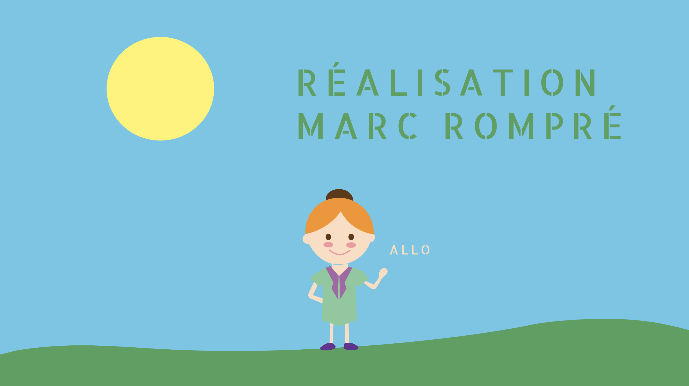

Le but de cet exercice est de sauvegarder une image en GIF:

***

## Matériel

Télécharger et ouvrer le fichier Photoshop suivant:

[📁 Document de départ](../assets/image/vecteur_rompre.psd){ .md-button }    

## Étapes

- [ ] Sauvegarder l'image au format GIF (Alt + Maj + Ctrl + S) sur le bureau avec le nom "vecteur_rompre.gif".

***

## Tutoriel 📚

[📖 Pour en savoir plus](https://uqam-my.sharepoint.com/:v:/g/personal/lavoie-pilote_francoise_uqam_ca/EcavsLtE0Y5Pk3GMxsWD-ssBC9P1z57Dx9FekQbGze7_8g?nav=eyJyZWZlcnJhbEluZm8iOnsicmVmZXJyYWxBcHAiOiJPbmVEcml2ZUZvckJ1c2luZXNzIiwicmVmZXJyYWxBcHBQbGF0Zm9ybSI6IldlYiIsInJlZmVycmFsTW9kZSI6InZpZXciLCJyZWZlcnJhbFZpZXciOiJNeUZpbGVzTGlua0NvcHkifX0&e=GQke8a){ .md-button }    
