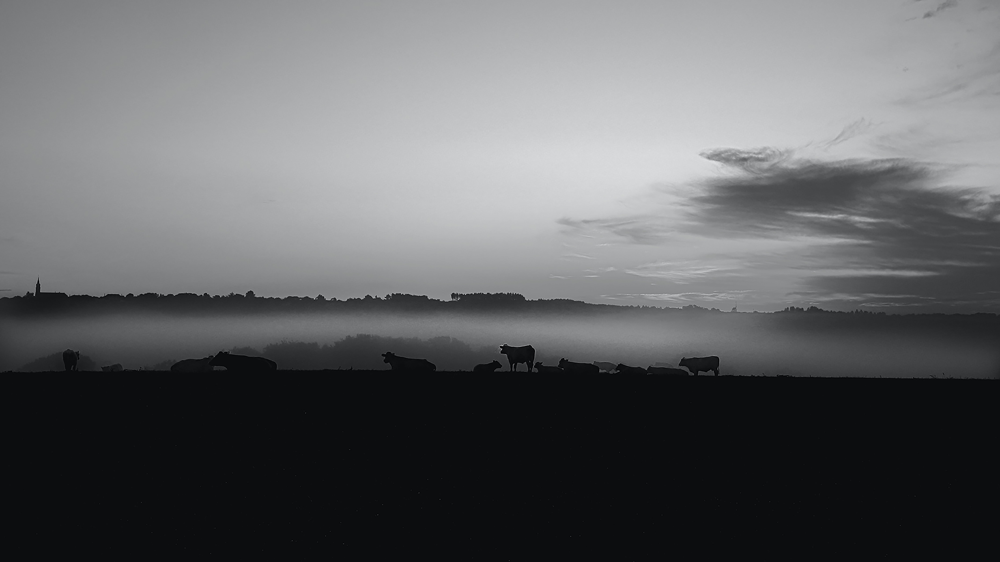

Le but de cet exercice est de sauvegarder une image en PSD:

***

## Matériel

Téléchargez et ouvrez le fichier Photoshop suivant:
[📁 Document de départ](../assets/image/anthony_cantin.jpg){ .md-button }    

## Étapes

- [ ] Créer deux nouveaux calques.
- [ ] Sur le premier calque, avec l'outil pinceau (B), écriver le mot "safari" et renommer le calque "safari".
- [ ] Sur le deuxième calque, avec l'outil pinceau (B), écriver le mot "solitaire" et renommer le calque "solitaire".
- [ ] Sauvegarder l'image en PSD ((Maj + Ctrl + S)) sur le bureau avec le nom "antony_cantin.psd"
- [ ] Pour sauvegarder à nouveau le PSD, vous pouvez simplement utiliser (Ctrl + S)

***

## Tutoriel 📚

[📖 Pour en savoir plus](https://uqam-my.sharepoint.com/:v:/g/personal/lavoie-pilote_francoise_uqam_ca/EcavsLtE0Y5Pk3GMxsWD-ssBC9P1z57Dx9FekQbGze7_8g?nav=eyJyZWZlcnJhbEluZm8iOnsicmVmZXJyYWxBcHAiOiJPbmVEcml2ZUZvckJ1c2luZXNzIiwicmVmZXJyYWxBcHBQbGF0Zm9ybSI6IldlYiIsInJlZmVycmFsTW9kZSI6InZpZXciLCJyZWZlcnJhbFZpZXciOiJNeUZpbGVzTGlua0NvcHkifX0&e=GQke8a){ .md-button }    
