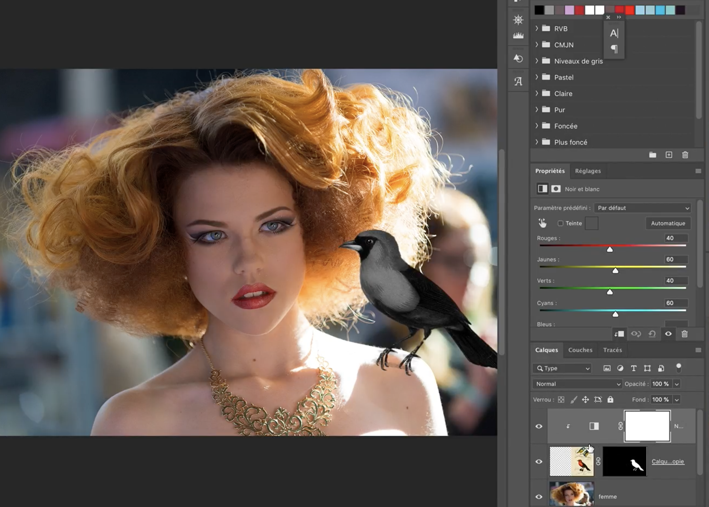

Le but de cet exercice est d'appliquer un effet sur un calque uniquement grâce à un masque d'écrétage

***

## Matériel

Téléchargez et ouvrez les fichiers suivants:

[📁 Document de départ_01](../assets/image/08_mesanges.jpg){ .md-button }

[📁 Document de départ_02](../assets/image/07_over_busy.psd){ .md-button }

## Étapes

- [ ] Aller dans le fichier 08_mesange.jpg
- [ ] Cliquer sur l'icône de sélection d'objet (W) dans la barre d'outils.
- [ ] Utiliser l'outil de sélection d'objet pour entourer la mésange orange de manière à la sélectionner.
- [ ] Dans le panneau d'option, aller dans sélectionner et masquer. Aller améliorer le contour de la sélection. Lorsque c'est terminé cliquez sur ok.
- [ ] Dans le panneau de calques, cliquer sur l'icône de masque de fusion située en bas pour masquer les zones en dehors de la sélection.
- [ ] Double-cliquer sur le nom du calque pour nommer "oiseau_orange".
- [ ] Clic-droit sur le calque oiseau_orange et dubliquer le calque dans le fichier 07_over_busy.psd
- [ ] Dans le fichier 07_over_busy.psd appliquer un effet de noir et blanc sur le calque d'oiseau orange uniquement grâce au masque d'écrétage.

***

## Tutoriel 📚

[📖 Pour en savoir plus](https://cmontmorency365-my.sharepoint.com/:v:/g/personal/flpilote_cmontmorency_qc_ca/EdXyaO31Gt5LmwGv2pYw8BcBsBqHgLyBFupN7IFpgkAAIQ?nav=eyJyZWZlcnJhbEluZm8iOnsicmVmZXJyYWxBcHAiOiJPbmVEcml2ZUZvckJ1c2luZXNzIiwicmVmZXJyYWxBcHBQbGF0Zm9ybSI6IldlYiIsInJlZmVycmFsTW9kZSI6InZpZXciLCJyZWZlcnJhbFZpZXciOiJNeUZpbGVzTGlua0NvcHkifX0&e=jpW2HI){ .md-button }
