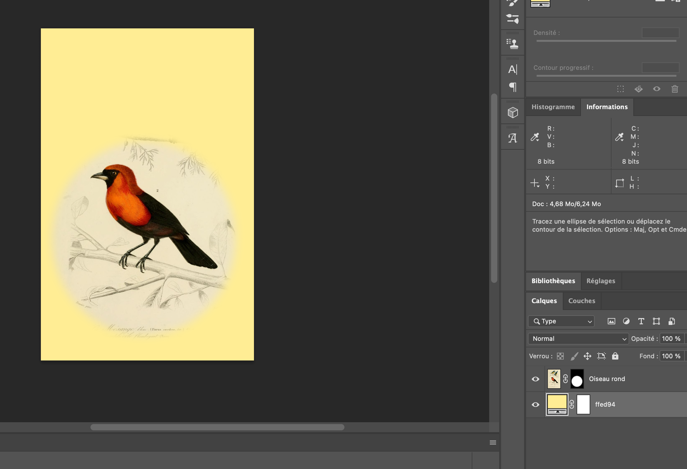

Le but de cet exercice est de faire une sélection circulaire avec un dégradé.

***

## Matériel

Téléchargez et ouvrez le fichier suivant:

[📁 Document de départ](../assets/image/08_mesanges.jpg){ .md-button }    

## Étapes

- [ ] Cliquer sur l'icône de sélection (M) dans la barre d'outils, puis maintener le clic pour accéder à l'outil de sélection elliptique (si l'outil de sélection rectangulaire est visible par défaut). Sélectionner l'outil elliptique dans le menu déroulant.
- [ ] En haut de l'écran, dans le panneau d'options, définisser la valeur de contour progressif (feather) à 20 px.
- [ ] Utiliser l'outil de sélection elliptique pour entourer la mésange orange de manière à la sélectionner.
- [ ] Dans le panneau de calques, cliquer sur l'icône de masque de fusion située en bas pour masquer les zones en dehors de la sélection.
- [ ] Double-cliquer sur le nom du calque pour nommer "oiseau_rond".
- [ ] Créer un calque de fond uni avec la couleur #ffed94. Aller dans le menu Calque > Nouveau calque de remplissage > Couleur unie, puis entrer le code couleur #ffed94.
- [ ] Double-cliquer sur le nom du calque pour nommer "#ffed94".

***

## Tutoriel 📚

[📖 Pour en savoir plus](https://uqam-my.sharepoint.com/:v:/g/personal/lavoie-pilote_francoise_uqam_ca/EfuKV4EK4cVKkANB08qW4NUBpMFNm07GCtUlyj5yuA-Lqg?nav=eyJyZWZlcnJhbEluZm8iOnsicmVmZXJyYWxBcHAiOiJPbmVEcml2ZUZvckJ1c2luZXNzIiwicmVmZXJyYWxBcHBQbGF0Zm9ybSI6IldlYiIsInJlZmVycmFsTW9kZSI6InZpZXciLCJyZWZlcnJhbFZpZXciOiJNeUZpbGVzTGlua0NvcHkifX0&e=ewjeZJ){ .md-button }    
