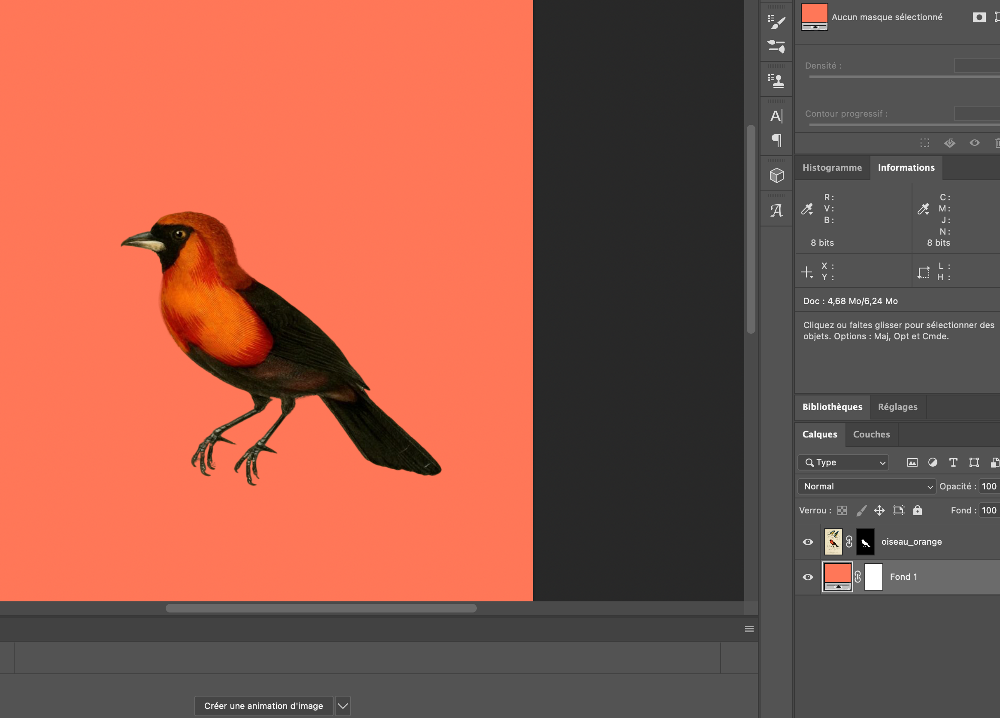

Le but de cet exercice est de faire une sélection d'objet avec la sélection d'objet.

***

## Matériel

Téléchargez et ouvrez le fichier suivant:

[📁 Document de départ](../assets/image/08_mesanges.jpg){ .md-button }    

## Étapes

- [ ] Cliquer sur l'icône de sélection d'objet (W) dans la barre d'outils.
- [ ] Utiliser l'outil de sélection d'objet pour entourer la mésange orange de manière à la sélectionner.
- [ ] Dans le panneau d'option, aller dans sélectionner et masquer. Aller améliorer le contour de la sélection. Lorsque c'est terminé cliquez sur ok.
- [ ] Dans le panneau de calques, cliquer sur l'icône de masque de fusion située en bas pour masquer les zones en dehors de la sélection.
- [ ] Double-cliquer sur le nom du calque pour nommer "oiseau_orange".
- [ ] Créer un calque de fond uni avec la couleur #ff7758. Aller dans le menu Calque > Nouveau calque de remplissage > Couleur unie, puis entrer le code couleur #ffed94.
- [ ] Double-cliquer sur le nom du calque pour nommer "#ff7758".

***

## Tutoriel 📚

[📖 Pour en savoir plus](https://uqam-my.sharepoint.com/:v:/g/personal/lavoie-pilote_francoise_uqam_ca/ET9NSGc2Ts5Ctdr63yH28n0BdkoE6fvHdtZIkcsjqBv2dQ?nav=eyJyZWZlcnJhbEluZm8iOnsicmVmZXJyYWxBcHAiOiJPbmVEcml2ZUZvckJ1c2luZXNzIiwicmVmZXJyYWxBcHBQbGF0Zm9ybSI6IldlYiIsInJlZmVycmFsTW9kZSI6InZpZXciLCJyZWZlcnJhbFZpZXciOiJNeUZpbGVzTGlua0NvcHkifX0&e=H5hXDS){ .md-button }    
