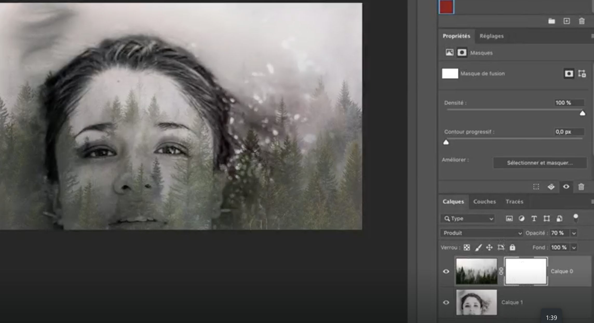
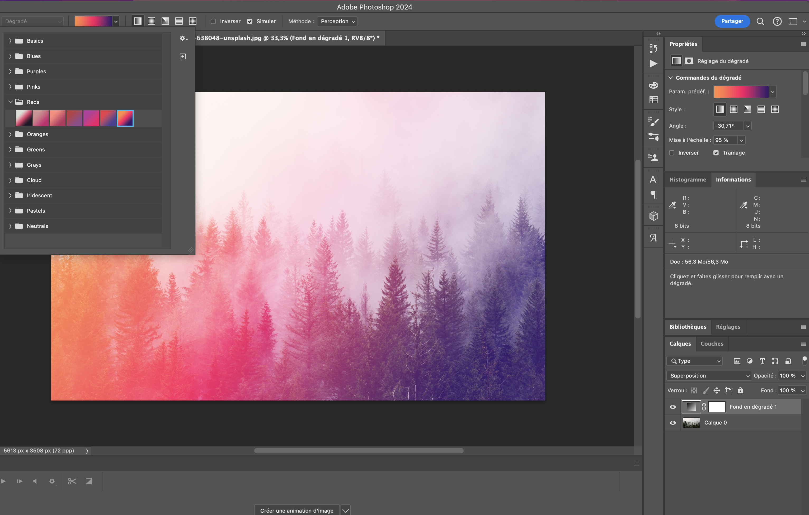

Le but de cet exercice est de fusionner deux calques grâce au mode de fusion.

***

## Matériel

Téléchargez et ouvrez les fichiers suivants:

[📁 Document de départ_01](../assets/image/12_lucho-renolfi-gyRxYFlxI-Q-unsplash.jpg){ .md-button }       
[📁 Document de départ_02](../assets/image/12_john-westrock-638048-unsplash.jpg){ .md-button }    

## Étapes

- [ ] Importer les deux images dans un seul document en les plaçant sur des calques distincts.
- [ ] Sélectionner le calque supérieur dans la palette des calques.
- [ ] Aller en haut de la palette des calques et cliquer sur le menu déroulant des "Modes de fusion" (à côté de l'option "Opacité").
- [ ] Choisir un mode de fusion (comme Multiplier, Incrustation, Lumière douce, etc.) pour voir comment le calque supérieur interagit avec le calque en dessous.
- [ ] Ajuster l’opacité du calque supérieur si nécessaire pour adoucir ou intensifier l’effet de fusion.
- [ ] Expérimenter avec différents modes de fusion jusqu'à obtenir l'effet désiré.
- [ ] Enregistrer votre travail une fois satisfait du résultat.

***
Nous allons faire une variation de l'exercice.

***

## Étapes

- [ ] Cacher le calque de l'image de la femme.
- [ ] Créer un calque avec un gradient. Le gradient doit être un gradient prédéfini rouge.
- [ ] Sur calque, en haut de la palette des calques et cliquer sur le menu déroulant des "Modes de fusion" (à côté de l'option "Opacité").
- [ ] Choisir un mode de fusion (comme Multiplier, Incrustation, Lumière douce, etc.) pour voir comment le calque supérieur interagit avec le calque en dessous.
- [ ] Ajuster l’opacité du calque supérieur si nécessaire pour adoucir ou intensifier l’effet de fusion.
- [ ] Expérimenter avec différents modes de fusion jusqu'à obtenir l'effet désiré.
- [ ] Enregistrer votre travail une fois satisfait du résultat.

## Tutoriel 📚

[📖 Pour en savoir plus](https://cmontmorency365-my.sharepoint.com/:v:/r/personal/flpilote_cmontmorency_qc_ca/Documents/01_cours/01_college/cours_illustration/cours_04_06_photoshop/12_outils_degrade_blending_pot_peinture/03_fusionner_avec_mode_fusion.mov?csf=1&web=1&nav=eyJyZWZlcnJhbEluZm8iOnsicmVmZXJyYWxBcHAiOiJPbmVEcml2ZUZvckJ1c2luZXNzIiwicmVmZXJyYWxBcHBQbGF0Zm9ybSI6IldlYiIsInJlZmVycmFsTW9kZSI6InZpZXciLCJyZWZlcnJhbFZpZXciOiJNeUZpbGVzTGlua0NvcHkifX0&e=imMdG7){ .md-button }    
