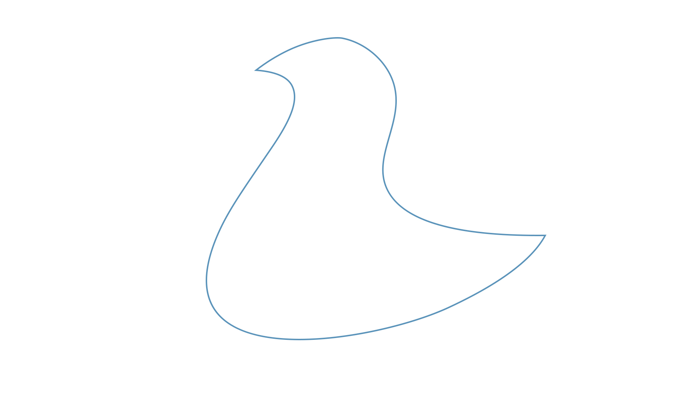

Le but de cet exercice est de retracer une image avec l'outil Courbure dans la Plume (P).

***

## Matériel

Télécharger et ouvrer les fichiers suivants:

[📁 Document de départ_01](../assets/image/14_vecteur_courbe.jpg){ .md-button }       

## Étapes

### Retracer une image avec l'outil Courbure dans la Plume

- [ ] **Sélectionner l'outil Plume (P)**, puis basculer sur l'outil **Courbure** dans la barre d'outils ou appuyer sur la touche **Maj + P** pour l'activer.
- [ ] **Clique une première fois** sur le contour de l'image que tu veux retracer pour créer un point de départ.
- [ ] **Clique à chaque endroit où le contour change de direction** :
  - L'outil Courbure va automatiquement créer des courbes fluides entre les points.
- [ ] Si tu veux **enlever la courbe** d'un point, **clique simplement dessus** pour transformer la courbe en une ligne droite.
- [ ] Pour ajuster une courbe, clique sur la ligne courbe et fais glisser pour repositionner le tracé ou ajuster l'angle.
- [ ] **Ajouter plus de points** si le tracé ne suit pas fidèlement l'image en cliquant simplement à un autre endroit du contour.
- [ ] Maintenir **Alt** tout en cliquant sur un point pour **créer un angle** au lieu d'une courbe si tu veux changer brutalement de direction.
- [ ] **Fermer le tracé** en cliquant sur le premier point d'ancrage pour former une boucle autour de l'image.
- [ ] Vérifie que le tracé suit parfaitement l'image en ajustant les points et les courbes au besoin.

### Appliquer le Contour et la Couleur
- [ ] Sélectionner la forme (Ctrl+clic ou Cmd+clic sur le calque).
- [ ] Régler le **Contour** à **4 points**.
- [ ] Appliquer la couleur du contour : `#5791b9` 
- [ ] Définir le **Remplissage** sur **Aucun** (case blanche barrée de rouge).

## Tutoriel 📚

[📖 Pour en savoir plus](https://uqam-my.sharepoint.com/:v:/g/personal/lavoie-pilote_francoise_uqam_ca/EXDzzWYBiRVLn7Rn3xy926gBB_J1wwkfX8dtkrmWuZvYCg?nav=eyJyZWZlcnJhbEluZm8iOnsicmVmZXJyYWxBcHAiOiJPbmVEcml2ZUZvckJ1c2luZXNzIiwicmVmZXJyYWxBcHBQbGF0Zm9ybSI6IldlYiIsInJlZmVycmFsTW9kZSI6InZpZXciLCJyZWZlcnJhbFZpZXciOiJNeUZpbGVzTGlua0NvcHkifX0&e=ISh2EO){ .md-button }    
