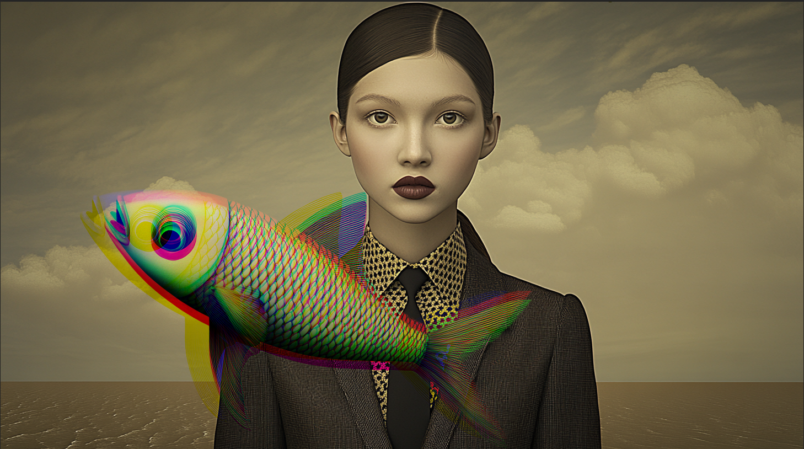

Le but de cet exercice est de jouer avec le décalage de couleurs 

***

## Matériel

Télécharger et ouvrer les fichiers suivants:

[📁 Document de départ_01](../assets/image/17_femme_dore.png){ .md-button }       
[📁 Document de départ_02](../assets/image/17_poisson_suspendu.png){ .md-button }       

## Étapes

- [ ] **Ouvrir le fichier PNG du poisson suspendu** dans Photoshop.
- [ ] **Ouvrir le fichier PNG de la femme dorée** dans un autre onglet Photoshop.
- [ ] **Sélectionner l'outil de sélection d'objet (W)** dans la barre d'outils.
  - Clique et fais glisser sur le poisson pour le sélectionner automatiquement.
- [ ] **Vérifier la sélection** et ajuster si nécessaire en utilisant l'outil de sélection rapide ou l'outil de lasso pour peaufiner les bords.
- [ ] **Copier la sélection** du poisson et **coller-la** dans l'image de la femme dorée.
- [ ] **Créer 3 copies** du calque du poisson dans la palette des calques (clic droit sur le calque > Dupliquer le calque ou appuyer sur **Ctrl + J** / **Cmd + J**).
- [ ] **Sélectionner le premier calque du poisson**, faire un **clic droit** et choisir **Options de fusion** dans le menu contextuel.
- [ ] Dans la fenêtre des **Options de fusion**, cocher la case **Incrustation de couleur**.
  - **Choisir une première couleur** pour ce calque (par exemple, rouge).
- [ ] **Répéter ces étapes** pour les deux autres copies du calque poisson, en choisissant à chaque fois une couleur différente (par exemple, bleu et vert).
- [ ] **Décaler légèrement chaque calque de poisson** : utilise l'outil de déplacement (**V**) pour déplacer chaque calque coloré légèrement à gauche, à droite, en haut ou en bas, afin que les différentes couleurs des poissons soient visibles.
  - Cela créera un effet de superposition colorée avec des contours légèrement décalés.
- [ ] **Réorganiser les calques** de manière créative pour harmoniser l'effet visuel avec les trois poissons colorés décalés dans l'image.
- [ ] **Enregistrer ton fichier** sous un nouveau nom pour conserver l'original et voir l'effet final avec les trois poissons colorés superposés sur l'image de la femme dorée.

## Tutoriel 📚

[📖 Pour en savoir plus](https://uqam-my.sharepoint.com/:v:/g/personal/lavoie-pilote_francoise_uqam_ca/EUqy42qFdflJq-z3yLZhm1wBvme2s2JziJoIjLhL2plHvA?nav=eyJyZWZlcnJhbEluZm8iOnsicmVmZXJyYWxBcHAiOiJPbmVEcml2ZUZvckJ1c2luZXNzIiwicmVmZXJyYWxBcHBQbGF0Zm9ybSI6IldlYiIsInJlZmVycmFsTW9kZSI6InZpZXciLCJyZWZlcnJhbFZpZXciOiJNeUZpbGVzTGlua0NvcHkifX0&e=d2uUOx){ .md-button }    
