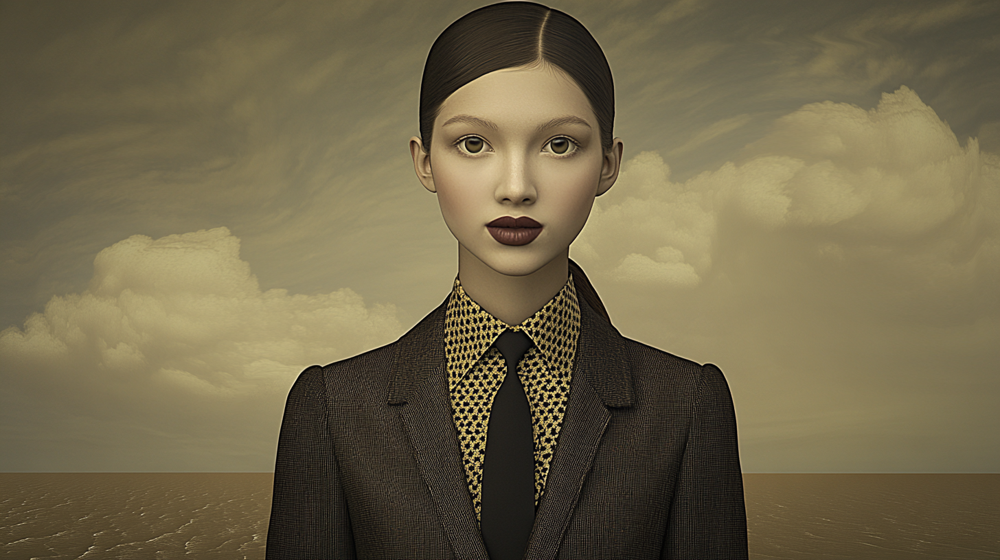

Le but de cet exercice est de jouer avec l'outil Fluidité dans Photoshop en sculptant les traits du visage, modifiant les proportions du corps, transformant le paysage en arrière-plan, exagérant ou réduisant les vêtements, ou en créant des distorsions artistiques. Cela te permettra d'explorer des ajustements subtils et créatifs tout en développant ta maîtrise technique et ton sens artistique.

***

## Matériel

Télécharger et ouvrer les fichiers suivants:

[📁 Document de départ_01](../assets/image/17_femme_dore.png){ .md-button }       

## Étapes

## Exploration des outils dans Fluidité

- [ ] **Utiliser l'outil Déformation avancée (W)** : commence par utiliser cet outil pour déplacer ou étirer les pixels dans l'image. Explore comment il permet de sculpter des formes et ajuster des parties spécifiques du visage ou du corps.
  
  **Exemple** : Tu peux agrandir les yeux, affiner la mâchoire ou même ajuster subtilement l'angle des sourcils pour changer l'expression faciale.

- [ ] **Explorer l'outil Tourbillon (C)** : cet outil permet de faire tourner les pixels autour d’un point donné. Expérimente en ajoutant des effets tourbillonnants aux cheveux, aux vêtements ou à l'arrière-plan.

  **Exemple** : Utilise cet outil pour créer des effets surréalistes dans les nuages ou ajouter un mouvement fluide aux cheveux.

- [ ] **Essayer l'outil Contraction (S)** : cet outil permet de contracter ou d’affiner une zone spécifique. Idéal pour affiner des détails du visage ou du corps.

  **Exemple** : Tu pourrais affiner le cou ou la taille pour ajuster les proportions, ou pour accentuer des éléments du visage comme le nez ou les pommettes.

- [ ] **Utiliser l'outil Dilatation (B)** : cet outil permet d'élargir ou d'agrandir des zones spécifiques. Expérimente sur des parties du visage comme les lèvres ou les yeux, ou même sur des éléments de l'arrière-plan pour jouer avec les proportions.

  **Exemple** : Agrandis les yeux pour un effet exagéré ou donne plus de volume aux cheveux ou aux vêtements pour créer une silhouette plus marquée.

- [ ] **Utiliser l'outil Décalage vers la gauche (O)** : cet outil permet de déplacer les pixels vers la gauche, utile pour repositionner certains éléments de manière plus précise.

  **Exemple** : Tu peux déplacer des parties du visage ou ajuster subtilement la forme des vêtements.

- [ ] **Utiliser l'outil Reconstruction (R)** : cet outil permet de restaurer les pixels déplacés dans leur position d’origine. Utilise-le pour annuler partiellement les modifications sur des zones où tu veux un rendu plus naturel après des ajustements plus extrêmes.

  **Exemple** : Après avoir exagéré les traits du visage, tu peux utiliser cet outil pour adoucir subtilement les changements et retrouver un effet plus équilibré.

- [ ] **Utiliser l'outil Blocage de masque (F)** : cet outil permet de protéger certaines zones de l'image pour éviter toute déformation lorsque tu travailles sur d'autres parties de l'image.

  **Exemple** : Si tu veux travailler uniquement sur le visage sans affecter l'arrière-plan ou le corps, utilise cet outil pour bloquer certaines zones avant de commencer.

- [ ] **Utiliser l'outil Libération de masque (D)** : cet outil permet de libérer les zones précédemment masquées pour que tu puisses les déformer si nécessaire.

  **Exemple** : Après avoir bloqué une zone et réalisé des ajustements, tu peux libérer cette zone pour y apporter des modifications supplémentaires.

- [ ] **Jouer avec la densité et la pression du pinceau** : dans le panneau Fluidité, ajuste la densité et la pression du pinceau pour obtenir des déformations plus douces ou plus fortes, selon l'effet que tu souhaites atteindre.

  **Exemple** : Une pression plus élevée créera des changements plus radicaux, tandis qu'une pression plus faible te permettra de faire des ajustements subtils pour un rendu plus naturel.

- [ ] **Expérimenter les différents masques et filtres** : utilise les masques pour cibler des zones spécifiques et joue avec les filtres pour affiner ou adoucir certaines parties de l'image sans tout affecter d'un coup.

  **Exemple** : Protéger les yeux pendant que tu modifies la forme du visage ou les vêtements te permet d'apporter des ajustements plus précis à une zone donnée.

## Tutoriel 📚

[📖 Pour en savoir plus](https://uqam-my.sharepoint.com/:f:/g/personal/lavoie-pilote_francoise_uqam_ca/EmmeRkiSKgpBq2tWHMlgyhYBuash2fpZK9bxHCJQRcqs_w?e=uzgDzk){ .md-button }    
