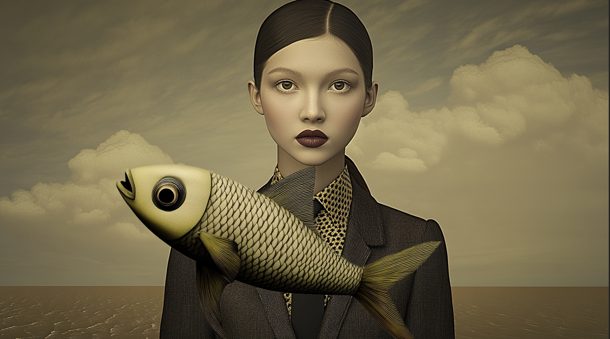

Le but de cet exercice est de créer une image duotone

***

## Matériel

Télécharger et ouvrer le fichier suivant:

[📁 Document de départ_01](../assets/image/17_femme_dore.png){ .md-button }       
[📁 Document de départ_01](../assets/image/17_poisson_suspendu.png){ .md-button }       

## Étapes

- [ ] **Ouvrir les deux fichiers** dans Photoshop :
  - Va dans **Fichier > Ouvrir** et sélectionne les fichiers **femme dorée** et **poisson suspendu** pour les ouvrir dans deux onglets séparés.
- [ ] **Détourer le poisson suspendu avec la sélection d'objet** :
  - Dans l'onglet du poisson suspendu, sélectionne l'outil **Sélection d'objet (W)**.
  - Clique et fais glisser sur le poisson pour le sélectionner.
- [ ] **Copier la sélection du poisson** :
  - Une fois le poisson sélectionné, appuie sur **Ctrl + C** / **Cmd + C** pour copier la sélection.
- [ ] **Coller le poisson dans l'image de la femme dorée** :
  - Va dans l'onglet de l'image de la femme dorée et colle le poisson (**Ctrl + V** / **Cmd + V**). Il apparaîtra sur un nouveau calque.

### Déplacer les pupilles et le poisson

#### Déplacer les pupilles
- [ ] **Sélectionner les pupilles** :
  - Utilise l'outil **Lasso (L)** pour faire une sélection autour des pupilles des yeux de la femme dorée.
- [ ] **Utiliser l'option Fluidité** :
  - Va dans **Filtre > Fluidité** (ou appuie sur **Shift + Ctrl + X** / **Shift + Cmd + X** sur Mac).
  - Utilise l'outil **Déformation avancée (W)** dans la fenêtre Fluidité pour **déplacer les pupilles** légèrement dans la direction du poisson.
  - Clique sur **OK** pour valider.

#### Animer le déplacement des pupilles
- [ ] **Ouvrir la fenêtre d'animation** :
  - Va dans **Fenêtre > Montage**, puis sélectionne **Créer une animation d'image**.
- [ ] **Créer des images clés** :
  - Sur la timeline, crée une première image avec les pupilles dans leur position initiale.
  - Duplique cette image clé pour en créer une deuxième.
  - **Déplacer les pupilles** : sur chaque nouvelle image clé, ajuste la position des pupilles avec **Fluidité** pour qu'elles suivent le déplacement du poisson.
  - Continue à ajuster la position des pupilles au fur et à mesure du déplacement du poisson.

#### Déplacer le poisson
- [ ] **Créer des images clés pour animer le poisson** :
  - Sur la timeline, crée une première image avec le poisson dans sa position initiale.
  - Duplique cette image clé pour en créer une deuxième.
  - **Déplacer le poisson** : sur chaque nouvelle image clé, utilise l'outil **Déplacement (V)** pour faire avancer le poisson dans l'image.
  - Répète l'opération à chaque nouvelle image clé pour créer un mouvement fluide.

### Prévisualiser et ajuster

- [ ] **Ajuster la durée de chaque image** :
  - Sous chaque image dans la timeline, tu peux définir une durée pour le temps d'affichage. Choisis une durée comme 0,1 seconde pour un mouvement fluide.
- [ ] **Prévisualiser l'animation** :
  - Utilise le bouton **Lecture** (Play) pour visualiser ton animation et vérifier que les mouvements des pupilles et du poisson sont bien synchronisés.

### Exportation

- [ ] **Exporter l'animation en vidéo H.264 - 1920x1080 à 24 fps** :
  - Va dans **Fichier > Exporter > Rendu vidéo**.
  - Choisis **Adobe Media Encoder** comme moteur de rendu.
  - Sous **Format**, sélectionne **H.264** et sous **Taille d'image**, choisis **1920x1080**.
  - Sous **Image par seconde**, sélectionne **24 fps**.
  - Clique sur **Rendu** pour exporter la vidéo.

### Conseils pour les étudiants :
- **Planifier les mouvements** : Réfléchis à la trajectoire du poisson pour créer une animation fluide et harmonieuse.
- **Utiliser les images clés** : Pour chaque changement de position du poisson, crée une nouvelle image clé dans la timeline.
- **Régler la durée des images** : Choisir la bonne durée pour chaque image est essentiel pour obtenir un mouvement fluide.
- **Ajuster la fluidité** : Si l'animation paraît saccadée, essaie de rapprocher ou espacer les images clés, ou ajuste la durée d'affichage de chaque image.

- [ ] **Enregistrer ton fichier** au format **PSD** pour conserver les calques et animations si tu souhaites retravailler le projet plus tard.

## Tutoriel 📚

[📖 Pour en savoir plus](https://uqam-my.sharepoint.com/:v:/g/personal/lavoie-pilote_francoise_uqam_ca/EbmZcSLx1DtDiguxj3z5tdEB9jguA5bHSUCw2SPV0EFOGQ?nav=eyJyZWZlcnJhbEluZm8iOnsicmVmZXJyYWxBcHAiOiJPbmVEcml2ZUZvckJ1c2luZXNzIiwicmVmZXJyYWxBcHBQbGF0Zm9ybSI6IldlYiIsInJlZmVycmFsTW9kZSI6InZpZXciLCJyZWZlcnJhbFZpZXciOiJNeUZpbGVzTGlua0NvcHkifX0&e=orVOtz){ .md-button }    
